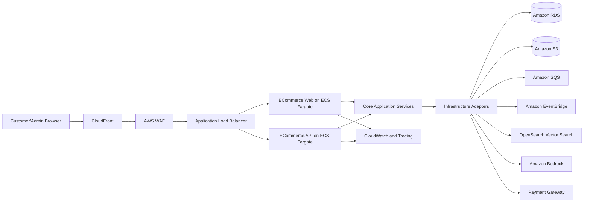

# MVP-To-Production E-Commerce Architecture Roadmap

## 1. Executive Summary

This roadmap defines a secure, scalable, and beginner-friendly path for building a modern e-commerce platform with .NET 10, ASP.NET Core, Entity Framework Core, and Onion Architecture. The platform starts as a modular monolith so the team can learn and ship safely, then evolves toward production-grade cloud operations on AWS when the design is approved.

This version fixes the earlier roadmap by adding security gates, cost controls, failure-handling patterns, AI/RAG guardrails, scalability decisions, and phase-level design documents. The intent is to make the design clear enough for a novice developer or basic AI coding tool to implement one module at a time.

## 2. Architecture Review Findings And Fixes

| Finding | Risk | Fix In This Roadmap |
| --- | --- | --- |
| AI/RAG was mentioned too broadly. | Private data leakage, hallucinated policy answers, prompt injection, expensive services too early. | AI moved to Phase 4 with approved knowledge sources, authorization checks, retrieval logging, confidence thresholds, and local/free-first design. |
| Payments lacked security detail. | Duplicate charges, unsigned callbacks, card data exposure, weak audit trail. | Payment module requires hosted/sandbox gateway flow, signed webhook validation, idempotency keys, no card storage, and payment audit records. |
| Inventory was too simple. | Overselling during concurrent checkout. | Add stock reservations, expiration, optimistic concurrency, and order/payment compensation flow. |
| Production AWS services appeared too early. | Cost surprises during design/MVP. | Use public free resources and local tools now; AWS managed services remain production targets only. |
| Observability was late. | Bugs become hard to diagnose. | Basic structured logging starts in Phase 1; metrics/traces/dashboards mature in Phase 5. |
| Security was not continuous. | Broken access control and insecure design can spread through all modules. | Add threat modeling, OWASP ASVS-inspired checks, RBAC, audit logs, secure file upload rules, dependency scanning, and security acceptance criteria per phase. |
| Queue/event design was underspecified. | Lost emails, duplicate order events, brittle retries. | Use an outbox table in MVP and SQS/EventBridge as production adapters later. |
| Caching was not constrained. | Stale prices, stale inventory, incorrect checkout totals. | Cache only read-heavy catalog data; never trust cache for checkout totals, payment, or final inventory reservation. |
| Project structure could move too early. | Noisy churn before design approval. | Keep current projects in place; document future `src/` and `tests/` layout for later. |

## 3. Product Vision

Build a modular e-commerce platform that supports:

- Customers browsing, searching, buying, tracking, reviewing, and returning products.
- Admin users managing catalog, inventory, orders, support, promotions, and analytics.
- Operators monitoring health, errors, deployments, performance, security, and cost.
- AI-assisted experiences for semantic product search, support answers, admin knowledge lookup, and recommendations.

### Target Users

| User Type | Primary Needs |
| --- | --- |
| Customer | Fast product discovery, smooth checkout, trusted payments, clear order status, easy returns. |
| Store Admin | Product management, inventory visibility, order operations, support workflow, business reporting. |
| Support Agent | Customer context, order history, return policy lookup, fast response drafting. |
| Business Owner | Sales metrics, conversion insights, campaign performance, reliable operations. |
| Developer | Clear architecture, small implementation tasks, testable modules, predictable conventions. |
| Operator | Secure deployments, monitoring, alerts, backups, disaster recovery, and cost visibility. |

## 4. Free-First Design Constraint

For now, use only publicly available free resources and local tools. Do not provision paid AWS infrastructure during the design phase.

### Free Resources And Tools For Now

| Need | Free/Public Option |
| --- | --- |
| Architecture learning | AWS Well-Architected Framework, AWS Architecture Center, AWS Prescriptive Guidance. |
| Architecture review | AWS Well-Architected Tool, design checklists in Markdown. |
| Cost planning | AWS Pricing Calculator, AWS Free Tier documentation, AWS Cost Anomaly Detection documentation. |
| Security learning | OWASP Top 10, OWASP ASVS, OWASP Cheat Sheet Series. |
| Diagrams | Mermaid Markdown diagrams, diagrams.net, AWS Architecture Icons. |
| Local development | .NET SDK, EF Core tools, SQLite or SQL Server LocalDB/Developer, Swagger/OpenAPI, xUnit. |
| Local AI/RAG prototype | Mock embeddings first; optional local vector store or simple database-backed search later. |

AWS managed services such as ECS, RDS, S3, CloudFront, SQS, EventBridge, Bedrock, and OpenSearch are production design targets. They should be introduced only after the design is approved and cost controls are in place.

## 5. Current And Future Project Structure

The current solution already follows the intended high-level Onion Architecture shape:

```text
ECommerceSolution/
  ECommerce.API/              REST API presentation layer
  ECommerce.Web/              MVC/Razor web presentation layer
  ECommerce.Core/             Domain and application contracts
  ECommerce.Infrastructure/   Data access, identity, external integrations
  ECommerce.Tests/            Unit and integration tests
  ECommerceSolution.slnx
```

Keep this structure for now. Move to the future structure only after system design approval:

```text
ECommerceSolution/
  src/
    ECommerce.API/
    ECommerce.Web/
    ECommerce.Core/
    ECommerce.Infrastructure/
  tests/
    ECommerce.Tests/
  docs/
    architecture/
    roadmap/
    implementation-guides/
    ai-rag/
```

## 6. Architecture Principles

### Application Style

Use a modular monolith first. It is easier to understand, test, deploy, and refactor than starting with microservices. Model each business area as a module inside the monolith, keep module boundaries explicit, and use events/outbox patterns so future extraction is possible.

### Onion Architecture Rules

- `ECommerce.Core` contains entities, value objects, domain services, application interfaces, DTOs, and business rules.
- `ECommerce.Infrastructure` implements persistence, identity, file storage, email, payment gateway adapters, search adapters, queue adapters, and AI providers.
- `ECommerce.API` exposes REST endpoints for web, mobile, admin, and integrations.
- `ECommerce.Web` provides the MVC/Razor user and admin experience.
- Dependencies point inward. Core must not depend on Infrastructure, API, or Web.

### Cross-Cutting Rules

- Every write operation must define validation, authorization, audit behavior, and failure behavior.
- Checkout, payment, inventory reservation, and order creation must be idempotent.
- External calls must use timeouts, retries with backoff, and safe retry rules.
- Files must be validated by type, size, ownership, and authorization before storage or download.
- Customer PII must not be logged. Secrets must not be committed.
- AI answers must be grounded in approved sources and guarded by authorization.

## 7. Target Production Architecture

The production target is AWS-oriented but not required during design.



### Production Service Targets

| Concern | AWS Target | Local/Free Design Equivalent |
| --- | --- | --- |
| App hosting | ECS Fargate | Local `dotnet run`. |
| Database | RDS for PostgreSQL or SQL Server | SQLite, LocalDB, or SQL Server Developer. |
| Media storage | S3 | Local filesystem abstraction. |
| CDN | CloudFront | Browser/static file testing. |
| Edge protection | AWS WAF | Documented threat model and local validation tests. |
| Secrets | Secrets Manager | .NET user-secrets or environment variables. |
| Async jobs | SQS | Database outbox plus local background worker. |
| Event routing | EventBridge | In-process domain events plus outbox records. |
| Observability | CloudWatch, OpenTelemetry | Console/file structured logs. |
| AI embeddings/LLM | Bedrock | Mock provider first. |
| Vector search | OpenSearch Serverless vector search | Mock search, local search, or pgvector later if PostgreSQL is selected. |

## 8. MVP Scope Versus Production Scope

### MVP Must Include

- Product catalog with categories, images, product details, and admin CRUD.
- Customer registration, login, profile, and address management.
- Shopping cart with guest and authenticated flows.
- Inventory tracking with stock reservation and reservation expiry.
- Checkout flow with payment sandbox integration.
- Signed payment callback/webhook validation.
- Order creation, order history, status tracking, and email notifications.
- Basic admin dashboard for products, inventory, and orders.
- Structured logging, centralized exception handling, validation, and tests.

### Production-Ready Must Include

- CI/CD pipeline with environment promotion and rollback.
- Secure secret management, least privilege access, rate limiting, audit logging, and RBAC.
- Backups, restore testing, monitoring, alerting, runbooks, and incident process.
- Caching strategy for catalog only; checkout remains source-of-truth database driven.
- Queue-based background jobs for emails, inventory events, indexing, and reporting.
- Performance, accessibility, SEO, and security testing.
- AI-enhanced semantic search and RAG support assistant with guardrails.
- Cost controls, budgets, anomaly detection, and service limit reviews.

## 9. Phase Documents

Each phase has its own beginner-friendly system design document:

| Phase | Document |
| --- | --- |
| Phase 0: Discovery and System Design | `docs/roadmap/phase-0.md` |
| Phase 1: MVP Foundation | `docs/roadmap/phase-1-mvp-foundation.md` |
| Phase 2: MVP Commerce Flow | `docs/roadmap/phase-2-mvp-commerce-flow.md` |
| Phase 3: MVP Experience Layer | `docs/roadmap/phase-3-mvp-experience-layer.md` |
| Phase 4: AI-Enhanced MVP | `docs/roadmap/phase-4-ai-enhanced-mvp.md` |
| Phase 5: Production Readiness | `docs/roadmap/phase-5-production-readiness.md` |
| Phase 6: Scale and Enterprise | `docs/roadmap/phase-6-scale-enterprise.md` |

## 10. Phase Summary

| Phase | Goal | Hard Gate Before Moving On |
| --- | --- | --- |
| 0 | Approve business goals, boundaries, system design, data model, API style, threat model, and cost assumptions. | Architecture review checklist completed. |
| 1 | Build the secure technical foundation. | Identity, catalog baseline, logging, exception handling, and tests are working. |
| 2 | Build a safe purchase flow. | Cart, inventory reservation, checkout, payment sandbox, and order tracking demo succeeds. |
| 3 | Improve product/customer experience. | Variants, wishlist, reviews, admin dashboard, and support tickets are complete. |
| 4 | Add practical AI/RAG. | Semantic search and assistants pass retrieval, authorization, and safety tests. |
| 5 | Harden for production. | Observability, security, resilience, performance, release, and cost controls are verified. |
| 6 | Expand toward enterprise scale. | Advanced features are isolated modules and do not destabilize MVP commerce flow. |

## 11. Domain Model Groups

| Bounded Context | Initial Entities |
| --- | --- |
| Identity and Access | ApplicationUser, CustomerProfile, Role, Permission, UserRole, RolePermission, RefreshToken, AuditLog |
| Catalog | Product, Category, ProductImage, ProductVariant, VariantOption, ProductAttribute |
| Inventory | InventoryItem, InventoryTransaction, StockReservation, Warehouse, StockAlert |
| Pricing and Promotions | PriceHistory, DiscountCoupon, Campaign, LoyaltyAccount |
| Cart and Checkout | Cart, CartItem, CheckoutSession, AddressSnapshot |
| Orders and Payments | Order, OrderItem, OrderStatusHistory, Payment, PaymentWebhookEvent, Refund, Receipt |
| Shipping and Returns | ShippingMethod, Shipment, TrackingEvent, ReturnRequest, ReturnReason |
| Customer Experience | Wishlist, Review, Rating, SupportTicket, TicketMessage, Notification |
| AI Search and Knowledge | SearchDocument, EmbeddingRecord, KnowledgeArticle, KnowledgeArticleVersion, RetrievalLog, AssistantConversation, AssistantMessage, AssistantFeedback |
| Operations | OutboxMessage, BackgroundJobLog, IntegrationEvent, SystemHealthCheck, ImportBatch |

Identity note: `ApplicationUser` is the canonical identity for customers and staff. Admins, support agents, inventory managers, catalog managers, auditors, and future staff users are represented through roles and permissions, not a separate admin-specific user entity unless a future architecture decision explicitly changes this.

## 12. Security Baseline

Every module must answer these questions before implementation:

- Who can perform this action?
- What customer, admin, or system data does the action touch?
- What should be logged, and what must never be logged?
- What validation prevents bad input?
- What happens if the same request is submitted twice?
- What happens if the database write succeeds but the email, payment callback, or indexing job fails?
- What is the abuse case for this feature?

## 13. AI/RAG Baseline

AI is useful only when it is grounded, authorized, and measurable.

Initial AI/RAG use cases:

- Semantic product search.
- Similar product recommendations.
- Customer support assistant over approved public policies and FAQ.
- Admin knowledge assistant over approved operational documents and authorized data.

Initial guardrails:

- Do not retrieve or expose private order/customer data for anonymous users.
- Do not answer payment, refund, legal, or policy questions from model memory alone.
- Log retrieved source IDs, answer confidence, unanswered questions, and user feedback.
- Keep AI provider behind an interface so Bedrock, local mocks, or another provider can be swapped.

## 14. Learning And Reference Links

- AWS Well-Architected Framework: https://docs.aws.amazon.com/wellarchitected/latest/framework/the-pillars-of-the-framework.html
- AWS Well-Architected Tool: https://docs.aws.amazon.com/wellarchitected/
- AWS Architecture Center: https://aws.amazon.com/architecture/
- AWS Architecture Icons: https://aws.amazon.com/architecture/icons/
- AWS Free Tier: https://docs.aws.amazon.com/awsaccountbilling/latest/aboutv2/free-tier.html
- AWS Pricing Calculator: https://docs.aws.amazon.com/pricing-calculator/
- AWS IAM Best Practices: https://docs.aws.amazon.com/IAM/latest/UserGuide/best-practices.html
- AWS Retry With Backoff Pattern: https://docs.aws.amazon.com/prescriptive-guidance/latest/cloud-design-patterns/retry-backoff.html
- AWS Builders Library, idempotent APIs: https://aws.amazon.com/builders-library/making-retries-safe-with-idempotent-APIs/
- Amazon OpenSearch vector search: https://docs.aws.amazon.com/opensearch-service/latest/developerguide/vector-search.html
- Amazon Bedrock Knowledge Bases: https://docs.aws.amazon.com/bedrock/latest/userguide/knowledge-base.html
- OWASP Top 10: https://owasp.org/www-project-top-ten/
- OWASP ASVS: https://owasp.org/www-project-application-security-verification-standard/
- OWASP Cheat Sheet Series: https://cheatsheetseries.owasp.org/

## 15. Final Design Approval Checklist

- MVP scope and production scope are separated.
- Every phase has a standalone design document.
- Every module has security, failure handling, testing, and demo expectations.
- Paid AWS services are not required during design.
- Production AWS targets have a cost review path before provisioning.
- AI/RAG has source, authorization, logging, and evaluation guardrails.
- Future AI-assisted coding can follow the docs without making architecture decisions.
