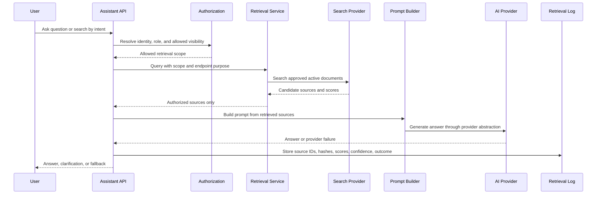
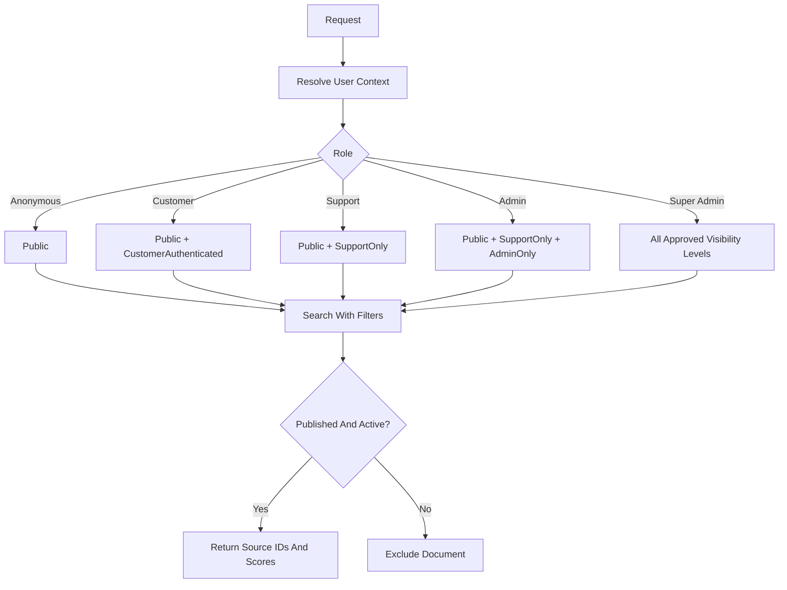

# RAG Architecture

## Purpose

This document is the shared AI/RAG architecture reference for the e-commerce platform. The detailed Phase 4 delivery plan lives in `docs/roadmap/phase-4-ai-enhanced-mvp.md`; this page keeps the cross-cutting architecture decisions in one place.

RAG means Retrieval-Augmented Generation. The application retrieves approved source content first, then asks an AI provider to answer using only that content. This is safer than asking a model to answer from memory, especially for policies, support guidance, and operational procedures.

## Architecture Principles

- Use .NET 10, ASP.NET Core on .NET 10, EF Core compatible with .NET 10, Onion Architecture, and the existing modular monolith.
- Use mock/local providers first. Do not connect paid AI or cloud services during design.
- Keep provider SDKs in Infrastructure, never in Core.
- Authorize before retrieval.
- Retrieve only approved and active sources.
- Generate answers only from retrieved sources.
- Return fallback when confidence is low or the topic is outside approved scope.
- Log source IDs, scores, hashes, and outcomes, not secrets or sensitive full prompts.
- Evaluate AI behavior before enabling customer-facing production use.

## Approved V1 Use Cases

| Use Case | Allowed User | Approved Sources | Notes |
| --- | --- | --- | --- |
| Semantic product search | Anonymous, customer, admin | Public active product catalog and public product metadata. | Search by intent, with keyword fallback. |
| Similar product recommendations | Anonymous, customer, admin | Public active product catalog. | Product-to-product similarity only, not sensitive personal profiling. |
| Customer support assistant | Anonymous or customer | Approved public FAQ, shipping policy, return policy, refund-policy summary, and public help documents. | Source-grounded answers only. |
| Admin knowledge assistant | Support, admin, super admin | Approved internal operational documents filtered by role. | Every request is audited. |

## Excluded V1 Use Cases

- Fully autonomous customer support.
- AI-generated refund, payment, legal, policy exception, or account-security decisions.
- AI access to private order/customer/payment data for anonymous users.
- AI retrieval without authorization checks.
- Unapproved drafts or uploaded files as knowledge sources.
- Paid AI provider integration before explicit approval.

## Data Classification

| Classification | Examples | Retrieval Rule |
| --- | --- | --- |
| Public | Product title, public description, public policy, FAQ. | Can be retrieved for anonymous users. |
| CustomerAuthenticated | General guidance for signed-in customers that does not include private data. | Authenticated customer or staff only. |
| SupportOnly | Support SOPs and troubleshooting guides. | Support, admin, or super admin only. |
| AdminOnly | Admin operations, catalog procedures, reporting notes. | Admin or super admin only. |
| SuperAdminOnly | Highly sensitive operational instructions. | Super admin only. |
| CustomerPrivate | Address, order history, support ticket content. | Excluded from Phase 4 AI indexing unless a later design explicitly approves it. |
| PaymentSensitive | Card data, payment secrets, webhook secrets, payment tokens. | Never expose through AI and never index for RAG. |

## Core RAG Flow

## Authorization-Aware Retrieval

The retrieval service must not retrieve broad data and then rely only on the AI prompt to hide restricted content. The data access query itself should include status, visibility, role, and deletion filters.

## Provider Strategy

| Stage | Provider Decision |
| --- | --- |
| Design | Mock AI provider, mock embedding provider, written evaluation questions. |
| Local MVP | Mock/local providers, simple keyword fallback, optional free local vector prototype behind interfaces. |
| Production target | Amazon Bedrock for LLM and embeddings, Amazon OpenSearch vector search for semantic retrieval. |
| Alternative | pgvector can be considered later if PostgreSQL becomes the approved database path. |

## Interfaces And Ownership

| Interface Or Service | Layer | Responsibility |
| --- | --- | --- |
| `IAiCompletionProvider` | Core abstraction, Infrastructure implementation | Generate source-grounded answers or deterministic mock responses. |
| `IEmbeddingProvider` | Core abstraction, Infrastructure implementation | Convert approved text and queries into embeddings or mock vectors. |
| `IVectorSearchProvider` | Core abstraction, Infrastructure implementation | Search by vector similarity with visibility filters. |
| `IRetrievalService` | Core/application service | Select scope, retrieve sources, calculate confidence, and return fallback decisions. |
| `IAssistantConversationService` | Core/application service | Manage conversations and message metadata. |
| Search indexing worker | Infrastructure/background worker | Build SearchDocument and EmbeddingRecord entries from approved sources. |

## Search Documents

The search index stores retrievable chunks, not whole unrestricted database records.

Required metadata:

- Source ID.
- Source type.
- Source version.
- Chunk number.
- Visibility level.
- Minimum role.
- Approval status.
- Active/deleted/stale flags.
- Indexed timestamp.
- Reindex-required flag.
- Content hash.

Only active, approved, non-deleted, non-stale documents can be retrieved.

## Guardrails

| Guardrail | Requirement |
| --- | --- |
| Approved-source-only answers | If no approved source is retrieved, the assistant must fallback. |
| Authorization before retrieval | Visibility filters are applied before source snippets are returned. |
| Prompt injection resistance | User input and retrieved text are treated as untrusted data. |
| Low-confidence fallback | Configurable confidence thresholds determine when to answer, clarify, or escalate. |
| Sensitive topic boundary | No final refund, payment, legal, policy exception, or account-security decisions. |
| Human escalation | Unsupported or risky questions should create or suggest a support path. |
| Admin audit | Admin assistant requests and source IDs are audited. |
| Redacted logging | Store hashes, previews, source IDs, and scores instead of sensitive full prompts. |

## Logging And Audit

Log:

- Correlation ID.
- User ID if authenticated.
- Role snapshot.
- Endpoint and assistant type.
- Source IDs.
- Retrieval scores.
- Confidence score.
- Fallback reason.
- Provider name and model name when future providers are enabled.
- Latency and failure category.

Never log:

- Secrets.
- Tokens.
- Authorization headers.
- Cookies.
- Card data.
- Payment secrets.
- Full private customer data.
- Full order/payment details.
- Full sensitive prompts.
- Private support messages unless a later protected retention policy approves it.

## Evaluation Gate

Create a small human-reviewed evaluation set before customer-facing AI is enabled:

- 20 product discovery questions.
- 20 support/policy questions.
- 10 similar-product scenarios.
- 10 admin knowledge questions across roles.
- 10 prompt-injection attempts.
- 10 private-data extraction attempts.
- 10 low-confidence/no-answer questions.

Each answer must be reviewed for source correctness, grounding, unauthorized data exposure, fallback behavior, clarity, and forbidden decision avoidance.

## Failure Behavior

| Failure | Behavior |
| --- | --- |
| AI provider unavailable | Return fallback and log provider failure metadata. |
| Embedding generation fails | Mark embedding failed and keep keyword fallback if safe. |
| Vector search fails | Use keyword fallback if configured, otherwise fallback. |
| No relevant source | Do not answer from memory; return fallback or clarification. |
| Source is stale | Exclude the source and request reindex or review. |
| Unauthorized question | Return forbidden or safe fallback depending on endpoint context. |
| Rate limit exceeded | Return `429 TOO_MANY_REQUESTS`. |

## Future AWS Mapping

These are future production targets, not local Phase 4 requirements:

- Amazon Bedrock for LLM generation and embeddings.
- Amazon Bedrock Guardrails as defense in depth for input and output filtering.
- Amazon OpenSearch vector search or OpenSearch Serverless vector collections for semantic retrieval.
- Amazon S3 for approved knowledge document storage.
- Amazon SQS or EventBridge for async indexing jobs.
- Amazon CloudWatch for redacted AI metrics and logs.
- IAM and AWS Secrets Manager for secure provider access.

## Approval Checklist

- [ ] Mock/local providers are implemented first.
- [ ] Provider SDKs are not referenced by Core.
- [ ] Retrieval applies role and visibility filters before prompt construction.
- [ ] Knowledge sources require approval before retrieval.
- [ ] Customer assistant uses only public approved sources.
- [ ] Admin assistant is role-scoped and audited.
- [ ] Low-confidence fallback is implemented.
- [ ] Prompt injection and private-data extraction tests exist.
- [ ] Retrieval logs avoid secrets and sensitive full prompts.
- [ ] Evaluation set is reviewed before production release.

## Public References

- [Amazon Bedrock Knowledge Bases](https://docs.aws.amazon.com/bedrock/latest/userguide/kb-how-it-works.html) describe the managed RAG pattern of retrieving knowledge-base context before generation.
- [Amazon Bedrock Guardrails](https://docs.aws.amazon.com/bedrock/latest/userguide/guardrails.html) can provide future input and output filtering controls.
- [Amazon OpenSearch vector search](https://docs.aws.amazon.com/opensearch-service/latest/developerguide/vector-search.html) supports semantic retrieval with embeddings.
- [OWASP Top 10 for LLM Applications](https://owasp.org/www-project-top-10-for-large-language-model-applications/) documents relevant GenAI risks such as prompt injection, sensitive information disclosure, and vector/embedding weaknesses.
