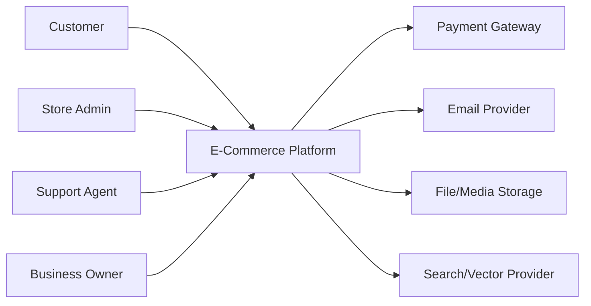
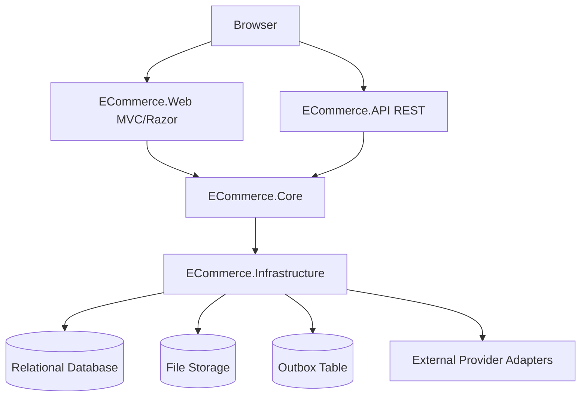
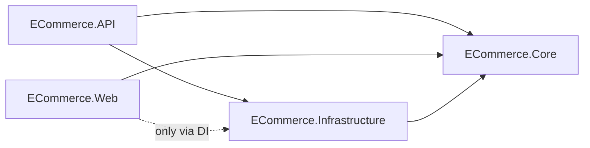
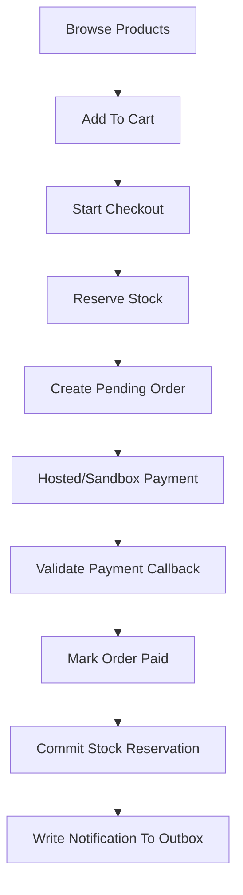
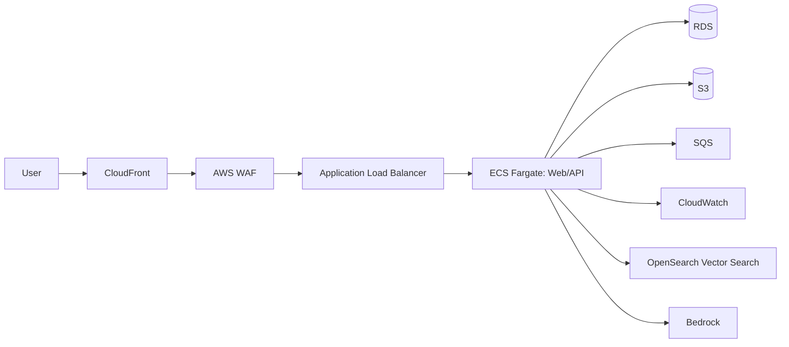

# System Design

## Purpose

This document explains the intended system design in beginner-friendly language. It is the bridge between the roadmap and implementation. Use it to understand how the parts fit together before writing code.

## Design Summary

The platform starts as a modular monolith built with .NET 10 and Onion Architecture.

- **Modular monolith** means one deployable application split into clear business modules.
- **Onion Architecture** means business rules live in the center and infrastructure details stay on the outside.
- **AWS-ready** means the application is designed so local/free adapters can later be replaced by AWS managed services.

## System Context

### Explanation

The e-commerce platform is the system we control. Customers, admins, support agents, and business owners use it. External systems such as payment, email, storage, and search are accessed through interfaces so they can be mocked locally and replaced in production.

## Container Design

### Container Responsibilities

| Container | Responsibility |
| --- | --- |
| `ECommerce.Web` | Server-rendered user/admin pages. |
| `ECommerce.API` | REST API for web, future mobile apps, admin tools, and integrations. |
| `ECommerce.Core` | Business rules, entities, DTOs, interfaces, application services. |
| `ECommerce.Infrastructure` | Database, Identity, external providers, file storage, search, AI, queues. |
| `ECommerce.Tests` | Unit and integration tests. |

## Core Dependency Rule

Core must not reference API, Web, or Infrastructure. Core defines what it needs. Infrastructure provides the implementation.

## Main Business Flow

## Data Ownership

| Module | Owns | Must Not Own |
| --- | --- | --- |
| Catalog | Product, category, image metadata, variants. | Stock quantity, payment, order state. |
| Inventory | Stock, reservations, inventory transactions. | Product descriptions, payment records. |
| Cart/Checkout | Cart, checkout session, address selection. | Final payment truth. |
| Orders/Payments | Order, payment, status history, callback audit. | Product authoring data. |
| Customer Experience | Wishlist, reviews, tickets. | Inventory reservation logic. |
| AI/Search | Search documents, embeddings, retrieval logs. | Source-of-truth product/order/payment data. |

## Canonical Identity And Role Model

`ApplicationUser` is the identity record for every human user: customers, admins, support agents, inventory managers, catalog managers, reporting viewers, auditors, and future staff roles. `CustomerProfile` stores customer-facing profile details. Staff capability comes from `Role`, `Permission`, `UserRole`, and `RolePermission`, not from a separate admin-specific user table.

Phase 1 seeds `Customer`, `Admin`, and `SuperAdmin`. Later phases can add specialized staff roles as permission bundles without changing the identity model.

## Canonical API And Error Conventions

- Public routes use `/api/v1/...` until a breaking API change requires a new version.
- JSON uses camelCase request and response fields.
- Validation, authentication, authorization, not-found, conflict, rate-limit, and unexpected errors use Problem Details-style responses.
- `X-Correlation-Id` is accepted when valid and generated when missing. It appears in logs, audit records, outbox messages, retrieval logs, and error responses.
- `Idempotency-Key` is required for checkout, payment, refund, order-creation, and other risky write commands that may be retried.
- API endpoints must declare authentication, authorization, ownership checks, pagination/filtering behavior, validation rules, and tests before implementation.

## Production AWS Target

Use this as a target architecture, not as a requirement for local development.

## Architecture Decisions

| Decision | Approved Direction |
| --- | --- |
| First deployable shape | Modular monolith. |
| Architecture style | Onion Architecture. |
| Local-first development | Free/local tools only. |
| Production host target | ECS Fargate before EKS. |
| Async pattern | Database outbox first, SQS/EventBridge later. |
| AI provider | Mock/local first, Bedrock later. |
| Vector provider | Mock/local first, OpenSearch or pgvector later. |
| Payment | Hosted/sandbox gateway, no direct card handling. |
| Enterprise scaling | Scale the modular monolith first; extract services only after measured need and clear ownership. |

## Production Operations Design

Phase 5 turns the MVP into an operable production workload. The production target remains AWS-oriented, but implementation stays local/free-first until design, cost, and security approvals pass.

| Concern | Production Direction | Local/Free-First Equivalent |
| --- | --- | --- |
| CI/CD | Build, tests, security scan, migration review, artifact, staging approval, production approval, smoke tests, rollback. | Manual checklist and local test commands until CI/CD is implemented. |
| Environments | Separate local, development, staging, and production configuration, databases, secrets, and logs. | Local environment plus documented config templates. |
| Secrets | AWS Secrets Manager with least-privilege IAM later. | .NET user-secrets or environment variables. |
| Observability | Structured logs, metrics, traces, dashboards, alerts, audit review, retention. | Console/file logs, correlation IDs, local test reports, Markdown alert definitions. |
| Backups | RDS automated backups/PITR, S3 versioning/lifecycle, restore drills. | Local database/media backup and restore simulation. |
| Release safety | Rolling or blue/green deployment later, rollback/forward-fix plan, health checks. | Local/staging smoke-test checklist before production work. |
| Cost controls | Pricing Calculator, Budgets, Cost Anomaly Detection, log retention, non-production shutdown. | Cost worksheet and no paid services before approval. |

Production readiness is not only deployment. It requires runbooks, incident response, restore testing, monitoring, security review, and a rollback strategy before real customer traffic.

## Enterprise Evolution Design

Phase 6 expands the platform after the MVP and production controls are stable. The default remains a modular monolith because checkout, payment, inventory, promotions, loyalty, and order workflows still need strong consistency and simple operations.

| Concern | Enterprise Direction |
| --- | --- |
| Advanced promotions | Add as a Pricing and Promotions module first. Checkout still calculates final discounts server-side. |
| Loyalty | Add an auditable points ledger inside the monolith first. Refunds and cancellations must reverse or adjust points. |
| Multi-warehouse inventory | Extend the Inventory module with warehouse-specific stock and reservations before considering service extraction. |
| Reporting | Use read models and projections before adding a separate analytics store. Reports must not drive checkout truth. |
| Events | Keep the outbox as the durable event publication source, then publish to SQS/EventBridge later if needed. |
| Service extraction | Extract only with clear data ownership, API/event boundary, team ownership, cost approval, and rollback path. |
| Multi-region | Single-region with high availability first. Active-active multi-region is delayed until business need is proven. |

The enterprise path is evolutionary: improve module boundaries, add read models, add workers, add safe caching, scale horizontally, and only then extract a module if the evidence says it is worth the operational cost.

## Beginner Mental Model

Think of the system like a store with departments:

- Catalog knows what is for sale.
- Inventory knows how many can be sold.
- Cart knows what the customer wants.
- Checkout coordinates the purchase.
- Payment knows whether money was received.
- Orders know what was purchased and what state it is in.
- Support helps after something goes wrong.
- AI/Search helps users find or understand information, but it does not become the source of truth.

## Design Approval Checklist

- Every business module has clear ownership.
- Every external service is behind an interface.
- Checkout and payment are idempotent.
- Inventory reservation prevents overselling.
- Admin/customer permissions are explicit.
- AI cannot bypass authorization.
- Local development does not require paid AWS services.
