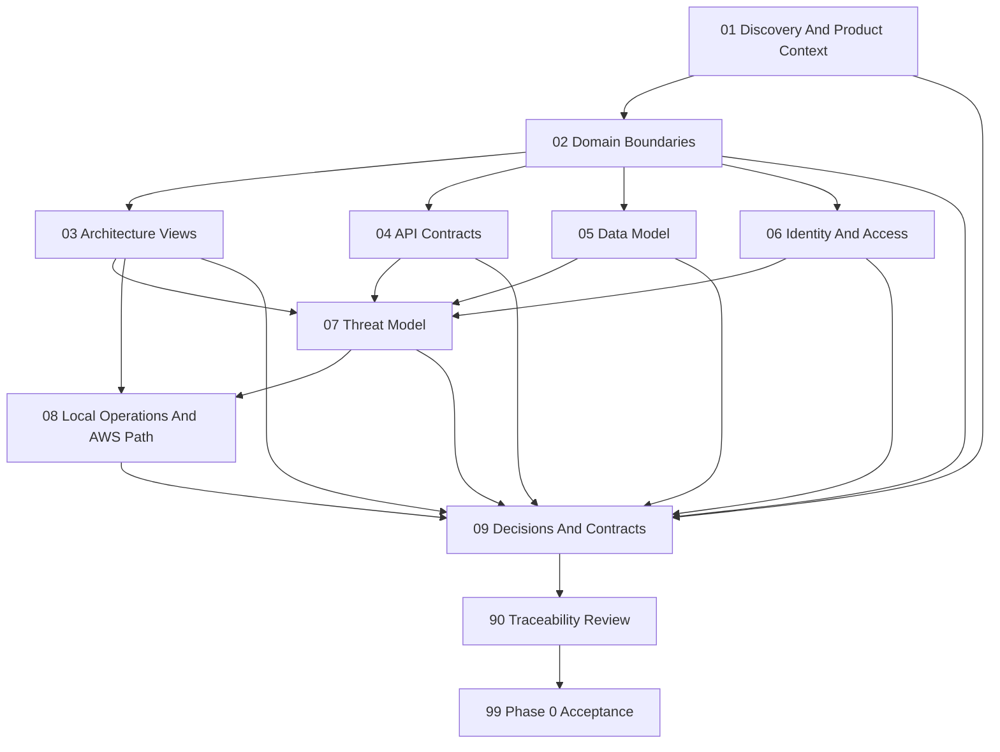

# Phase 0 Instruction Package

## Purpose

This package turns Phase 0 into small, reviewable design work packets. It is the execution guide for producing approved architecture decisions and contracts before Phase 1 coding begins.

Phase 0 produces documentation only. It must not add application code, migrations, deployment code, cloud resources, packages, credentials, or paid-service dependencies.

## Source Of Truth Order

When documents disagree, stop and record the conflict. Use this precedence after human review:

1. Approved architecture decision record in `artifacts/adr/`.
2. Approved cross-phase contract in `artifacts/cross-phase-contract-register.md`.
3. `ECommerce Platform Requirements Roadmap.md`.
4. `docs/roadmap/phase-0.md`.
5. Cross-cutting architecture, security, and AI/RAG documents.
6. This instruction package.

An instruction packet may clarify an approved decision but may not silently override it.

## Work Packet Status

Use exactly one status in each packet and artifact review record:

| Status | Meaning |
| --- | --- |
| `Not Started` | No work has begun. |
| `In Progress` | Work is active and not ready for approval. |
| `Blocked` | A named decision owner must answer an unresolved question. |
| `Ready For Review` | Required artifacts and evidence exist. |
| `Approved` | A named human reviewer accepted the packet. |

Only an approved packet can unblock dependent packets. Packets 03-08 may be drafted in parallel after Packet 02, but they must not be approved against unresolved ownership boundaries.

## Package Outputs

Execution of these packets should create only Phase 0 artifacts under:

```text
docs/implementation-guides/phase-0/
  README.md
  01-repository-and-product-discovery.md
  02-domain-boundaries-and-ownership.md
  03-architecture-and-trust-boundaries.md
  04-api-contract-baseline.md
  05-data-model-and-lifecycles.md
  06-identity-access-and-audit.md
  07-threat-model-and-security-controls.md
  08-local-operations-and-aws-path.md
  09-decisions-contracts-and-phase-1-entry.md
  90-traceability-matrix.md
  99-phase-0-acceptance.md
  artifacts/
    product-context.md
    glossary.md
    domain-contracts.md
    architecture-views.md
    api-contract-baseline.md
    data-model.md
    identity-access-audit.md
    threat-model.md
    operations-and-aws-path.md
    decision-register.md
    cross-phase-contract-register.md
    phase-0-approval-record.md
    adr/
```

Do not create empty artifact placeholders. Create an artifact only while executing its owning packet.

## Dependency Graph



## Execution Order And Progress

| Order | Packet | Primary Artifact | Status |
| --- | --- | --- | --- |
| 1 | [Repository And Product Discovery](01-repository-and-product-discovery.md) | `artifacts/product-context.md`, `artifacts/glossary.md` | Not Started |
| 2 | [Domain Boundaries And Ownership](02-domain-boundaries-and-ownership.md) | `artifacts/domain-contracts.md` | Not Started |
| 3 | [Architecture And Trust Boundaries](03-architecture-and-trust-boundaries.md) | `artifacts/architecture-views.md` | Not Started |
| 4 | [API Contract Baseline](04-api-contract-baseline.md) | `artifacts/api-contract-baseline.md` | Not Started |
| 5 | [Data Model And Lifecycles](05-data-model-and-lifecycles.md) | `artifacts/data-model.md` | Not Started |
| 6 | [Identity, Access, And Audit](06-identity-access-and-audit.md) | `artifacts/identity-access-audit.md` | Not Started |
| 7 | [Threat Model And Security Controls](07-threat-model-and-security-controls.md) | `artifacts/threat-model.md` | Not Started |
| 8 | [Local Operations And AWS Path](08-local-operations-and-aws-path.md) | `artifacts/operations-and-aws-path.md` | Not Started |
| 9 | [Decisions, Contracts, And Phase 1 Entry](09-decisions-contracts-and-phase-1-entry.md) | Decision and contract registers | Not Started |
| 10 | [Traceability Matrix](90-traceability-matrix.md) | Completed matrix | Not Started |
| 11 | [Phase 0 Acceptance](99-phase-0-acceptance.md) | `artifacts/phase-0-approval-record.md` | Not Started |

## Rules For Every Packet

- Read the packet and every listed source before editing.
- Inspect current repository state; never invent files, commands, package versions, or implementation status.
- Keep changes within `docs/implementation-guides/phase-0/` unless a human explicitly approves a source-document correction.
- Use Mermaid for required diagrams and explain each diagram in plain language.
- Use `TBD` only with an owner, deadline/phase gate, default, and impact.
- Treat security, privacy, money, stock, admin access, and AI authorization decisions as high risk.
- Do not mark a checklist item complete without evidence.
- Run scope and Markdown checks before requesting review.
- End with a human approval decision; an AI agent cannot self-approve architecture.

## Shared Verification Commands

Run from the repository root. Adjust only when repository inspection proves a command is invalid.

```powershell
git diff --check
git diff --name-only
rg -n "TBD|TODO|BLOCKED" docs/implementation-guides/phase-0
rg -n "\.NET 8|net8\.0|AdminUser|search/query" docs/implementation-guides/phase-0
```

For documentation-only packets, application build/test results may be reused from Packet 01 if no source or project file changed. The completion evidence must explicitly say `not rerun - documentation-only scope`; do not pretend tests ran.

## Current Assumptions

| Assumption | Status | Must Be Confirmed By |
| --- | --- | --- |
| .NET 10 modular monolith and Onion Architecture remain approved. | Approved baseline | Phase 0 acceptance |
| Current projects remain in place; no `src/` or `tests/` move now. | Approved baseline | Phase 0 acceptance |
| Local/free adapters are used before paid AWS services. | Approved baseline | Every packet |
| Same MVC/Razor Web app hosts customer and admin UI for MVP. | Default | Packet 03 |
| Web uses secure cookies; API uses bearer tokens when API authentication is implemented. | Default needing contract clarification | Packet 06 |
| Local filesystem abstraction stores product images; S3 is future only. | Default | Packets 03, 07, 08 |
| Payment uses a hosted mock/sandbox adapter and stores no card data. | Approved baseline | Packets 03, 07 |
| AI/RAG uses mock/local providers and approved-source retrieval only. | Approved baseline | Packets 02, 07, 08 |

## Known Decision Blockers

| Decision | Owner | Required By | Default Until Decided |
| --- | --- | --- | --- |
| Target market, legal jurisdiction, primary currency, tax, shipping, and return assumptions. | Product owner | Phase 1 planning; payment details before Phase 2 | Record as unspecified; do not invent business rules. |
| Numeric business and reliability success targets. | Product owner and architect | Phase 0 approval | Use candidate targets clearly labeled `Proposed`. |
| Production database engine: PostgreSQL or SQL Server. | Architect and operator | Before production-specific migration planning | Keep Core/provider-neutral contracts. |
| Local development database default. | Development lead | Before Phase 1 database packet | SQL Server Developer/LocalDB or SQLite; document limitations. |
| Real payment provider and supported markets. | Product owner and security reviewer | Before Phase 2 provider integration | Deterministic mock/hosted sandbox abstraction. |
| Data retention periods and privacy jurisdiction. | Product owner/security owner | Before production launch | Minimize data and defer deletion periods. |

## Phase 0 Completion Rule

Phase 0 is complete only when all packets are `Approved`, the traceability matrix has no uncovered requirement, every blocker needed for Phase 1 is resolved or has an accepted default, and the approval record names the human reviewers and evidence.

