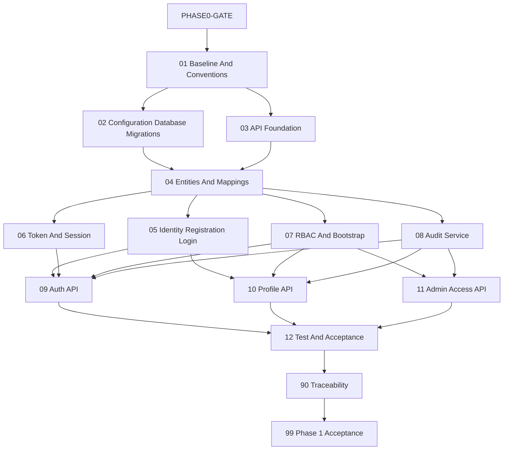

# Phase 1 MVP Foundation Instruction Package

## Status And Execution Gate

**Package status: Draft - Blocked by `PHASE0-GATE`.**

The Phase 0 instruction package exists, but all Phase 0 packets are `Not Started`; no Phase 0 artifacts, ADRs, cross-phase contract register, traceability approval, or Phase 0 approval record exists. This Phase 1 package may be reviewed as a draft, but no coding packet may execute until all of these exist and approve Phase 1 entry:

- `docs/implementation-guides/phase-0/artifacts/phase-0-approval-record.md`
- `docs/implementation-guides/phase-0/artifacts/cross-phase-contract-register.md`
- Applicable accepted ADRs under `docs/implementation-guides/phase-0/artifacts/adr/`
- Completed `docs/implementation-guides/phase-0/90-traceability-matrix.md`

When the gate passes, replace each packet status `Blocked - PHASE0-GATE` with `Not Started`. Do not infer approval from the existence of roadmap documents.

## Purpose

This package converts Phase 1 into small, dependency-aware vertical slices for a novice developer or AI coding agent. It establishes the secure .NET 10 foundation: configuration, persistence, Identity, tokens/sessions, access control, audit, API contracts, and tests.

Phase 1 must not implement cart, checkout, order, payment, inventory, shipping, returns, reviews, product experience, or AI/RAG behavior.

## Source Of Truth Order

1. Accepted Phase 0 ADRs.
2. Approved Phase 0 cross-phase contracts and approval record.
3. `ECommerce Platform Requirements Roadmap.md`.
4. `docs/roadmap/phase-1-mvp-foundation.md`.
5. Cross-cutting architecture/security documents.
6. This package.

If sources disagree, stop and request a Phase 0 contract/ADR review. A coding agent may not select the preferred interpretation.

## Observed Repository Baseline

These are observations for planning, not permanent decisions. Packet 01 must re-verify them:

- Solution: `ECommerceSolution.slnx` with API, Web, Core, Infrastructure, and Tests projects.
- Projects currently target `net10.0`.
- API references Core and Infrastructure; Infrastructure references Core; Web references Core; Tests reference all projects.
- Infrastructure currently references both SQLite and SQL Server EF providers; no default provider is approved.
- `EcommerceDbContext` and `AppIdentityDbContext` both exist as empty skeletons; their boundary is unresolved.
- `ApplicationUser`, `UserInfo`, `IUserService`, duplicate `UserService` skeletons, empty DbContexts, placeholder middleware, sample controllers, and placeholder tests exist.
- API and Web pipelines call authorization but do not yet configure authentication.
- Package versions are present, but every future packet must check installed .NET 10 compatibility and vulnerabilities before changing packages.
- The repository `.gitignore` contains `artifacts/`, so this package uses `evidence/` for completion records. Do not create ignored evidence and assume it is tracked.

## Planned Package Structure

```text
docs/implementation-guides/phase-1/
  README.md
  01-solution-baseline-and-conventions.md
  02-configuration-database-and-migrations.md
  03-api-foundation-errors-validation-and-logging.md
  04-identity-access-entities-and-mappings.md
  05-identity-registration-login-and-account-safety.md
  06-token-and-session-lifecycle.md
  07-rbac-permissions-and-bootstrap.md
  08-audit-service-and-sensitive-transactions.md
  09-auth-api-vertical-slices.md
  10-profile-api-vertical-slices.md
  11-admin-access-api-vertical-slices.md
  12-test-infrastructure-and-phase-acceptance.md
  90-traceability-matrix.md
  99-phase-1-acceptance.md
  evidence/                       created only while executing packets
```

## Packet Status Model

| Status | Meaning |
| --- | --- |
| `Blocked - PHASE0-GATE` | Phase 0 approval evidence is missing. No coding allowed. |
| `Not Started` | Gate passed; packet has not started. |
| `In Progress` | Work is active. |
| `Blocked` | A packet-specific decision/evidence is missing. |
| `Ready For Review` | Code, tests, evidence, and scope checks are complete. |
| `Approved` | Named human reviewer accepted the packet. |

## Dependency Graph



## Execution Order

| Order | Packet | Primary Outcome | Status |
| --- | --- | --- | --- |
| 1 | [Solution Baseline And Conventions](01-solution-baseline-and-conventions.md) | Verified SDK/projects/dependencies/conventions | Blocked - PHASE0-GATE |
| 2 | [Configuration, Database, And Migrations](02-configuration-database-and-migrations.md) | Approved local DB/DbContext/config/migration baseline | Blocked - PHASE0-GATE |
| 3 | [API Foundation](03-api-foundation-errors-validation-and-logging.md) | Problem Details, validation, exception, correlation/logging foundation | Blocked - PHASE0-GATE |
| 4 | [Identity/Access Entities And Mappings](04-identity-access-entities-and-mappings.md) | Entities, EF mappings, constraints, migration | Blocked - PHASE0-GATE |
| 5 | [Identity Registration/Login](05-identity-registration-login-and-account-safety.md) | Safe Identity account service | Blocked - PHASE0-GATE |
| 6 | [Token And Session Lifecycle](06-token-and-session-lifecycle.md) | JWT/refresh rotation/reuse/revocation | Blocked - PHASE0-GATE |
| 7 | [RBAC, Permissions, Bootstrap](07-rbac-permissions-and-bootstrap.md) | Policies/seeding/safe super-admin bootstrap | Blocked - PHASE0-GATE |
| 8 | [Audit Service](08-audit-service-and-sensitive-transactions.md) | Redacted mandatory audit behavior | Blocked - PHASE0-GATE |
| 9 | [Auth API Slices](09-auth-api-vertical-slices.md) | Register/login/refresh/logout APIs | Blocked - PHASE0-GATE |
| 10 | [Profile API Slices](10-profile-api-vertical-slices.md) | Current/update profile APIs | Blocked - PHASE0-GATE |
| 11 | [Admin Access API Slices](11-admin-access-api-vertical-slices.md) | User list/role/effective-permission APIs | Blocked - PHASE0-GATE |
| 12 | [Test Infrastructure And Acceptance](12-test-infrastructure-and-phase-acceptance.md) | Full regression/security/migration/demo gate | Blocked - PHASE0-GATE |
| 13 | [Traceability Matrix](90-traceability-matrix.md) | Requirement-to-evidence verification | Blocked - PHASE0-GATE |
| 14 | [Phase 1 Acceptance](99-phase-1-acceptance.md) | Human approval and Phase 2 entry decision | Blocked - PHASE0-GATE |

## Rules For Every Coding Packet

- Re-read its source documents and inspect current repository state before editing.
- Implement only the named packet; do not change unrelated files.
- Keep Core free of EF Core, ASP.NET Identity, JWT signing, database/provider, HTTP, and presentation dependencies.
- Put framework/provider implementations in Infrastructure and composition/pipeline wiring in API/Web.
- Check exact package compatibility against the installed SDK and official documentation at execution time; do not copy versions from this guide.
- Add tests in the same packet as behavior.
- Never log passwords, access/refresh tokens or hashes, cookies, authorization headers, reset codes, signing keys, connection strings, full personal data, or sensitive request bodies.
- Do not hardcode secrets or bootstrap credentials.
- Run build, tests, vulnerability review, diff, and scope checks before review.
- Do not delete/rewrite user work or broad-refactor the skeleton unless the packet explicitly approves replacement.
- Human review is mandatory for project references, packages, migrations, Identity/token security, role/permission changes, bootstrap, and mandatory-audit behavior.

## Shared Completion Evidence

Each executed packet creates `docs/implementation-guides/phase-1/evidence/NN-completion.md` containing:

- Commit/worktree reference and date.
- Files changed and why.
- Decisions/defaults used.
- Commands run and actual exit results.
- Tests added and result summary.
- Security/privacy checks.
- Migration/package review when applicable.
- `git diff --check`, `git diff --stat`, and scope review.
- Manual reviewer and decision.
- Known limitations and next packet.

Do not store secrets or raw sensitive logs in evidence.

## Shared Verification Commands

Future agents must first verify the correct solution/test commands from repository state. Expected baseline commands are:

```powershell
dotnet --info
dotnet restore ECommerceSolution.slnx
dotnet build ECommerceSolution.slnx --no-restore
dotnet test ECommerceSolution.slnx --no-build
dotnet list ECommerceSolution.slnx package --vulnerable --include-transitive
git diff --check
git diff --stat
git status --short
```

Do not claim a command passed unless it was run and its result recorded.

## Unresolved Phase 1 Decisions

| ID | Decision | Default/Rule | Required Before |
| --- | --- | --- | --- |
| `PHASE0-GATE` | Phase 0 contracts and approval are missing. | No Phase 1 coding. | Packet 01 |
| `P1-DB-001` | Local database provider. | Select one provider for primary local execution; keep provider detail in Infrastructure. | Packet 02 |
| `P1-DB-002` | One DbContext or separate Identity/application contexts in one database. | Existing two empty contexts are not approval. Decide with migration/transaction implications. | Packet 02 |
| `P1-AUTH-001` | Web cookie/API bearer boundary. | API bearer; Web cookie only when explicitly designed. | Packets 03, 06, 09 |
| `P1-AUTH-002` | Email confirmation required locally. | Mock/local optional; production requirement remains. | Packet 05 |
| `P1-AUTH-003` | Refresh-token client transport/storage. | Never localStorage guidance by assumption; approve API/browser handling. | Packet 06 |
| `P1-SEC-001` | Admin MFA timing. | Production gate unless product/security requires Phase 1. | Packet 07 |
| `P1-BOOT-001` | One-time super-admin bootstrap workflow. | User-secrets/env, idempotent, no hardcoded credentials/logging. | Packet 07 |
| `P1-AUDIT-001` | Mandatory audit and transaction behavior. | Sensitive security/admin writes fail safely if required audit cannot persist. | Packet 08 |

## Completion Rule

Phase 1 is complete only when `PHASE0-GATE` passed, Packets 01-12 and 90 are approved, Packet 99 records human approval, all tests and migrations are reproducible locally, and no Phase 2 feature leaked into the foundation.

