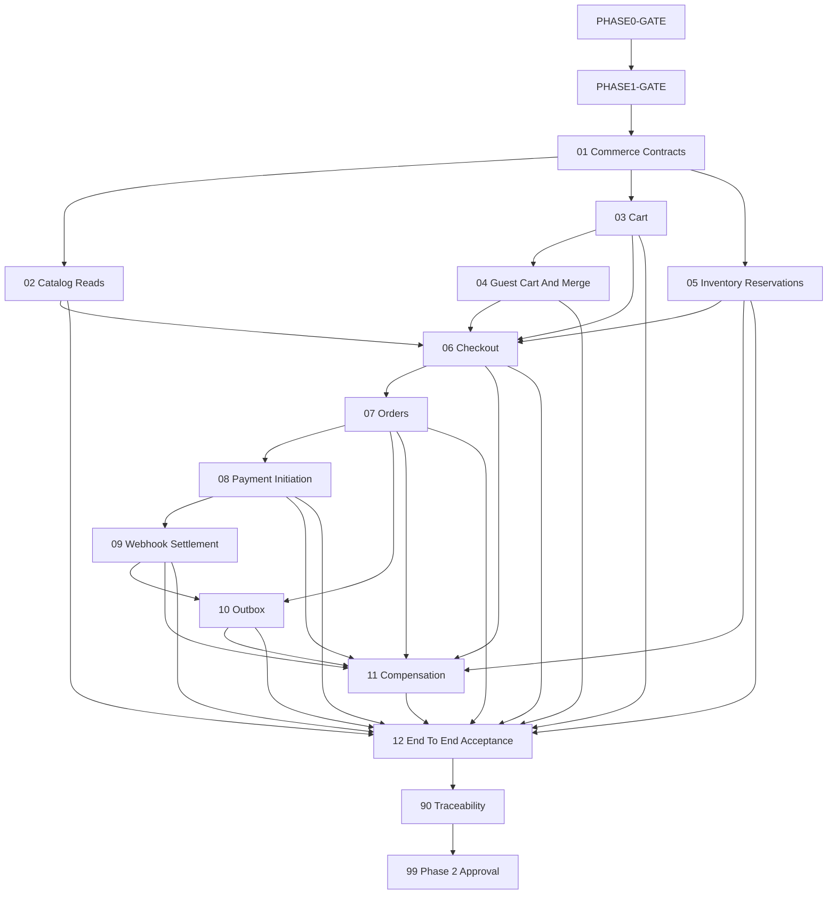

# Phase 2 MVP Commerce Flow Instruction Package

## Status And Hard Gates

**Package status: Draft - Blocked by `PHASE0-GATE` and `PHASE1-GATE`.**

No Phase 0 approval/contracts or Phase 1 evidence/approval currently exist. This package may be reviewed as planning, but no commerce coding packet may execute until these files exist and are human-approved:

- `docs/implementation-guides/phase-0/artifacts/phase-0-approval-record.md`
- `docs/implementation-guides/phase-0/artifacts/cross-phase-contract-register.md`
- `docs/implementation-guides/phase-1/evidence/99-phase-1-approval.md`
- Approved Phase 1 database, API, identity, audit, migration, and security evidence required by the packet

Every packet starts `Blocked - PHASE0/PHASE1-GATE`. After both gates pass, change it to `Not Started`; do not infer approval from roadmap or instruction documents.

## Purpose

This package converts the Phase 2 commerce design into small, dependency-safe .NET 10 modular-monolith implementation packets. It protects money, stock, customer ownership, payment callbacks, order history, and reliable follow-up work.

Phase 2 must never trust client-provided price, discount amount, shipping, tax, total, stock, payment status, or authorization context. It must never store card data or production payment credentials.

## Source Of Truth Order

1. Accepted Phase 0 ADRs and cross-phase contracts.
2. Approved Phase 1 implementation evidence/contracts.
3. `ECommerce Platform Requirements Roadmap.md`.
4. `docs/roadmap/phase-2-mvp-commerce-flow.md`.
5. Cross-cutting architecture/security documents.
6. This package.

Stop on conflict. A coding agent may not choose a preferred commerce interpretation.

## Observed Planning Baseline

- Current repository inspection found no Product, Cart, Inventory, Checkout, Order, Payment, Outbox, or commerce-idempotency implementation types.
- Phase 0 and Phase 1 packages are unexecuted and unapproved.
- The Phase 1 instruction package does not contain a catalog implementation packet, while Phase 2 depends on trusted Product/ProductVariant/price visibility data.
- Therefore `P2-CATALOG-001` must be resolved before Packet 02 coding: approve an existing catalog baseline, add a separately approved prerequisite remediation, or explicitly place the minimal source model in Phase 2 without changing ownership.
- This package uses `evidence/`, not `artifacts/`, because the repository ignore rules currently match directories named `artifacts`.

## Planned Package Structure

```text
docs/implementation-guides/phase-2/
  README.md
  01-commerce-contracts-states-and-idempotency.md
  02-catalog-browse-and-detail-reads.md
  03-cart-domain-persistence-and-api.md
  04-guest-cart-security-and-merge.md
  05-inventory-reservations-and-expiry.md
  06-checkout-session-pricing-and-address-snapshots.md
  07-orders-snapshots-history-and-ownership.md
  08-payment-abstraction-initiation-and-reconciliation.md
  09-payment-webhook-validation-and-settlement.md
  10-transactional-outbox-worker-and-notifications.md
  11-compensation-recovery-and-reconciliation.md
  12-end-to-end-commerce-acceptance.md
  90-traceability-matrix.md
  99-phase-2-acceptance.md
  evidence/                         created during packet execution only
```

## Status Model

| Status | Meaning |
| --- | --- |
| `Blocked - PHASE0/PHASE1-GATE` | Foundation approvals are missing; no coding allowed. |
| `Not Started` | Foundation approved; packet has not begun. |
| `Blocked` | Packet-specific business/security decision is missing. |
| `Pre-Code Approved` | High-risk design/transaction/idempotency review passed. |
| `In Progress` | Scoped coding/test work is active. |
| `Ready For Post-Test Review` | Required tests/evidence pass. |
| `Approved` | Named human reviewers accepted implementation and evidence. |

High-risk Packets 04-11 require both `Pre-Code Approved` and post-test human approval. Packets 05, 06, 08, 09, 10, and 11 require security plus commerce/data review.

## Dependency Graph



## Execution Order

| Order | Packet | Primary Outcome | Status |
| --- | --- | --- | --- |
| 1 | [Commerce Contracts](01-commerce-contracts-states-and-idempotency.md) | Money/status/error/event/idempotency baseline | Blocked - PHASE0/PHASE1-GATE |
| 2 | [Catalog Reads](02-catalog-browse-and-detail-reads.md) | Trusted visible product/variant/price queries | Blocked - PHASE0/PHASE1-GATE |
| 3 | [Cart](03-cart-domain-persistence-and-api.md) | Authenticated cart behavior/API | Blocked - PHASE0/PHASE1-GATE |
| 4 | [Guest Cart And Merge](04-guest-cart-security-and-merge.md) | Secure guest identity/expiry/merge | Blocked - PHASE0/PHASE1-GATE |
| 5 | [Inventory Reservations](05-inventory-reservations-and-expiry.md) | Overselling-safe reserve/release/confirm | Blocked - PHASE0/PHASE1-GATE |
| 6 | [Checkout](06-checkout-session-pricing-and-address-snapshots.md) | Trusted totals/address/reservation orchestration | Blocked - PHASE0/PHASE1-GATE |
| 7 | [Orders](07-orders-snapshots-history-and-ownership.md) | Pending order/snapshots/history APIs | Blocked - PHASE0/PHASE1-GATE |
| 8 | [Payment](08-payment-abstraction-initiation-and-reconciliation.md) | Deterministic mock hosted initiation/reconciliation | Blocked - PHASE0/PHASE1-GATE |
| 9 | [Webhook Settlement](09-payment-webhook-validation-and-settlement.md) | Signed replay-safe callback/settlement | Blocked - PHASE0/PHASE1-GATE |
| 10 | [Outbox](10-transactional-outbox-worker-and-notifications.md) | Transactional events/local worker/dead letter | Blocked - PHASE0/PHASE1-GATE |
| 11 | [Compensation And Recovery](11-compensation-recovery-and-reconciliation.md) | Partial-failure recovery/reconciliation | Blocked - PHASE0/PHASE1-GATE |
| 12 | [End-To-End Acceptance](12-end-to-end-commerce-acceptance.md) | Concurrency/security/failure/demo gate | Blocked - PHASE0/PHASE1-GATE |
| 13 | [Traceability](90-traceability-matrix.md) | Requirement-to-evidence proof | Blocked - PHASE0/PHASE1-GATE |
| 14 | [Phase 2 Acceptance](99-phase-2-acceptance.md) | Human Phase 3 entry decision | Blocked - PHASE0/PHASE1-GATE |

## Rules For Every Coding Packet

- Inspect current repository and approved earlier evidence before naming/editing files.
- Keep Core free of EF Core, HTTP, payment SDKs, hosted services, cryptographic provider code, and Infrastructure dependencies.
- Infrastructure owns persistence, provider adapters, cryptographic webhook verification, file/worker mechanisms, and clocks where appropriate.
- API remains thin and enforces approved auth/ownership/contracts.
- Recalculate every trusted commerce amount and stock decision server-side.
- Define transaction boundaries and idempotency owner before coding a write path.
- Use canonical Phase 1 Problem Details, correlation, authentication, authorization, audit, validation, and logging rules.
- Add unit, integration, API, security, concurrency, duplicate, and failure tests with each behavior.
- Do not add exact package versions without installed SDK/official compatibility/vulnerability review.
- Never log/store card data, payment/provider secrets, raw sensitive webhook payloads, auth tokens/cookies/headers, full addresses, or unnecessary PII.
- No paid AWS service, production credentials, refunds/returns, promotions/loyalty, multi-warehouse, AI/RAG, or unrelated refactor.
- Record actual commands/results in `evidence/NN-completion.md`; never claim tests ran when they did not.

## Idempotency Ownership Baseline

This is a planning default; Packet 01 must reconcile it with approved contracts:

| Command | Owner | Durable Uniqueness/Replay Source |
| --- | --- | --- |
| Guest cart merge | Cart | Customer + guest cart + merge operation/key |
| Checkout creation | Checkout | Customer + idempotency key + request fingerprint |
| Pending order creation | Orders | Unique checkout session and/or order command key |
| Payment initiation | Payments | Order + idempotency key + request fingerprint |
| Provider callback | Payments | Provider + provider event ID, signature/replay checks |
| Outbox handling | Outbox/consumer | Message/event ID plus handler receipt/idempotent effect |

Same key/same fingerprint returns the original outcome. Same key/different fingerprint returns conflict. Correlation ID is never an idempotency key.

## Blocking Commerce Decisions

| ID | Decision | Safe Default | Required Before |
| --- | --- | --- | --- |
| `PHASE0-GATE` | Approved architecture/data/API/security contracts. | No coding. | Packet 01 |
| `PHASE1-GATE` | Approved identity/database/API/audit/testing foundation. | No coding. | Packet 01 |
| `P2-CATALOG-001` | Trusted catalog source model/price/variant baseline. | Block Packet 02; remediate prerequisite explicitly. | Packet 02 |
| `P2-MONEY-001` | Primary currency/rounding/precision and mixed-currency rejection. | One currency per cart/checkout/order; no conversion. | Packet 01 |
| `P2-IDEMP-001` | Idempotency storage, scope, fingerprint, retention, and replay contract. | Owner-specific durable record/unique constraint; no sensitive body storage. | Packet 01 |
| `P2-GUEST-001` | Guest cart cookie/key format, lifetime, signing/hash, SameSite/CSRF behavior. | Server-issued high-entropy opaque value; stored hash; secure cookie where applicable. | Packet 04 |
| `P2-INV-001` | Reservation duration/retry/expiry worker/stock semantics. | Proposed 15 minutes; bounded concurrency retry. | Packet 05 |
| `P2-CHECKOUT-001` | Discount/shipping/tax Phase 2 behavior. | Server-side zero placeholders with explicit not-implemented status; reject unsupported discount. | Packet 06 |
| `P2-ORDER-001` | Order/payment failure/retry state transitions and order-number policy. | Pending order before payment; immutable snapshots. | Packet 07 |
| `P2-PAY-001` | Deterministic mock/sandbox provider contract and webhook signing scheme. | Local deterministic hosted mock; no real credentials/card data. | Packet 08 |
| `P2-SETTLE-001` | Atomic settlement transaction owner across Payment/Order/Inventory/Outbox. | One application orchestration using approved single database/transaction boundary. | Packet 09 |
| `P2-OUTBOX-001` | Retry/backoff/lease/dead-letter/consumer dedupe settings. | Bounded exponential backoff and manual dead-letter review. | Packet 10 |

## Completion Rule

Phase 2 is complete only when both foundation gates pass, Packets 01-12 and 90 are approved, all high-risk pre/post reviews are recorded, Packet 99 approves Phase 3 entry, and no client-controlled money/stock/payment truth or card data exists.

