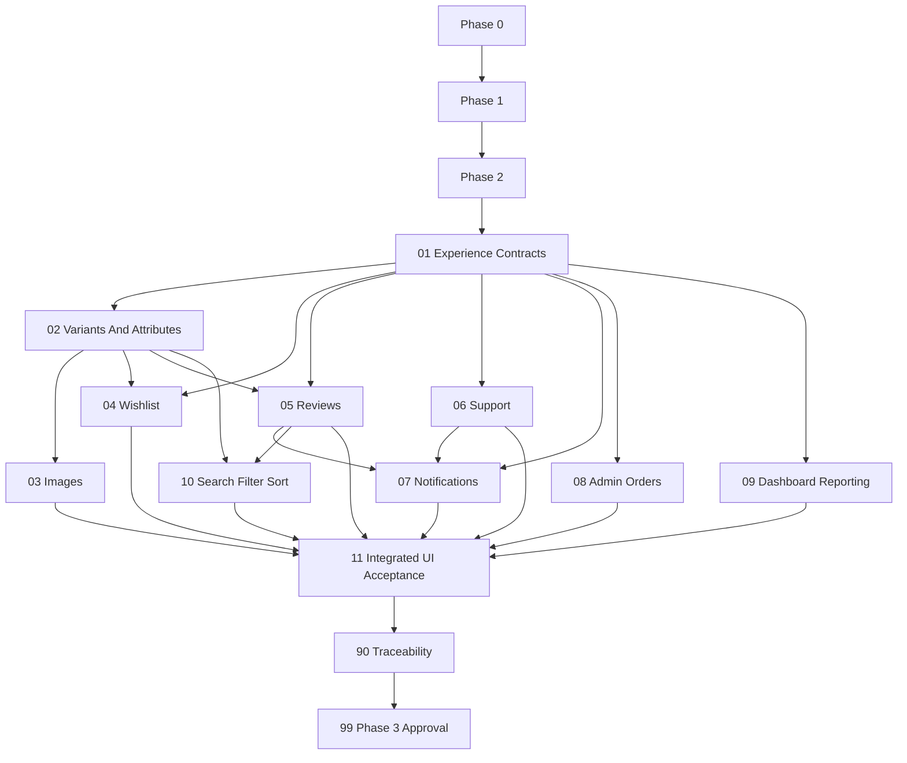

# Phase 3 MVP Experience Layer Instruction Package

## Status And Hard Gates

**Package status: Draft - Blocked by `PHASE0/PHASE1/PHASE2-GATE`.**

Phase 0, Phase 1, and Phase 2 approval evidence is missing. No Phase 3 coding packet may execute until these are human-approved:

- `docs/implementation-guides/phase-0/artifacts/phase-0-approval-record.md`
- `docs/implementation-guides/phase-0/artifacts/cross-phase-contract-register.md`
- `docs/implementation-guides/phase-1/evidence/99-phase-1-approval.md`
- `docs/implementation-guides/phase-2/evidence/99-phase-2-approval.md`

Every packet starts `Blocked - PHASE0/PHASE1/PHASE2-GATE`. Roadmaps and instruction files are not implementation approval.

## Purpose

This package converts Phase 3 into small, reviewable .NET 10 modular-monolith vertical slices for customer, admin, and support experiences. Every packet defines data ownership, permitted read-only consumption, API contracts, UI loading/empty/success/validation/error/forbidden states, tests, and evidence.

Phase 3 must not weaken Phase 1 identity/access/audit rules or Phase 2 catalog price, inventory reservation, checkout, order, payment, webhook, outbox, and compensation invariants.

## Technology And Architecture Baseline

- Target .NET 10, ASP.NET Core on .NET 10, an EF Core release verified as compatible with the installed .NET 10 SDK, and modern C# supported by that SDK.
- Preserve Onion Architecture and modular-monolith boundaries: Core is framework-neutral; Infrastructure implements approved Core interfaces; API and Web remain thin; Tests may reference the projects under test.
- Keep local/free-first adapters and tools. AWS services are future replacement targets only after architecture, security, and cost approval.
- Before each packet, inspect the actual repository, installed SDK, approved contracts, and migrations. Treat file areas and commands in this package as expected guidance, never as permission to fabricate repository state or package versions.

## Source Of Truth Order

1. Accepted Phase 0 ADRs/cross-phase contracts.
2. Approved Phase 1 and Phase 2 implementation evidence/contracts.
3. Main roadmap and Phase 3 roadmap.
4. Cross-cutting architecture/security documents.
5. This package.

Stop on conflict. Admin screens, reporting queries, and UI convenience never override domain services.

## Observed Planning Baseline

- No Phase 3 entity/service/API/UI implementation types currently exist.
- The Web project is the default MVC/Razor/Bootstrap shell with no approved Phase 3 design system or authenticated experience.
- Earlier implementation phases are unexecuted, so ProductVariant, Order, Inventory, Outbox, permissions, audit, and current-user contracts are not available yet.
- Product variant work must refine the approved Catalog model from Phase 2; it must not create a second variant/price source.
- This package uses `evidence/` because repository ignore rules currently match directories named `artifacts`.

## Planned Package Structure

```text
docs/implementation-guides/phase-3/
  README.md
  01-experience-contracts-permissions-and-ui-conventions.md
  02-product-variants-attributes-and-detail-experience.md
  03-product-image-storage-and-upload-safety.md
  04-wishlist-ownership-and-experience.md
  05-reviews-ratings-and-moderation.md
  06-support-tickets-messages-and-visibility.md
  07-notifications-outbox-and-delivery.md
  08-admin-order-management-experience.md
  09-dashboard-and-basic-reporting.md
  10-product-search-filter-and-sort-experience.md
  11-integrated-ui-security-and-accessibility-acceptance.md
  90-traceability-matrix.md
  99-phase-3-acceptance.md
  evidence/                         created during packet execution only
```

## Status Model

| Status | Meaning |
| --- | --- |
| `Blocked - PHASE0/PHASE1/PHASE2-GATE` | Prerequisite approvals are missing. |
| `Not Started` | Gates passed; no work begun. |
| `Blocked` | Packet-specific decision/evidence is missing. |
| `Pre-Code Approved` | Sensitive design/visibility/query/upload/moderation/order review passed. |
| `In Progress` | Scoped implementation is active. |
| `Ready For Post-Test Review` | Code/tests/evidence complete. |
| `Approved` | Named human reviewers accepted it. |

Packets 03, 05, 06, 08, and 09 require explicit pre-code and post-test human approval. Packet 02 requires commerce/catalog review because it touches sellable variant behavior.

## Dependency Graph



## Execution Order

| Order | Packet | Primary Outcome | Status |
| --- | --- | --- | --- |
| 1 | [Experience Contracts](01-experience-contracts-permissions-and-ui-conventions.md) | Statuses, permissions, ownership/read matrix, API/UI conventions | Blocked - PHASE0/PHASE1/PHASE2-GATE |
| 2 | [Variants And Attributes](02-product-variants-attributes-and-detail-experience.md) | Sellable options, admin/public API/UI | Blocked - PHASE0/PHASE1/PHASE2-GATE |
| 3 | [Images](03-product-image-storage-and-upload-safety.md) | Safe local product media lifecycle | Blocked - PHASE0/PHASE1/PHASE2-GATE |
| 4 | [Wishlist](04-wishlist-ownership-and-experience.md) | Private authenticated wishlist | Blocked - PHASE0/PHASE1/PHASE2-GATE |
| 5 | [Reviews](05-reviews-ratings-and-moderation.md) | Verified/moderated review lifecycle | Blocked - PHASE0/PHASE1/PHASE2-GATE |
| 6 | [Support](06-support-tickets-messages-and-visibility.md) | Assigned tickets/internal-note isolation | Blocked - PHASE0/PHASE1/PHASE2-GATE |
| 7 | [Notifications](07-notifications-outbox-and-delivery.md) | Recipient-owned in-app/mock delivery | Blocked - PHASE0/PHASE1/PHASE2-GATE |
| 8 | [Admin Orders](08-admin-order-management-experience.md) | Privileged read/transition UI using Phase 2 services | Blocked - PHASE0/PHASE1/PHASE2-GATE |
| 9 | [Dashboard And Reporting](09-dashboard-and-basic-reporting.md) | Aggregate bounded read models | Blocked - PHASE0/PHASE1/PHASE2-GATE |
| 10 | [Search/Filter/Sort](10-product-search-filter-and-sort-experience.md) | Keyword UX and Phase 4 handoff | Blocked - PHASE0/PHASE1/PHASE2-GATE |
| 11 | [Integrated Acceptance](11-integrated-ui-security-and-accessibility-acceptance.md) | UI/security/accessibility/demo regression | Blocked - PHASE0/PHASE1/PHASE2-GATE |
| 12 | [Traceability](90-traceability-matrix.md) | Requirement-to-evidence proof | Blocked - PHASE0/PHASE1/PHASE2-GATE |
| 13 | [Phase 3 Acceptance](99-phase-3-acceptance.md) | Human Phase 4 entry decision | Blocked - PHASE0/PHASE1/PHASE2-GATE |

## Progress Checklist

Update a checkbox only after the packet's acceptance criteria, evidence, and required human review pass. Execute each implementation packet as one focused coding session and one reviewable pull request; reopen the owning packet rather than hiding unfinished work in a later packet.

- [ ] Phase 0, Phase 1, and Phase 2 approval gates are present and accepted.
- [ ] Packet 01: experience contracts, permissions, ownership, and UI conventions.
- [ ] Packet 02: variants, attributes, and product-detail behavior.
- [ ] Packet 03: product images and upload safety, including both human reviews.
- [ ] Packet 04: authenticated wishlist.
- [ ] Packet 05: reviews and moderation, including both human reviews.
- [ ] Packet 06: support tickets and visibility, including both human reviews.
- [ ] Packet 07: notifications and Outbox delivery.
- [ ] Packet 08: admin order management, including both human reviews.
- [ ] Packet 09: dashboard and reporting, including both human reviews.
- [ ] Packet 10: keyword search/filter/sort and Phase 4 handoff.
- [ ] Packet 11: integrated security, accessibility, UI, and demo acceptance.
- [ ] Packet 90: traceability review.
- [ ] Packet 99: signed Phase 3 approval and Phase 4 entry decision.

## Shared Ownership Rule

Each packet must state:

- **Owns:** entities, rules, statuses, and writes controlled by the module.
- **Reads:** minimal projections obtained through approved application query interfaces.
- **Must not own:** source-of-truth fields/rules from Identity, Catalog, Inventory, Orders, Payments, or Outbox.

Read-only consumers cannot mutate another module's tables, duplicate its entities, or use a reporting/search projection for transactional truth.

## Shared API And UI Acceptance States

Every user-facing packet defines and tests:

| State | Requirement |
| --- | --- |
| Loading/processing | Stable layout, disabled duplicate submit where relevant, accessible status announcement. |
| Empty | Normal useful empty state, not exception; no misleading metrics/data. |
| Success | Clear result and next action; server remains source of truth. |
| Validation | Field-level accessible messages plus Problem Details API contract. |
| Unauthorized | Authentication flow without leaking resource existence. |
| Forbidden/not found | Permission/ownership-safe response and UI; use 404 when existence is sensitive. |
| Conflict/stale | Explain refresh/retry without overwriting concurrent changes. |
| Dependency failure | Safe unavailable/partial state; no internals or false success. |

Use existing MVC/Razor/Bootstrap conventions unless an approved UX ADR changes them. Meet keyboard, focus, labels, semantic HTML, contrast, error association, and reduced-motion expectations; target WCAG 2.2 AA for review.

## Rules For Every Coding Packet

- Inspect current repository and approved prior-phase evidence before editing.
- Keep Core framework-neutral; Infrastructure owns persistence/storage/provider adapters; API/Web are thin presentation layers.
- Enforce server-side authentication, permission, ownership, validation, audit, and legal transitions even when UI hides controls.
- Use Phase 1 Problem Details/correlation/redacted logging and Phase 2 idempotency/outbox/order/inventory/payment contracts.
- Add API and MVC/Razor UI tests/states with each behavior; do not defer all UI/security tests to Packet 11.
- Do not log full profiles, addresses, support/review bodies, files, tokens/cookies/headers, payment/order payloads, or sensitive request bodies.
- No paid AWS, AI/RAG, advanced analytics, live chat, returns/refunds, loyalty, campaigns, multi-warehouse, or unrelated refactor.
- Check package compatibility/vulnerabilities before any package change; do not copy versions from this guide.
- Record actual commands/results and human reviews in `evidence/NN-completion.md`.

## Blocking Decision Register

| ID | Decision | Safe Default | Required Before |
| --- | --- | --- | --- |
| `P3-GATES` | Phase 0-2 approvals/contracts absent. | No coding. | Packet 01 |
| `P3-CATALOG-001` | Approved Product/ProductVariant/price/inventory linkage baseline. | Refine one Catalog model; never duplicate. | Packet 02 |
| `P3-VARIANT-001` | Option-combination uniqueness, default variant, price adjustment/currency behavior. | Unique SKU/options; one default; same-currency server calculation. | Packet 02 |
| `P3-ACCESS-001` | SupportAgent and new permission codes/assignment/seed/invalidation. | Add permissions through Phase 1 change process; no separate staff identity. | Packet 01/06 |
| `P3-IMAGE-001` | Max size/dimensions/content decoder/storage root/public URL/physical cleanup. | JPG/JPEG/PNG/WebP, 5 MB, generated name, local storage outside source, soft delete. | Packet 03 |
| `P3-WISHLIST-001` | Product versus variant identity and unavailable display. | One private customer wishlist; product plus optional variant; retain unavailable. | Packet 04 |
| `P3-REVIEW-001` | Verified-buyer requirement, uniqueness, edit/remoderation, rate/length limits. | Verified paid/confirmed buyer; one active product/order review; moderation required. | Packet 05 |
| `P3-SUPPORT-001` | Assignment queue/permissions/internal-note policy/escalation/status transitions. | Assigned/authorized only; internal notes never customer-visible. | Packet 06 |
| `P3-NOTIFY-001` | Types/templates/dedupe/retention/retry and mock email scope. | In-app first; mock email; explicit recipient; outbox-driven. | Packet 07 |
| `P3-ORDER-001` | Admin-allowed Phase 2 transitions and required reasons/concurrency. | No total/payment edits; narrow allowlist only. | Packet 08 |
| `P3-REPORT-001` | Direct queries versus persisted read model, metrics/freshness/query budget. | Bounded direct aggregate queries first; explicit unavailable/stale state. | Packet 09 |
| `P3-SEARCH-001` | Keyword fields/ranking/filter facets/rating sort freshness. | Database keyword search, allowlists, no semantic claims. | Packet 10 |

## Completion Rule

Phase 3 is complete only when all prerequisite gates pass, Packets 01-11 and 90 are approved, sensitive packets have pre/post reviews, Packet 99 approves Phase 4 entry, all ownership/UI/security/accessibility tests pass, and no experience/read model bypasses Identity or Phase 2 commerce truth.
