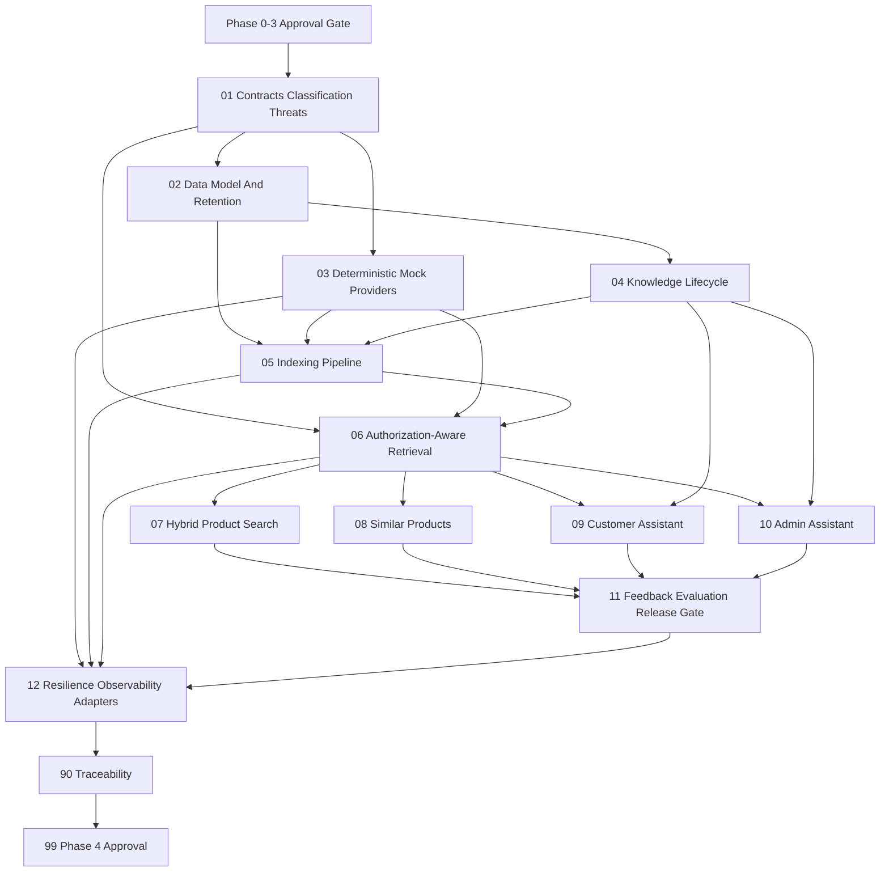

# Phase 4 AI-Enhanced MVP Instruction Package

## Status And Hard Gates

**Package status: Draft - Blocked by `PHASE0/PHASE1/PHASE2/PHASE3-GATE`.**

No Phase 4 coding packet may execute until these human-approved records exist:

- `docs/implementation-guides/phase-0/artifacts/phase-0-approval-record.md`
- `docs/implementation-guides/phase-0/artifacts/cross-phase-contract-register.md`
- `docs/implementation-guides/phase-1/evidence/99-phase-1-approval.md`
- `docs/implementation-guides/phase-2/evidence/99-phase-2-approval.md`
- `docs/implementation-guides/phase-3/evidence/99-phase-3-approval.md`

Every packet starts `Blocked - PHASE0/PHASE1/PHASE2/PHASE3-GATE`. Roadmaps and instruction files are planning inputs, not implementation approval.

Customer-facing semantic search, recommendations, or assistant behavior also requires `P4-CUSTOMER-ENABLEMENT-GATE`: approved adversarial evaluation, zero unauthorized-source exposure in the approved set, no unresolved high/critical finding, and named manual security/product approval.

## Purpose

This package converts Phase 4 into small, reviewable .NET 10 modular-monolith vertical slices for local, deterministic AI/RAG learning. It uses mock completion/embedding/vector providers and database keyword fallback first. Amazon Bedrock and Amazon OpenSearch remain future Infrastructure adapters after security, architecture, evaluation, and cost approval.

AI/Search owns derived indexes, retrieval decisions, conversation metadata, and evaluation evidence. It never owns Product, Inventory, Order, Payment, CustomerProfile, SupportTicket, policy truth, authorization, or business decisions.

## Technology And Architecture Baseline

- Target .NET 10, ASP.NET Core on .NET 10, an EF Core release verified against the installed .NET 10 SDK, and modern C# supported by that SDK.
- Preserve Onion Architecture and the modular monolith: Core defines framework-neutral contracts/rules; Infrastructure implements persistence/providers/workers; API/Web are thin; Tests reference approved projects.
- Inspect the actual repository, installed SDK, prior evidence, database provider, and migrations before every packet. Do not fabricate files, package versions, commands, or implementation status.
- Keep all runtime behavior local/free-first. Do not add provider SDKs, model downloads, external network calls, cloud resources, credentials, or paid services.

## Source Of Truth Order

1. Accepted Phase 0 ADRs and cross-phase contracts.
2. Approved Phase 1-3 implementation evidence and public/read contracts.
3. Main roadmap and Phase 4 roadmap.
4. `docs/ai-rag/rag-architecture.md` and cross-cutting architecture/security documents.
5. This package.

Stop on conflict. A prompt, UI, provider, or index must never override source-module visibility, authorization, or business truth.

## Observed Planning Baseline

- No Phase 4 AI/RAG types or implementations exist in Core, Infrastructure, API, Web, or Tests.
- The repository remains a skeleton; approved Identity, Catalog, Support, Outbox, permission, audit, and UI contracts are not implemented.
- All Phase 0-3 implementation packages remain unexecuted and their required approval evidence is absent.
- Phase 3 keyword-search and public Catalog handoff must exist before semantic search can compose it.
- This package uses `evidence/` because repository ignore rules match directories named `artifacts`.

## Planned Package Structure

```text
docs/implementation-guides/phase-4/
  README.md
  01-ai-rag-contracts-classification-and-threat-model.md
  02-ai-rag-data-model-retention-and-ef-plan.md
  03-deterministic-mock-providers-and-keyword-fallback.md
  04-knowledge-lifecycle-authorization-and-poisoning-defense.md
  05-indexing-chunking-versioning-and-local-worker.md
  06-authorization-aware-retrieval-grounding-and-citations.md
  07-hybrid-semantic-product-search.md
  08-similar-product-recommendations.md
  09-customer-support-assistant-and-escalation.md
  10-admin-knowledge-assistant-and-role-isolation.md
  11-feedback-evaluation-release-gates-and-disable-switch.md
  12-resilience-abuse-observability-and-future-adapters.md
  90-traceability-matrix.md
  99-phase-4-acceptance.md
  evidence/                         created during packet execution only
```

## Status Model

| Status | Meaning |
| --- | --- |
| `Blocked - PHASE0/PHASE1/PHASE2/PHASE3-GATE` | Prior implementation approvals are missing; no coding allowed. |
| `Not Started` | Prerequisites passed; no work begun. |
| `Blocked` | A packet-specific decision/evidence is missing. |
| `Pre-Code Approved` | Required architecture/security/data review passed. |
| `In Progress` | One scoped implementation session is active. |
| `Ready For Post-Test Review` | Code, tests, adversarial evaluation, evidence, and scope checks exist. |
| `Approved` | Named human reviewers accepted the packet. |
| `Enabled Locally` | Customer surface passed the separate enablement gate; this is not production approval. |

Packets 04-11 require security review. Packets 06-10 require explicit adversarial tests. Packets 07-09 require manual security approval before any customer-visible local enablement. Packet 10 requires privileged-access security approval. Packet 11 owns the release threshold and disable decision; Packet 12 proves failure/degradation behavior.

## Dependency Graph



## Execution Order And Progress

| Order | Packet | Primary Outcome | Status |
| --- | --- | --- | --- |
| 1 | [Contracts And Threat Model](01-ai-rag-contracts-classification-and-threat-model.md) | Use cases, provider contracts, classifications, visibility, threats | Blocked - PHASE0/PHASE1/PHASE2/PHASE3-GATE |
| 2 | [Data Model](02-ai-rag-data-model-retention-and-ef-plan.md) | Entities, constraints, retention, mapping/migration plan | Blocked - PHASE0/PHASE1/PHASE2/PHASE3-GATE |
| 3 | [Mock Providers](03-deterministic-mock-providers-and-keyword-fallback.md) | Deterministic completion/embedding/vector/keyword contracts | Blocked - PHASE0/PHASE1/PHASE2/PHASE3-GATE |
| 4 | [Knowledge Lifecycle](04-knowledge-lifecycle-authorization-and-poisoning-defense.md) | Approved-source workflow and poisoning controls | Blocked - PHASE0/PHASE1/PHASE2/PHASE3-GATE |
| 5 | [Indexing Pipeline](05-indexing-chunking-versioning-and-local-worker.md) | Atomic versioned product/knowledge indexing | Blocked - PHASE0/PHASE1/PHASE2/PHASE3-GATE |
| 6 | [Retrieval And Grounding](06-authorization-aware-retrieval-grounding-and-citations.md) | Pre-filtered retrieval, confidence, prompt, citations, logs | Blocked - PHASE0/PHASE1/PHASE2/PHASE3-GATE |
| 7 | [Hybrid Search](07-hybrid-semantic-product-search.md) | Safe public product semantic search | Blocked - PHASE0/PHASE1/PHASE2/PHASE3-GATE |
| 8 | [Similar Products](08-similar-product-recommendations.md) | Product-to-product recommendations only | Blocked - PHASE0/PHASE1/PHASE2/PHASE3-GATE |
| 9 | [Customer Assistant](09-customer-support-assistant-and-escalation.md) | Grounded public support answers/refusal/escalation | Blocked - PHASE0/PHASE1/PHASE2/PHASE3-GATE |
| 10 | [Admin Assistant](10-admin-knowledge-assistant-and-role-isolation.md) | Role-scoped internal knowledge with audit | Blocked - PHASE0/PHASE1/PHASE2/PHASE3-GATE |
| 11 | [Evaluation And Release Gate](11-feedback-evaluation-release-gates-and-disable-switch.md) | Golden/adversarial sets, metrics, thresholds, kill switch | Blocked - PHASE0/PHASE1/PHASE2/PHASE3-GATE |
| 12 | [Resilience And Future Adapters](12-resilience-abuse-observability-and-future-adapters.md) | Failure, rate, metrics, cost fields, adapter contracts | Blocked - PHASE0/PHASE1/PHASE2/PHASE3-GATE |
| 13 | [Traceability](90-traceability-matrix.md) | Requirement-to-evidence proof | Blocked - PHASE0/PHASE1/PHASE2/PHASE3-GATE |
| 14 | [Phase 4 Acceptance](99-phase-4-acceptance.md) | Human Phase 5 entry and enablement decision | Blocked - PHASE0/PHASE1/PHASE2/PHASE3-GATE |

- [ ] Phase 0-3 approval gate passed.
- [ ] Packets 01-06 approved.
- [ ] Packets 07-10 approved with adversarial evidence and required manual security reviews.
- [ ] Packet 11 evaluation thresholds and disable switch approved.
- [ ] Packet 12 resilience/abuse/observability/future-adapter evidence approved.
- [ ] Packet 90 traceability passed.
- [ ] Packet 99 signed Phase 4 and customer-enablement decisions.

## Non-Negotiable Safety Invariants

- Resolve identity, endpoint purpose, role, permissions, and allowed visibility before retrieval.
- Apply visibility, publication, active, deletion, expiry, source-version, and product-visibility filters in the backing query/provider request, not after broad retrieval.
- Only current, complete, approved/published source versions can reach prompt construction.
- User input and retrieved content are untrusted data, never instructions.
- Every factual assistant answer cites the source chunks that support it. Missing support, restricted topic, stale evidence, provider failure, or low confidence produces fallback.
- Never answer refund/payment/legal/policy-exception/account-security questions from model memory. The assistant may summarize an approved public policy with citations but cannot decide eligibility or outcome.
- No customer/order/payment/address/private support data is indexed in Phase 4. No assistant executes business actions.
- Conversations, retrieval logs, prompts, provider logs, and evidence exclude secrets, tokens, cookies, authorization headers, full sensitive prompts, private messages, payment/order payloads, and unnecessary PII.
- The disable switch and keyword/manual-support fallbacks fail closed and do not depend on the AI provider.

## Shared API And UI States

All user-facing packets define and test: loading/processing, empty/no-match, grounded success with citations, low-confidence fallback, restricted-topic refusal, validation, unauthenticated, forbidden/concealed, rate limited, stale source, provider/vector/index unavailable, disabled feature, conversation ownership failure, and retry/escalation. UI must preserve Phase 3 accessibility and responsive rules.

## Rules For Every Coding Packet

- Execute one packet as one focused AI session and one reviewable pull request.
- Add behavior tests in the same packet; do not postpone security/adversarial tests.
- Keep provider SDKs and vector/database mechanics out of Core.
- Reuse Phase 1 auth/permission/audit/Problem Details/correlation/rate conventions, Phase 2 Outbox, and Phase 3 Catalog/Support/UI contracts.
- Never trust client role, visibility, source IDs, confidence, ranking weight, prompt template, provider/model, or fallback decision.
- Record commands/results, test/evaluation dataset version, security review, diff/scope, and limitations in `evidence/NN-completion.md`.
- Do not connect paid services, download models, add external provider packages, or provision AWS.

## Blocking Decision Register

| ID | Decision | Safe Default Until Approved | Required Before |
| --- | --- | --- | --- |
| `P4-GATES` | Phase 0-3 approval evidence absent. | No Phase 4 coding. | Packet 01 |
| `P4-VIS-001` | Final visibility lattice and permission codes. | Roadmap Public/CustomerAuthenticated/SupportOnly/AdminOnly/SuperAdminOnly; deny unknown. | Packet 01 |
| `P4-DATA-001` | Local database/provider and vector representation. | Provider-neutral metadata; no provider-specific vector column until approved. | Packet 02 |
| `P4-RET-001` | Retention for conversations/messages/retrieval/provider logs/feedback/deleted sources. | Minimize; no automatic hard delete until legal/privacy owner approves periods. | Packet 02/11 |
| `P4-MOCK-001` | Deterministic embedding dimension/tokenization/similarity/completion fixtures. | Built-in deterministic mock only; no downloaded model. | Packet 03 |
| `P4-KB-001` | Approval separation and policy-content reviewers. | Author cannot self-approve; policy requires independent authorized reviewer. | Packet 04 |
| `P4-CHUNK-001` | Chunk boundaries, size/overlap, metadata, completeness. | Heading/paragraph boundaries; configurable bounded characters; tune by evaluation. | Packet 05 |
| `P4-CONFIDENCE-001` | Retrieval/answer confidence formula and thresholds. | Central configurable proposed roadmap bands; customer answers disabled until evaluated. | Packet 06/11 |
| `P4-CITATION-001` | Public citation display and source navigation. | Return stable IDs plus approved public title/section; never expose internal IDs/content publicly. | Packet 06/09 |
| `P4-SEARCH-001` | Hybrid merge/ranking weights, availability, pagination. | Server-owned deterministic ranking; hidden/draft deleted; unavailable clearly excluded or labelled by approved Catalog rule. | Packet 07 |
| `P4-RECO-001` | Similarity weights and fallback source. | Same-category public deterministic fallback or empty; no personal popularity/profile data. | Packet 08 |
| `P4-ASSIST-001` | Anonymous assistant and ticket-escalation UX. | Local authenticated testing first; no private context; suggest approved ticket route only. | Packet 09 |
| `P4-ADMIN-001` | Assistant permissions, role hierarchy, retrieval-log access. | Explicit permissions; deny unknown/ambiguous role; mandatory audit. | Packet 10 |
| `P4-EVAL-001` | Recall/grounding/fallback/latency release thresholds. | Zero unauthorized disclosure/forbidden decisions/injection success; other numeric targets require human approval. | Packet 11 |
| `P4-RATE-001` | Anonymous/user/admin/indexing limits and windows. | Conservative local limits; no customer enablement until abuse review. | Packet 12 |
| `P4-AWS-001` | Bedrock/OpenSearch models, regions, index, credentials, cost. | No implementation or package; contract notes only. | Future approval after Phase 5 |

## Completion Rule

Phase 4 is complete only when prior gates pass, Packets 01-12 and 90 are approved, Packet 99 records named human approval, evaluation/adversarial thresholds pass, customer-facing enablement is explicitly approved or explicitly remains disabled, and no provider/index/assistant bypasses source ownership, authorization, publication, grounding, or privacy rules.
