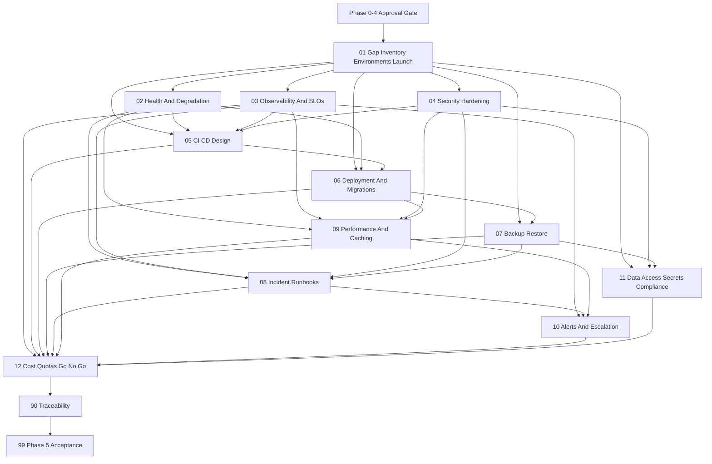

# Phase 5 Production Readiness Instruction Package

## Status And Hard Gates

**Package status: Draft - Blocked by `PHASE0/PHASE1/PHASE2/PHASE3/PHASE4-GATE`.**

No Phase 5 implementation or readiness claim may execute until these human-approved records exist:

- `docs/implementation-guides/phase-0/artifacts/phase-0-approval-record.md`
- `docs/implementation-guides/phase-0/artifacts/cross-phase-contract-register.md`
- `docs/implementation-guides/phase-1/evidence/99-phase-1-approval.md`
- `docs/implementation-guides/phase-2/evidence/99-phase-2-approval.md`
- `docs/implementation-guides/phase-3/evidence/99-phase-3-approval.md`
- `docs/implementation-guides/phase-4/evidence/99-phase-4-approval.md`

Every packet starts `Blocked - PHASE0/PHASE1/PHASE2/PHASE3/PHASE4-GATE`. Documentation can approve a design, but it cannot prove a local test, staging deployment, production control, restore, incident drill, or go-live happened.

Production release requires a separate `P5-GO-LIVE-GATE` signed by named business, engineering, security, operations, database, payment, privacy, and release authorities after staging evidence exists. No packet provisions AWS or implies this gate has passed.

## Purpose

This package converts Phase 5 into small, reviewable production-readiness work packets for the .NET 10 modular monolith. It separates local verification from staging readiness and future AWS execution while preserving Phase 1-4 identity, commerce, experience, and AI safety invariants.

Phase 5 adds operational controls and evidence, not major business features. ECS Fargate, RDS, S3, CloudFront, WAF, SQS, EventBridge, CloudWatch, Secrets Manager, IAM, AWS Backup, Bedrock, and OpenSearch remain future targets after architecture, security, cost, account, and go-live approval.

## Technology And Architecture Baseline

- Target .NET 10, ASP.NET Core on .NET 10, an EF Core version verified against the installed .NET 10 SDK, and modern C# supported by that SDK.
- Preserve Onion Architecture and the modular monolith. Core owns business rules/contracts; Infrastructure owns providers/persistence; API/Web/worker are deployment surfaces; Tests verify behavior.
- Inspect repository, installed tools, approved contracts, environment, and current evidence before every packet. Do not fabricate files, package versions, commands, environments, owners, measurements, or approvals.
- Use local/free-first verification. No workflow/deployment code, cloud resource, secret, credential, production URL, or paid service is authorized by this package.

## Source Of Truth Order

1. Approved Phase 0 ADRs/cross-phase contracts.
2. Approved Phase 1-4 implementation evidence and security/operational decisions.
3. Main roadmap and Phase 5 roadmap.
4. Cross-cutting system/security/RAG architecture.
5. This package.

Stop on conflict. Operational convenience never overrides auth, authorization, payment/webhook, inventory/order, upload, audit, AI retrieval, privacy, or source-of-truth rules.

## Observed Planning Baseline

- No Phase 0-4 implementation approval records exist; earlier instruction packages remain unexecuted drafts.
- The application is still a skeleton. Web has basic HSTS wiring, but no approved Phase 5 health, observability, rate-limit, security-header, deployment, backup, or runbook implementation exists.
- No staging or production environment, CI/CD platform, production database, AWS account/region, alert channel, on-call roster, or go-live authority is approved.
- This package uses `evidence/` because repository ignore rules match directories named `artifacts`.

## Evidence Tiers

Every packet must maintain these tiers separately:

| Tier | Meaning | Minimum Proof | Prohibited Claim |
| --- | --- | --- | --- |
| `Design Evidence` | Reviewed intended contract, owner, risk, diagram, checklist, and acceptance criteria. | Versioned Markdown/ADR, named reviewers, open decisions resolved. | Does not mean behavior exists. |
| `Local Verification Evidence` | Behavior or drill executed with local/free tools and synthetic data. | Exact environment/commands/results/tests/timings/log scans and reviewer. | Does not mean staging-ready. |
| `Staging Evidence` | Approved release candidate verified in a production-like isolated environment. | Artifact version, configuration class, migration/smoke/load/rollback/restore/security results and owners. | Cannot be created before staging exists. |
| `Production Approval Evidence` | Named authorities accepted residual risk and authorized a specific production action/version/window. | Signed change/go-live record, backup/rollback/monitoring/on-call/access/cost evidence. | Documentation alone can never satisfy it. |

Use status `Not Applicable - reason and approver` only when the owning reviewer accepts why a tier does not apply. `Not run`, `planned`, and `documented` are not passes.

## Planned Package Structure

```text
docs/implementation-guides/phase-5/
  README.md
  01-production-gap-workload-environments-and-launch-criteria.md
  02-health-readiness-liveness-and-degradation.md
  03-observability-slos-dashboards-and-retention.md
  04-security-hardening-scanning-and-approval-gates.md
  05-cicd-design-quality-gates-and-rollback.md
  06-deployment-topology-migrations-media-and-aws-mapping.md
  07-backup-restore-rto-rpo-and-drills.md
  08-incident-response-runbooks-and-command.md
  09-performance-load-capacity-and-caching.md
  10-monitoring-alert-catalog-and-escalation.md
  11-data-protection-access-secrets-and-compliance-evidence.md
  12-cost-quotas-launch-readiness-and-go-no-go.md
  90-traceability-matrix.md
  99-phase-5-acceptance.md
  evidence/                         created during packet execution only
```

## Status Model

| Status | Meaning |
| --- | --- |
| `Blocked - PHASE0/PHASE1/PHASE2/PHASE3/PHASE4-GATE` | Prior approvals absent; no implementation/readiness work. |
| `Not Started` | Prerequisite gate passed; packet not begun. |
| `Blocked` | Required decision, owner, environment, or evidence absent. |
| `Design Approved` | Design evidence accepted; no implementation claim. |
| `Local Verified` | Approved local evidence passed. |
| `Staging Verified` | Approved production-like staging evidence passed. |
| `Ready For Production Review` | All required evidence exists for go-live review. |
| `Production Approved` | Named authorities approved one version/action/window. |

## Dependency Graph



## Execution Order And Progress

| Order | Packet | Primary Outcome | Status |
| --- | --- | --- | --- |
| 1 | [Gap Assessment](01-production-gap-workload-environments-and-launch-criteria.md) | Workloads, owners, environment/config matrix, launch criteria | Blocked - PHASE0/PHASE1/PHASE2/PHASE3/PHASE4-GATE |
| 2 | [Health And Degradation](02-health-readiness-liveness-and-degradation.md) | Safe liveness/readiness/dependency behavior | Blocked - PHASE0/PHASE1/PHASE2/PHASE3/PHASE4-GATE |
| 3 | [Observability And SLOs](03-observability-slos-dashboards-and-retention.md) | Logs/metrics/traces/audit/retention/SLIs/SLOs | Blocked - PHASE0/PHASE1/PHASE2/PHASE3/PHASE4-GATE |
| 4 | [Security Hardening](04-security-hardening-scanning-and-approval-gates.md) | Web/auth/rate/upload/scan/OWASP controls | Blocked - PHASE0/PHASE1/PHASE2/PHASE3/PHASE4-GATE |
| 5 | [CI/CD Design](05-cicd-design-quality-gates-and-rollback.md) | Platform-neutral pipeline and release gates, no workflow code | Blocked - PHASE0/PHASE1/PHASE2/PHASE3/PHASE4-GATE |
| 6 | [Deployment And Migrations](06-deployment-topology-migrations-media-and-aws-mapping.md) | Web/API/worker topology, safe migration/rollout/rollback | Blocked - PHASE0/PHASE1/PHASE2/PHASE3/PHASE4-GATE |
| 7 | [Backup And Restore](07-backup-restore-rto-rpo-and-drills.md) | Backup inventory, RTO/RPO, local/staging restore proof | Blocked - PHASE0/PHASE1/PHASE2/PHASE3/PHASE4-GATE |
| 8 | [Incident Response](08-incident-response-runbooks-and-command.md) | Roles/severity/comms and complete tested runbooks | Blocked - PHASE0/PHASE1/PHASE2/PHASE3/PHASE4-GATE |
| 9 | [Performance And Caching](09-performance-load-capacity-and-caching.md) | Budgets/load tests/capacity/query/cache rules | Blocked - PHASE0/PHASE1/PHASE2/PHASE3/PHASE4-GATE |
| 10 | [Alerts And Escalation](10-monitoring-alert-catalog-and-escalation.md) | Actionable owned alert catalog and tests | Blocked - PHASE0/PHASE1/PHASE2/PHASE3/PHASE4-GATE |
| 11 | [Data, Access, Secrets, Compliance](11-data-protection-access-secrets-and-compliance-evidence.md) | PII/retention/deletion/access/audit/rotation controls | Blocked - PHASE0/PHASE1/PHASE2/PHASE3/PHASE4-GATE |
| 12 | [Cost, Quotas, And Go/No-Go](12-cost-quotas-launch-readiness-and-go-no-go.md) | Estimate/quotas/budgets/launch recommendation | Blocked - PHASE0/PHASE1/PHASE2/PHASE3/PHASE4-GATE |
| 13 | [Traceability](90-traceability-matrix.md) | Requirement-to-evidence proof | Blocked - PHASE0/PHASE1/PHASE2/PHASE3/PHASE4-GATE |
| 14 | [Phase 5 Acceptance](99-phase-5-acceptance.md) | Human production-readiness and go-live decision | Blocked - PHASE0/PHASE1/PHASE2/PHASE3/PHASE4-GATE |

- [ ] Phase 0-4 approvals exist and Phase 5 entry is signed.
- [ ] Packet 01: workload, owner, environment, configuration and launch baseline.
- [ ] Packet 02: health, readiness, liveness and degradation.
- [ ] Packet 03: logs, correlation, metrics, traces, audit, SLOs and retention.
- [ ] Packet 04: security hardening, rates, upload and scan gates.
- [ ] Packet 05: CI/CD and immutable release design, with no workflow code.
- [ ] Packet 06: topology, migrations, media, flags and rollout design.
- [ ] Packet 07: backup/restore design and witnessed required drills.
- [ ] Packet 08: incident command, complete runbooks and required drills.
- [ ] Packet 09: performance/capacity/cache design and tests.
- [ ] Packet 10: alert catalog, escalation and alert tests.
- [ ] Packet 11: PII, retention/deletion, access, audit, secrets and IAM design.
- [ ] Packet 12: cost/quota/readiness evidence and bounded recommendation.
- [ ] Packet 90: tier-correct traceability complete.
- [ ] Packet 99: explicit design/local/staging/production decisions signed.

## Manual Approval Matrix

| Risk | Required Human Approval |
| --- | --- |
| CI/CD and branch/release gates | Delivery/release, security, operations owners before workflow implementation or change. |
| EF migrations | Database and module owners before generation acceptance, staging apply, or production execution. |
| Secrets and rotation | Security and service owner; never expose values in evidence. |
| IAM | Security/cloud owner and service owner; least-privilege review before provisioning. |
| Rate limits | Security plus affected Auth/Commerce/Payment/Upload/Search/AI owner after measured tests. |
| Payment behavior | Payment and security owners; no readiness task changes webhook/settlement semantics silently. |
| Restore drills | Database/media/module/operations owners witness and sign actual recovery evidence. |
| Incident procedures | Incident commander, security, operations, module owners approve and participate in tabletop/drill. |
| Go-live | Business, product, engineering, security, operations, database, payment, privacy, cost, and release authorities. |

## Rules For Every Packet

- Execute one packet as one focused session and reviewable pull request/document review.
- Label every result by evidence tier. Never copy a design checkbox into local/staging/production evidence.
- Use synthetic data locally/staging unless masked production data has explicit privacy/security approval.
- Add tests/drills with behavior; record exact tool/environment/version/commands/results/owners.
- Preserve Phase 1-4 security and transaction contracts. Health, metrics, load tests, flags, and operations cannot bypass them.
- Never log or place in evidence passwords, tokens, cookies, authorization headers, secrets, payment payloads, full PII, private support text, AI prompts, internal URLs, or production data.
- No workflow/deployment code, AWS resource, account action, credential, secret, paid service, production migration, or go-live action is authorized now.

## Blocking Decision Register

| ID | Decision | Safe Default Until Approved | Required Before |
| --- | --- | --- | --- |
| `P5-GATES` | Phase 0-4 approvals absent. | No Phase 5 implementation/readiness claim. | Packet 01 |
| `P5-OWNERS-001` | Business/release/ops/security/DB/payment/commerce/media/AI/privacy/cost/on-call owners. | Block launch; named roles cannot be `TBD`. | Packet 01 |
| `P5-ENV-001` | Environment topology/data/access/promotion and staging fidelity. | Isolated local/dev/staging/prod; synthetic lower data. | Packet 01 |
| `P5-DB-001` | Production database engine/version/HA and local test parity. | Provider-neutral; no production migration plan. | Packets 01/06/07 |
| `P5-HEALTH-001` | Liveness/readiness/startup checks and dependency degradation. | Liveness process-only; readiness critical dependencies only; no secrets. | Packet 02 |
| `P5-SLO-001` | Critical journeys, SLI/SLO/error budgets, support hours. | Candidate roadmap targets only; not approved SLOs. | Packet 03/09 |
| `P5-LOG-001` | Log/trace/audit retention, redaction, sampling and access. | Minimize, bounded local retention, no sensitive payloads. | Packet 03/11 |
| `P5-SEC-001` | Admin MFA, session/cookie/token, CSP/headers/CORS/CSRF, upload scan compensations. | Production blocked without MFA or signed compensation. | Packet 04 |
| `P5-RATE-001` | Endpoint limits/windows/keys/response and trusted proxy rules. | Conservative local proposals; no production values without load/security review. | Packets 04/09 |
| `P5-CICD-001` | CI/CD platform, branch model, artifact registry/signing/SBOM/retention. | Platform-neutral design; no workflow code. | Packet 05 |
| `P5-MIG-001` | Migration owner, lock/backfill/expand-contract/forward-fix/maintenance rules. | No startup auto-migration; block production. | Packet 06 |
| `P5-DEPLOY-001` | API/Web/worker topology, rollout, feature flag, rollback window. | Staging design only; no AWS deployment. | Packet 06 |
| `P5-BACKUP-001` | Assets, RTO/RPO, backup frequency/retention/encryption/region and restore authority. | Proposed 4h RTO/1h RPO only; no production claim. | Packet 07 |
| `P5-INCIDENT-001` | Severity, incident commander/on-call, communication/legal escalation. | Block staging/go-live drills until named. | Packet 08 |
| `P5-PERF-001` | Workload model, budgets, tool, hardware, data size, concurrency/capacity margin. | Roadmap targets are candidates; measure locally/staging. | Packet 09 |
| `P5-ALERT-001` | Channels, thresholds, pages vs tickets, escalation/maintenance windows. | No production readiness until every critical alert has owner/test. | Packet 10 |
| `P5-PRIVACY-001` | Jurisdiction, retention/deletion/legal hold/data subject request/compliance owner. | Minimize and block irreversible deletion policy. | Packet 11 |
| `P5-COST-001` | Region/traffic/storage/log/backup/AI assumptions, budgets, approvers. | Worksheet only; no provisioning. | Packet 12 |
| `P5-AWS-001` | Accounts/region/network/domain/certificates/IAM/service quotas. | Future mapping only; no resource/IAM policy code. | Packets 06/12 |
| `P5-GO-LIVE-GATE` | Launch authority/version/window/residual risks. | No production action. | Packet 99 |

## Completion Rule

Phase 5 planning is complete only when Packets 01-12 and 90 have approved design evidence and Packet 99 records that decision. Production readiness requires required local and staging evidence as well. Production go-live remains blocked until all manual gates, restore/incident/rollback drills, monitoring/on-call/access/cost controls, and signed `P5-GO-LIVE-GATE` exist for one immutable release.
