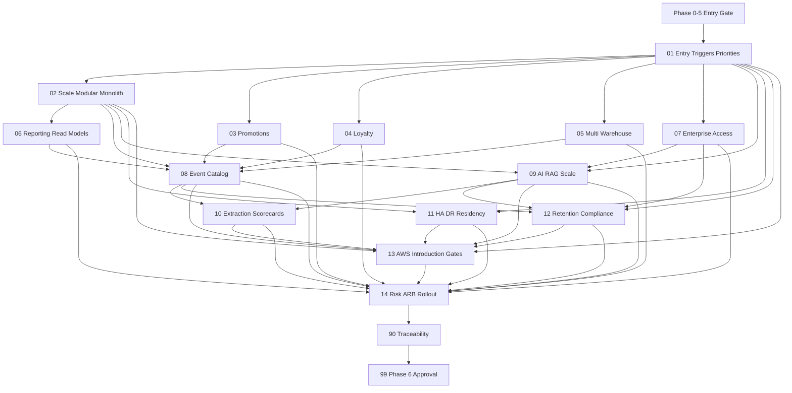

# Phase 6 Scale And Enterprise Instruction Package

## Status And Hard Gates

**Package status: Draft - Blocked by `PHASE0/PHASE1/PHASE2/PHASE3/PHASE4/PHASE5-GATE`.**

No Phase 6 planning decision may authorize implementation until these human-approved records exist:

- `docs/implementation-guides/phase-0/artifacts/phase-0-approval-record.md`
- `docs/implementation-guides/phase-0/artifacts/cross-phase-contract-register.md`
- `docs/implementation-guides/phase-1/evidence/99-phase-1-approval.md`
- `docs/implementation-guides/phase-2/evidence/99-phase-2-approval.md`
- `docs/implementation-guides/phase-3/evidence/99-phase-3-approval.md`
- `docs/implementation-guides/phase-4/evidence/99-phase-4-approval.md`
- `docs/implementation-guides/phase-5/evidence/99-phase-5-approval.md`

Every packet starts `Blocked - PHASE0/PHASE1/PHASE2/PHASE3/PHASE4/PHASE5-GATE`. Phase 5 must show stable production controls and measured workload behavior before enterprise expansion starts. Documentation does not prove stability, traffic, team ownership, budget, or operational readiness.

No microservice, multi-region write path, paid AWS service, distributed transaction, external queue, cache-as-truth, or data warehouse is authorized by this package. A service implementation prompt can exist only after a separate approved extraction ADR; until then every candidate decision is **Remain in the modular monolith**.

## Purpose

This package converts Phase 6 into small, evidence-driven planning packets for enterprise evolution of the .NET 10 modular monolith. Each expansion requires stable MVP/Phase 5 controls, measured need, named product/module/data/operations owner, cost/security review, compatibility and migration plan, phased rollout, rollback/forward-fix, and explicit human approval.

Enterprise growth is evolutionary: improve boundaries, queries, read models, workers, outbox, safe caching, horizontal scaling, access governance and operational evidence before considering extraction.

## Technology And Architecture Baseline

- Target .NET 10, ASP.NET Core on .NET 10, an EF Core version verified against the installed .NET 10 SDK, and modern C# supported by that SDK.
- Preserve Onion Architecture and the modular monolith as the default deployment/data consistency model.
- Keep Core free of EF/provider/cloud/messaging SDKs. Infrastructure owns adapters; source modules own data and event meaning.
- Inspect actual repository, approved evidence, production measurements, installed tools and current organization before every packet. Never fabricate traffic, cost, team, file, package, environment or approval state.
- Keep work local/free-first and documentation-only now. Future AWS services are optional targets after trigger, cost, quota, security, operations and architecture approval.

## Source Of Truth Order

1. Approved Phase 0 ADRs/cross-phase contracts.
2. Approved Phase 1-5 implementation/production evidence and residual-risk decisions.
3. Main roadmap and Phase 6 roadmap.
4. Cross-cutting architecture/security/RAG documents.
5. This package.

Stop on conflict. Enterprise convenience cannot override server-side pricing, inventory reservation, payment/webhook, order snapshots/transitions, authorization, audit, privacy, AI grounding, backup, incident, or production controls.

## Observed Planning Baseline

- No Phase 0-5 approval records or production measurements exist; earlier packages remain unexecuted drafts.
- No Promotion, Loyalty, Warehouse, enterprise event/read-model, extraction or multi-region implementation exists.
- No dedicated enterprise teams/on-call, production database/AWS account, service quotas, cost baseline, data jurisdiction or architecture review board is approved.
- This package uses `evidence/` because repository ignore rules match directories named `artifacts`.

## Enterprise Evidence Model

| Evidence Class | Required Proof | What It Cannot Prove |
| --- | --- | --- |
| `Entry Evidence` | Phase 5 production controls, stable release history, SLO/error/incident/capacity/cost baseline, named owners. | A roadmap or design document is not entry evidence. |
| `Measured Need Evidence` | Repeated quantified bottleneck/business requirement with baseline, impact, trend, threshold and owner. | Preference, forecast alone or "module feels large." |
| `Design Evidence` | Approved ownership/data/API/event/security/privacy/cost/migration/rollout/rollback design and tests. | Does not authorize implementation. |
| `Monolith-First Evidence` | Implemented/tested module or scaling optimization inside monolith, production measurement and residual limitation. | Local benchmark alone does not justify extraction. |
| `Extraction/Cloud Evidence` | Approved scorecard/ADR, dedicated team/on-call, independent scale/deploy need, contract maturity, cost/quotas, strangler/fallback. | Never inferred; absent means remain in monolith/local adapter. |

Each packet records evidence state separately. `Planned`, `proposed`, and `documented` are not `measured` or `approved`.

## Planned Package Structure

```text
docs/implementation-guides/phase-6/
  README.md
  01-enterprise-entry-triggers-priorities-and-anti-overengineering.md
  02-modular-monolith-scaling-and-compatibility.md
  03-promotions-campaigns-and-coupons.md
  04-loyalty-ledger-rewards-and-reconciliation.md
  05-multi-warehouse-inventory-allocation-and-recovery.md
  06-reporting-analytics-read-models-and-exports.md
  07-enterprise-rbac-approvals-and-access-governance.md
  08-integration-event-catalog-and-outbox-evolution.md
  09-ai-rag-scale-evaluation-and-service-criteria.md
  10-module-extraction-scorecards-and-strangler-plans.md
  11-single-region-ha-active-passive-and-residency.md
  12-retention-compliance-legal-holds-and-evidence.md
  13-future-aws-service-introduction-gates.md
  14-enterprise-risk-arb-rollout-and-acceptance-readiness.md
  90-traceability-matrix.md
  99-phase-6-acceptance.md
  evidence/                         created during packet execution only
```

## Status Model

| Status | Meaning |
| --- | --- |
| `Blocked - PHASE0/PHASE1/PHASE2/PHASE3/PHASE4/PHASE5-GATE` | Stable MVP/production evidence absent; no execution. |
| `Not Started` | Entry gate passed; planning not begun. |
| `Blocked` | Measured need, owner, contract, cost, security, migration or rollback evidence absent. |
| `Planning Approved` | Design/decision accepted; no implementation authority unless prompt says so. |
| `Monolith Implementation Approved` | Named module slice may implement in monolith under earlier controls. |
| `Production Measured` | Monolith-first result measured under approved production controls. |
| `Extraction ADR Required` | Scorecard suggests review; no service code allowed. |
| `Remain In Monolith` | Default or reviewed outcome. |

## Dependency Graph



## Execution Order And Progress

| Order | Packet | Primary Outcome | Status |
| --- | --- | --- | --- |
| 1 | [Enterprise Entry](01-enterprise-entry-triggers-priorities-and-anti-overengineering.md) | Stable entry, scale triggers, ownership/capacity/priorities | Blocked - PHASE0/PHASE1/PHASE2/PHASE3/PHASE4/PHASE5-GATE |
| 2 | [Monolith Scaling](02-modular-monolith-scaling-and-compatibility.md) | Evidence-first indexes/read models/workers/cache/scale/compatibility | Blocked - PHASE0/PHASE1/PHASE2/PHASE3/PHASE4/PHASE5-GATE |
| 3 | [Promotions](03-promotions-campaigns-and-coupons.md) | Server-side promotion/coupon module plan | Blocked - PHASE0/PHASE1/PHASE2/PHASE3/PHASE4/PHASE5-GATE |
| 4 | [Loyalty](04-loyalty-ledger-rewards-and-reconciliation.md) | Auditable points/reward ledger plan | Blocked - PHASE0/PHASE1/PHASE2/PHASE3/PHASE4/PHASE5-GATE |
| 5 | [Multi-Warehouse](05-multi-warehouse-inventory-allocation-and-recovery.md) | Warehouse stock/allocation/reservation/transfer plan | Blocked - PHASE0/PHASE1/PHASE2/PHASE3/PHASE4/PHASE5-GATE |
| 6 | [Reporting](06-reporting-analytics-read-models-and-exports.md) | Privacy-safe derived analytics/read models | Blocked - PHASE0/PHASE1/PHASE2/PHASE3/PHASE4/PHASE5-GATE |
| 7 | [Enterprise Access](07-enterprise-rbac-approvals-and-access-governance.md) | Least privilege, approvals, emergency/access review | Blocked - PHASE0/PHASE1/PHASE2/PHASE3/PHASE4/PHASE5-GATE |
| 8 | [Event Evolution](08-integration-event-catalog-and-outbox-evolution.md) | Versioned events/idempotency/ordering/outbox decisions | Blocked - PHASE0/PHASE1/PHASE2/PHASE3/PHASE4/PHASE5-GATE |
| 9 | [AI/RAG Scale](09-ai-rag-scale-evaluation-and-service-criteria.md) | Index/evaluation/cost/resilience scale plan | Blocked - PHASE0/PHASE1/PHASE2/PHASE3/PHASE4/PHASE5-GATE |
| 10 | [Extraction Scorecards](10-module-extraction-scorecards-and-strangler-plans.md) | Nine candidate scorecards; default remain monolith | Blocked - PHASE0/PHASE1/PHASE2/PHASE3/PHASE4/PHASE5-GATE |
| 11 | [HA And DR](11-single-region-ha-active-passive-and-residency.md) | Single-region/Multi-AZ/active-passive criteria | Blocked - PHASE0/PHASE1/PHASE2/PHASE3/PHASE4/PHASE5-GATE |
| 12 | [Retention And Compliance](12-retention-compliance-legal-holds-and-evidence.md) | Data/legal-hold/deletion/evidence matrix | Blocked - PHASE0/PHASE1/PHASE2/PHASE3/PHASE4/PHASE5-GATE |
| 13 | [AWS Introduction Gates](13-future-aws-service-introduction-gates.md) | Trigger/local/cost/quota/security/operations mapping | Blocked - PHASE0/PHASE1/PHASE2/PHASE3/PHASE4/PHASE5-GATE |
| 14 | [Risk And ARB](14-enterprise-risk-arb-rollout-and-acceptance-readiness.md) | Risk register, review board, rollout/rollback recommendation | Blocked - PHASE0/PHASE1/PHASE2/PHASE3/PHASE4/PHASE5-GATE |
| 15 | [Traceability](90-traceability-matrix.md) | Requirement-to-evidence proof | Blocked - PHASE0/PHASE1/PHASE2/PHASE3/PHASE4/PHASE5-GATE |
| 16 | [Phase 6 Acceptance](99-phase-6-acceptance.md) | Human enterprise planning/implementation decisions | Blocked - PHASE0/PHASE1/PHASE2/PHASE3/PHASE4/PHASE5-GATE |

- [ ] Phase 0-5 approvals and stable enterprise entry evidence accepted.
- [ ] Packet 01 triggers/owners/priorities and anti-overengineering gate approved.
- [ ] Packet 02 monolith-first scaling evidence plan approved.
- [ ] Packets 03-09 feature/access/event/AI plans approved as applicable.
- [ ] Packet 10 assigns explicit `Remain In Monolith` or `Extraction ADR Required` per candidate.
- [ ] Packets 11-13 DR/retention/AWS gates approved without active-active/paid actions.
- [ ] Packet 14 risk/ARB/rollout recommendation complete.
- [ ] Packet 90 traceability and Packet 99 human decisions signed.

## Non-Negotiable Enterprise Rules

- Modular monolith is the default. "Future service" diagrams are not implementation authority.
- Scale with measured indexes/query plans/read models/workers/outbox/safe caches/horizontal replicas before extraction.
- Pricing/discounts, loyalty, stock reservations and payment/order truth remain server-side and transactionally protected.
- Derived search/report/cache/read-model data never drives checkout/payment/inventory/authorization truth.
- Events are versioned facts, not remote commands disguised as events. Outbox remains publish intent source.
- No global event ordering assumption, distributed transaction, dual-write or shared-database microservice.
- Single Region with Multi-AZ and tested backups is default; active-active multi-region writes are rejected without separate exceptional ADR and conflict model.
- Every paid service requires measured trigger, local alternative, dated estimate, quotas, security/IAM/secrets, operations/on-call/runbook, migration/fallback and approval.

## Rejected Overengineering Defaults

| Proposal | Default Decision | Evidence Needed To Reopen |
| --- | --- | --- |
| Microservices by default | Rejected; remain modular monolith. | Packet 10 scorecard plus approved extraction ADR. |
| Active-active multi-region writes | Rejected. | Business RTO/RPO/revenue need, conflict semantics, team/cost/drills and separate ADR. |
| Distributed transactions/2PC | Rejected. | Exceptional consistency need and platform/operations proof; prefer local transaction/outbox/compensation. |
| Cache as pricing/stock/payment/auth truth | Permanently prohibited. | No ordinary exception; source-of-truth rules remain. |
| Data warehouse before measured reporting harm | Rejected. | Packet 06 production query/load evidence and cost/security approval. |
| External SQS/EventBridge without outbox maturity | Rejected. | Packet 08 event contracts/idempotency/replay/operations evidence. |
| AI/RAG separate service before owner/load/safety need | Rejected. | Packets 09-10 evidence and extraction ADR. |
| Paid enterprise service before trigger/cost/quota review | Rejected. | Packet 13 service introduction approval. |

## Blocking Decision Register

| ID | Decision | Safe Default Until Approved | Required Before |
| --- | --- | --- | --- |
| `P6-GATES` | Phase 0-5 approval/stability evidence absent. | No Phase 6 execution. | Packet 01 |
| `P6-ENTRY-001` | Stable release/SLO/incident/capacity/cost baseline and enterprise trigger. | No expansion. | Packet 01 |
| `P6-OWNERS-001` | Product/module/data/security/operations/on-call/privacy/cost owners. | Block feature/extraction. | Packet 01 |
| `P6-PRIORITY-001` | Enterprise feature sequence/value/dependencies. | Promotions considered first only after commerce stability; no implementation. | Packet 01 |
| `P6-SCALE-001` | Scale thresholds/query/capacity/read-model/worker/cache strategy. | Measure/tune monolith first. | Packet 02 |
| `P6-PROMO-001` | Rule precedence/stacking/rounding/eligibility/usage/refund. | No discount beyond approved existing behavior. | Packet 03 |
| `P6-LOYALTY-001` | Points value/earn/redeem/expiry/refund/fraud/accounting. | No points issuance/redemption. | Packet 04 |
| `P6-WH-001` | Warehouse model/allocation/fulfillment/transfer/consistency. | Existing single stock model remains. | Packet 05 |
| `P6-REPORT-001` | Metrics/freshness/privacy/export/warehouse trigger. | Bounded read models in monolith; no heavy export. | Packet 06 |
| `P6-RBAC-001` | Enterprise roles/approval/separation/emergency/access review. | Least privilege; deny new privileged action. | Packet 07 |
| `P6-EVENT-001` | Event envelope/schema/version/ordering/idempotency/retention/migration. | Existing local outbox only. | Packet 08 |
| `P6-AI-001` | Index/provider/evaluation/cost/rate/resilience scale thresholds. | Phase 4 local/approved behavior; remain module. | Packet 09 |
| `P6-EXTRACT-001` | Score weights/threshold/authority and ADR requirements. | All candidates remain monolith. | Packet 10 |
| `P6-DR-001` | RTO/RPO/residency/backup-region/active-passive trigger. | Single-region/Multi-AZ target; no multi-region writes. | Packet 11 |
| `P6-RET-001` | Jurisdiction/retention/deletion/legal hold/evidence owner. | Minimize; no irreversible deletion policy. | Packet 12 |
| `P6-AWS-001` | Region/account/service triggers/cost/quotas/IAM/operations. | Local/free equivalent; no provisioning. | Packet 13 |
| `P6-ARB-001` | Architecture review board membership/decision/risk/exception lifecycle. | No enterprise rollout. | Packet 14 |

## Completion Rule

Phase 6 planning is complete only when Phase 0-5 entry evidence passes, Packets 01-14 and 90 are human-approved, Packet 99 records feature-specific planning/monolith implementation/extraction decisions, and every extraction candidate defaults to `Remain In Monolith` unless a separate ADR is explicitly required. No paid service, service code, or multi-region write is approved by Phase 6 package completion.
