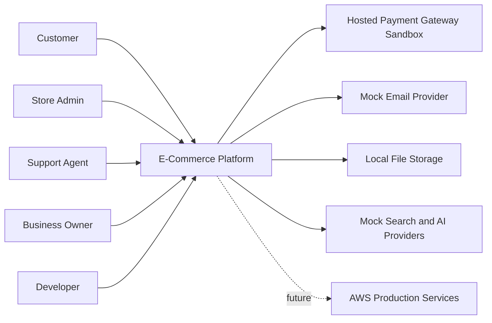
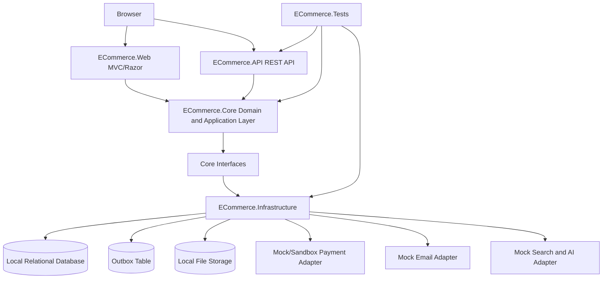
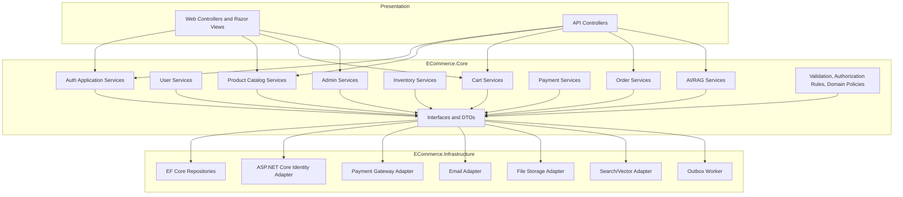
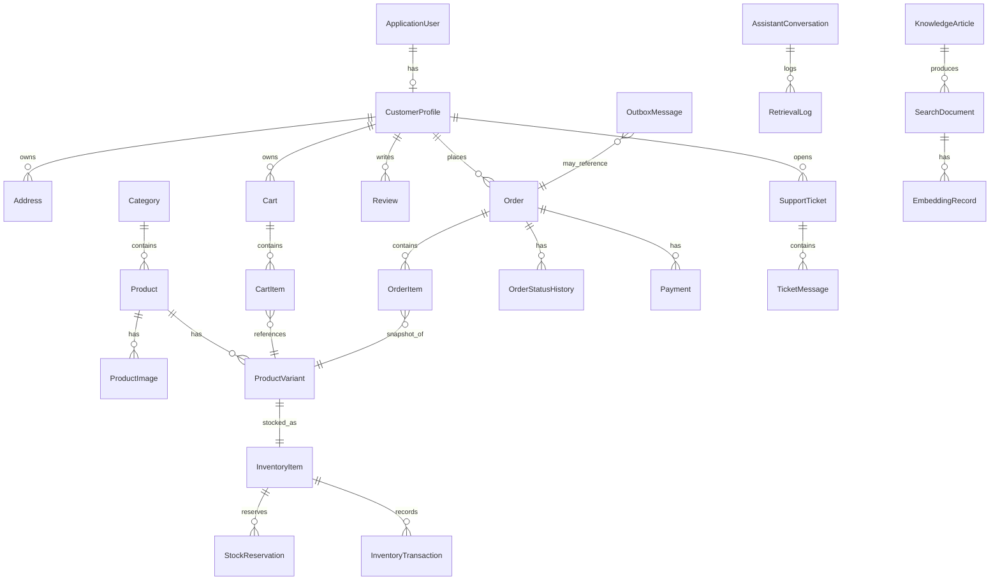

# Phase 0: Beginner-Friendly System Design Package

## 1. Purpose

Phase 0 is the design phase. No application code should be written in this phase.

The goal is to define the system clearly enough that a beginner, or a basic AI coding tool, can later implement one module at a time without inventing architecture. This document is written from an AWS/Amazon Solutions Architect perspective, but it keeps the current work local-first and free-first.

## 2. Free-First Rule

During Phase 0, use only public documentation and local/free tools:

| Need | Phase 0 Tool |
| --- | --- |
| Architecture method | AWS Well-Architected Framework public docs |
| Security review | OWASP Top 10, OWASP API Security Top 10, OWASP ASVS ideas |
| Diagrams | Mermaid Markdown |
| API review | Swagger/OpenAPI later, Markdown now |
| Database design | Markdown ERD/table design now, local SQL database later |
| Cloud planning | AWS Architecture Center, AWS Pricing Calculator, AWS Free Tier docs |
| AI/RAG planning | Mock providers and diagrams only |

Do not provision AWS services yet. AWS services are production targets, not Phase 0 dependencies.

## 3. Phase 0 Deliverables

Phase 0 is complete only when these design assets are approved:

- Domain boundaries and module ownership.
- C4 Context, Container, and Component diagrams.
- API conventions.
- MVP data model and constraints.
- Authentication and authorization design.
- Security risk register and mitigations.
- Scalability and AWS migration path.
- Logging, monitoring, audit, and backup strategy.
- Production-readiness checklist.
- Open design questions documented.

## 4. Domain Boundaries

### Beginner Explanation

A domain boundary says: "This part of the business owns this data and these rules." Good boundaries stop one module from quietly becoming responsible for everything.

For this MVP, use a modular monolith. That means all modules live in one deployable application, but each module has clear ownership and clear interfaces.

### MVP Module Boundaries

| Module | Owns | Does Not Own | Example Core Interfaces |
| --- | --- | --- | --- |
| Auth | Login, registration, password policy, tokens/cookies, role membership. | Customer profile details, product data, payments. | `IIdentityService`, `ITokenService`, `ICurrentUserService` |
| User | Customer profile, addresses, user preferences. | Authentication secrets, order totals, admin permissions. | `IUserProfileService`, `IAddressService` |
| Product | Products, categories, images metadata, variants, public product attributes. | Stock quantity, cart state, payment state. | `IProductCatalogService`, `IProductRepository` |
| Inventory | Stock levels, reservations, stock transactions, reservation expiry. | Product descriptions, payment confirmation, final order status. | `IInventoryService`, `IStockReservationService` |
| Cart | Guest cart, customer cart, cart items, cart merge on login. | Final price truth, payment, stock ownership. | `ICartService` |
| Order | Order, order items, status history, price snapshots, order ownership. | Payment gateway behavior, live product editing. | `IOrderService`, `IOrderRepository` |
| Payment | Payment intent, hosted payment session, callback/webhook audit, payment status. | Card storage, order fulfillment, inventory quantity. | `IPaymentService`, `IPaymentGateway` |
| Admin | Admin dashboards, moderation workflows, operational views, staff actions. | Bypassing module rules. | `IAdminDashboardService`, `IAuditService` |
| AI/RAG | Search documents, embeddings metadata, retrieval logs, assistant conversations. | Source-of-truth product/order/customer/payment data. | `ISearchService`, `IEmbeddingProvider`, `IAssistantService` |

### Ownership Rules

- Product owns product descriptions, but Inventory owns sellable quantity.
- Cart stores customer intent, but Order stores purchase history.
- Payment stores gateway references and status, but never stores raw card data.
- AI/RAG can index approved copies of data, but it is never the source of truth.
- Admin can orchestrate workflows, but must use the same domain services and authorization rules as other users.

### Domain Event Candidates

These events should first be stored in a local database outbox table. AWS SQS/EventBridge can replace or extend the outbox later.

Naming note: simple event names are acceptable inside the MVP modular monolith. Events that leave the module through the outbox or a future broker should use the Phase 6 convention `<Domain>.<Entity>.<PastTenseAction>.v<Version>`, for example `Orders.OrderPlaced.v1`.

| Event | Producer | Consumer |
| --- | --- | --- |
| `UserRegistered` | Auth | Notification, audit |
| `ProductPublished` | Product | Search indexing |
| `StockReserved` | Inventory | Checkout, audit |
| `StockReservationExpired` | Inventory | Cart/checkout, audit |
| `OrderCreated` | Order | Notification, admin dashboard |
| `PaymentSucceeded` | Payment | Order, inventory, notification |
| `PaymentFailed` | Payment | Order, inventory |
| `KnowledgeSourceUpdated` | AI/RAG | Search/RAG indexing |

## 5. C4 Diagrams

### 5.1 C4 Context Diagram

This diagram shows the platform as one system and the people/systems around it.



### 5.2 C4 Container Diagram

This diagram shows the main deployable and storage pieces.



### 5.3 C4 Component Diagram

This diagram shows the main application components inside the modular monolith.



## 6. API Conventions

### Base URL And Versioning

- Use path versioning for clarity in the MVP: `/api/v1/...`
- Use plural nouns for resources: `/api/v1/products`, `/api/v1/orders`
- Avoid verbs in routes unless the operation is a business command that is not simple CRUD.
- Keep admin routes separate: `/api/v1/admin/...`

### Route Style

| Use Case | Route |
| --- | --- |
| List products | `GET /api/v1/products` |
| Get one product | `GET /api/v1/products/{productId}` |
| Create product as admin | `POST /api/v1/admin/products` |
| Update product as admin | `PUT /api/v1/admin/products/{productId}` |
| Add item to cart | `POST /api/v1/cart/items` |
| Update cart item quantity | `PATCH /api/v1/cart/items/{cartItemId}` |
| Start checkout | `POST /api/v1/checkout/sessions` |
| Create payment session | `POST /api/v1/orders/{orderId}/payments` |
| Payment callback | `POST /api/v1/payments/webhooks/{provider}` |
| Semantic product search | `POST /api/v1/search/semantic` |

### Request Format

Use JSON with camelCase fields.

```json
{
  "productId": "prd_123",
  "variantId": "var_456",
  "quantity": 2
}
```

Rules:

- Client must not send trusted prices for checkout.
- Client must not send user/admin role assignments except through approved admin endpoints.
- Write commands that can be retried must support an `Idempotency-Key` header.
- Use ISO 8601 UTC timestamps.
- Use decimal amount plus currency for money values.

### Success Response Format

For single resources, return the resource directly:

```json
{
  "id": "prd_123",
  "name": "Cotton T-Shirt",
  "price": {
    "amount": 19.99,
    "currency": "USD"
  }
}
```

For list resources, return items plus metadata:

```json
{
  "items": [],
  "page": {
    "pageNumber": 1,
    "pageSize": 20,
    "totalItems": 0,
    "totalPages": 0
  }
}
```

### Error Format

Use a Problem Details-style response.

```json
{
  "type": "https://example.com/problems/validation-error",
  "title": "Validation failed",
  "status": 400,
  "detail": "One or more fields are invalid.",
  "traceId": "00-abc-123",
  "errors": {
    "quantity": ["Quantity must be greater than zero."]
  }
}
```

### Status Codes

| Status | Meaning |
| --- | --- |
| 200 | Read or update succeeded. |
| 201 | Resource created. |
| 202 | Accepted for async processing. |
| 204 | Delete or command completed with no response body. |
| 400 | Validation error. |
| 401 | Not authenticated. |
| 403 | Authenticated but not allowed. |
| 404 | Resource not found or not visible to this user. |
| 409 | State conflict, duplicate, or concurrency issue. |
| 422 | Business rule failure. |
| 429 | Rate limit exceeded. |
| 500 | Unexpected server error. |

### Pagination, Filtering, And Sorting

Use query parameters:

```text
GET /api/v1/products?pageNumber=1&pageSize=20&categoryId=cat_1&minPrice=10&maxPrice=50&sort=price_asc
```

Rules:

- Default `pageNumber`: `1`
- Default `pageSize`: `20`
- Maximum `pageSize`: `100`
- Filtering fields must be allowlisted by endpoint.
- Sorting fields must be allowlisted by endpoint.

### Correlation And Idempotency Headers

| Header | Required When | Purpose |
| --- | --- | --- |
| `X-Correlation-Id` | Optional from client, generated if missing | Trace a request across logs. |
| `Idempotency-Key` | Required for checkout, payment, refund, and risky commands | Prevent duplicate effects from retries. |

## 7. MVP Data Model

### Entity Relationship Diagram



### Entity Ownership And Constraints

| Entity | Owner Module | Important Constraints |
| --- | --- | --- |
| `ApplicationUser` | Auth | Unique email, password policy, lockout rules, role membership. |
| `CustomerProfile` | User | One profile per user, no duplicate profile for same auth user. |
| `Address` | User | Belongs to customer; never editable by another customer. |
| `Product` | Product | SKU/name rules, active/draft status, category required for publishing. |
| `ProductVariant` | Product | Unique SKU, belongs to one product, can be disabled. |
| `ProductImage` | Product | Allowed file types and max size; stores metadata, not raw file in DB. |
| `InventoryItem` | Inventory | One stock record per sellable variant; quantity cannot go below zero. |
| `StockReservation` | Inventory | Has expiry; unique active reservation per checkout line. |
| `Cart` | Cart | Belongs to session or customer; one active cart per owner. |
| `CartItem` | Cart | Quantity greater than zero; references active variant. |
| `Order` | Order | Immutable price snapshot after placement; status changes through workflow only. |
| `OrderItem` | Order | Stores product name, SKU, price, tax, and currency snapshot. |
| `Payment` | Payment | Stores provider reference and status only; no card data. |
| `PaymentWebhookEvent` | Payment | Unique provider event ID to block replay. |
| `Review` | User/Product | Only visible after moderation; optional verified purchase flag. |
| `SupportTicket` | User/Admin | Customer can see own tickets; staff access is role controlled. |
| `SearchDocument` | AI/RAG | Copy/index record only; not source of truth. |
| `RetrievalLog` | AI/RAG | Logs source IDs and outcome; must avoid sensitive prompt data where possible. |
| `OutboxMessage` | Operations | Stores pending events until processed; retries are tracked. |

### Data Classification

| Classification | Examples | Rule |
| --- | --- | --- |
| Public | Product name, public description, public policy. | Can be indexed for public search. |
| Customer private | Address, order history, support ticket. | Owner or authorized staff only. |
| Admin internal | Audit logs, operational notes, admin dashboard data. | Admin/staff role only. |
| Payment sensitive | Provider references, webhook payload details. | Never expose publicly; never log secrets/card data. |
| AI indexed copy | Search documents and embeddings. | Must point back to source and respect classification. |

## 8. Authentication And Authorization Design

### Authentication

Use ASP.NET Core Identity for MVP.

| Area | MVP Design |
| --- | --- |
| Customer login | Email/password with secure password policy. |
| Admin login | Same identity system, admin role required. |
| API authentication | Cookie for Web, bearer token can be added for API clients later. |
| Password storage | Managed by ASP.NET Core Identity hashing. |
| Account safety | Email confirmation, lockout after repeated failures, password reset flow. |

### Authorization Roles

| Role | Allowed |
| --- | --- |
| Anonymous | Browse public catalog, search public products, register, log in. |
| Customer | Manage own profile, addresses, cart, orders, wishlist, reviews, tickets. |
| SupportAgent | View assigned tickets and limited customer/order context needed for support. |
| InventoryManager | Manage stock, reservations, and stock adjustments. |
| CatalogManager | Manage products, categories, variants, images. |
| Admin | Manage users, staff permissions, dashboard, moderation, and system settings. |

Role evolution note: Phase 1 seeds only `Customer`, `Admin`, and `SuperAdmin`. Specialized staff roles such as `SupportAgent`, `InventoryManager`, and `CatalogManager` are later role/permission expansions on `ApplicationUser`; they are not separate user entities.

### Authorization Rules

- Every endpoint must have an explicit auth rule.
- Ownership must be checked for customer-owned resources.
- Admin routes require role/policy authorization.
- Staff roles should use least privilege.
- AI/RAG retrieval must filter by user role before returning sources.
- Use `403` when a logged-in user is not allowed.
- Use `404` when revealing existence would leak another user's resource.

## 9. OWASP-Based Security Risks And Mitigations

| Risk Area | Example In This Platform | Mitigation |
| --- | --- | --- |
| Broken access control | Customer reads another customer's order. | Ownership checks, policy-based authorization, negative tests. |
| Broken authentication | Brute-force login attempts. | Lockout, secure password policy, email confirmation, later MFA for admins. |
| Injection | Malicious search/filter input reaches SQL. | EF Core parameterization, allowlisted filters/sorts, validation. |
| Insecure design | Checkout creates duplicate paid orders. | Idempotency keys, order workflow, payment event replay protection. |
| Security misconfiguration | Detailed errors shown in production. | Central exception handling, environment-specific error pages. |
| Vulnerable dependencies | Outdated NuGet package. | Dependency review and later CI scanning. |
| Identification/auth failures | Admin session not protected enough. | Secure cookies, HTTPS, SameSite, admin timeout, later MFA. |
| Software/data integrity | Fake payment webhook. | Signature validation, replay window, unique event IDs. |
| Logging/monitoring failure | Payment failures invisible. | Structured logs, audit events, alertable metrics in later phases. |
| SSRF/file abuse | Unsafe image upload or remote URL fetch. | Do not fetch arbitrary URLs in MVP; validate uploaded files. |
| API unrestricted resource consumption | Huge page size or expensive search. | Max page size, rate limits later, query allowlists. |

## 10. Scalability Decisions And AWS Migration Path

### Phase 0 Scalability Decisions

| Decision | Reason |
| --- | --- |
| Modular monolith first | Easier to learn, test, and keep data consistent. |
| Database outbox first | Reliable event handoff without paid queues. |
| Interface-based adapters | Local/free implementation can be replaced by AWS later. |
| Cache catalog only | Checkout, inventory, and payment must read trusted database state. |
| Use idempotent commands | Safe retries are required before distributed systems. |
| Avoid microservices in MVP | Reduces deployment, networking, and consistency complexity. |

### Future AWS Migration Path

| Local/MVP Design | AWS Production Target |
| --- | --- |
| Local Web/API process | ECS Fargate service behind Application Load Balancer |
| Local relational database | Amazon RDS PostgreSQL or SQL Server |
| Local file storage abstraction | Amazon S3 with CloudFront |
| Local outbox worker | SQS for queues and EventBridge for event routing |
| Local structured logs | CloudWatch Logs and metrics |
| Local/mock search and AI | OpenSearch vector search and Amazon Bedrock |
| Local secrets/user-secrets | AWS Secrets Manager |
| Local backup notes | RDS automated backups and tested restore plan |

### Migration Rule

Do not migrate to AWS by rewriting domain logic. Migrate by replacing Infrastructure adapters.

## 11. Logging, Monitoring, Audit, And Backup Strategy

### Logging

MVP logs should be structured and include:

- Timestamp.
- Log level.
- Correlation ID.
- User ID when authenticated.
- Module name.
- Action name.
- Result status.

Never log:

- Passwords.
- Tokens.
- Payment card data.
- Full payment webhook secrets.
- Unnecessary customer PII.
- Raw AI prompts containing private data unless explicitly reviewed.

### Monitoring

Phase 0 defines the monitoring plan; later phases implement it.

| Metric | Why It Matters |
| --- | --- |
| Login failures | Detect brute force or broken auth. |
| Product list latency | Customer experience and catalog performance. |
| Checkout failures | Revenue and reliability. |
| Payment callback failures | Payment correctness. |
| Stock reservation conflicts | Overselling risk. |
| Outbox backlog | Background job health. |
| AI no-answer rate | RAG quality. |

### Audit

Audit these events:

- Admin login and logout.
- Admin product/category changes.
- Stock adjustments.
- Order status changes.
- Payment status changes.
- Refund actions.
- Staff permission changes.
- Admin AI assistant queries.

Audit records should include who, what, when, where possible why, and correlation ID.

### Backup

Phase 0 backup design:

- Define which data must be backed up: database and uploaded media.
- Define restore objective for MVP learning: restore local database from a known backup.
- Production target: RDS automated backups, S3 versioning, restore drills, and documented recovery steps.
- Backups must be tested. An untested backup is only a hope with a timestamp.

## 12. Production-Readiness Checklist For Phase 0

Phase 0 can be approved when each item is true:

| Area | Checklist |
| --- | --- |
| Domain | Boundaries are documented for Auth, User, Product, Cart, Order, Payment, Inventory, Admin, and AI/RAG. |
| Diagrams | Context, Container, and Component diagrams exist in Mermaid. |
| API | Route, request, response, error, pagination, filtering, and versioning conventions are documented. |
| Data | MVP entities, relationships, ownership, and constraints are documented. |
| Auth | Authentication and authorization roles/rules are documented. |
| Security | OWASP-style risks and mitigations are documented. |
| Scalability | Local-first design and AWS migration path are documented. |
| Operations | Logging, monitoring, audit, and backup strategy are documented. |
| AI/RAG | AI is clearly non-source-of-truth and authorization-filtered. |
| Cost | No paid AWS service is required before design approval. |
| AI coding | The feature template and AI playbook can guide later implementation. |

## 13. Beginner Implementation Guidance For Later

When implementation starts, give the AI coding tool one module at a time. Use this order:

1. Auth foundation.
2. User profile and addresses.
3. Product catalog.
4. Inventory foundation.
5. Cart.
6. Order draft and status workflow.
7. Payment sandbox.
8. Admin operations.
9. AI/RAG indexing and search.

Do not let a coding tool combine payment, inventory, and order logic in one large patch. Those modules touch money and stock, so they need careful review.

## 14. Open Design Questions

These questions should be answered before Phase 1 implementation:

| Question | Default For Now |
| --- | --- |
| Primary production database: PostgreSQL or SQL Server? | Keep EF Core provider-neutral for now; decide before production planning. |
| API auth for external clients: cookies, JWT, or both? | Cookies for Web MVP; JWT can be added later for mobile/external clients. |
| Payment provider for Bangladesh/global support? | Use hosted sandbox abstraction first; choose real provider before Phase 2 payment work. |
| Admin UI location: same Web app or separate app? | Same MVC Web app for MVP. |
| Product image storage in MVP? | Local file abstraction; S3 later. |
| AI provider for local prototype? | Mock provider first; Bedrock later after cost/security approval. |

## 15. References

- AWS Well-Architected Framework: https://docs.aws.amazon.com/wellarchitected/latest/framework/welcome.html
- AWS IAM best practices: https://docs.aws.amazon.com/IAM/latest/UserGuide/best-practices.html
- AWS retry with backoff pattern: https://docs.aws.amazon.com/prescriptive-guidance/latest/cloud-design-patterns/retry-backoff.html
- AWS Builders Library on idempotent APIs: https://aws.amazon.com/builders-library/making-retries-safe-with-idempotent-APIs/
- OWASP Top 10: https://owasp.org/www-project-top-ten/
- OWASP API Security Top 10: https://owasp.org/API-Security/editions/2023/en/0x00-header/
- OWASP ASVS: https://owasp.org/www-project-application-security-verification-standard/
