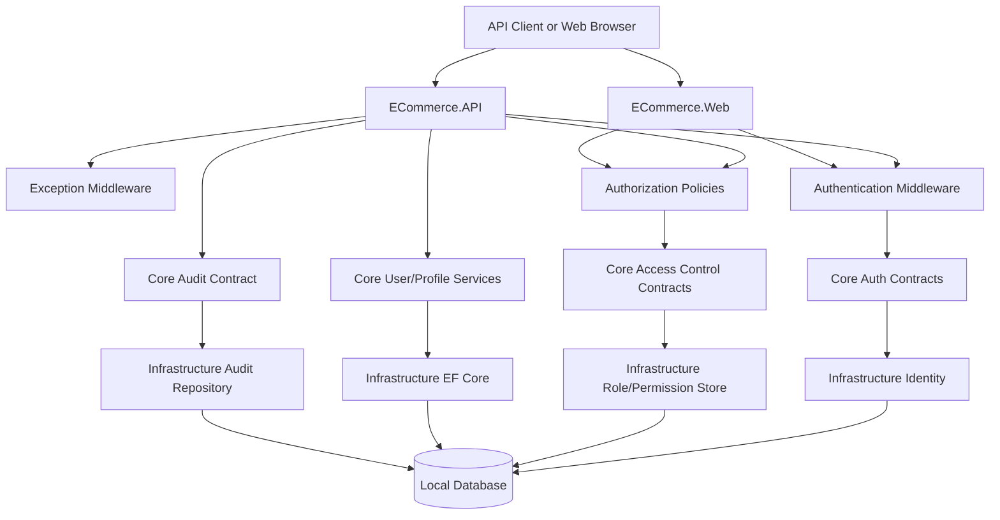
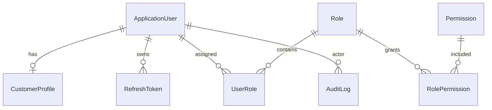
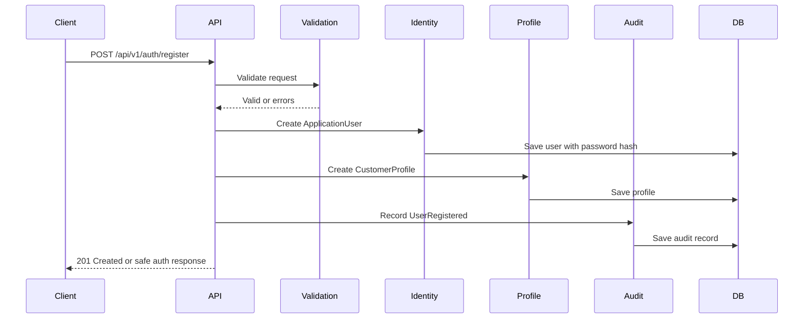
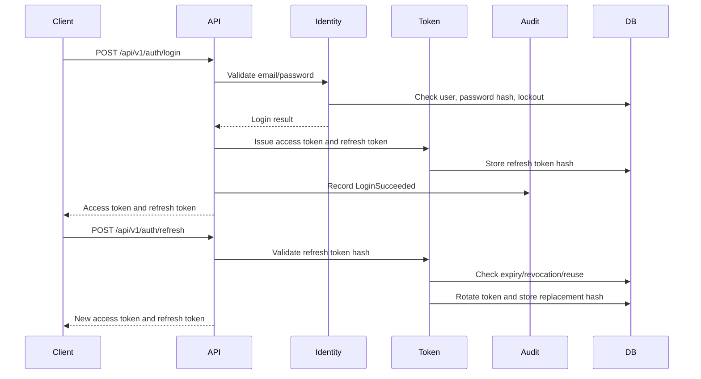
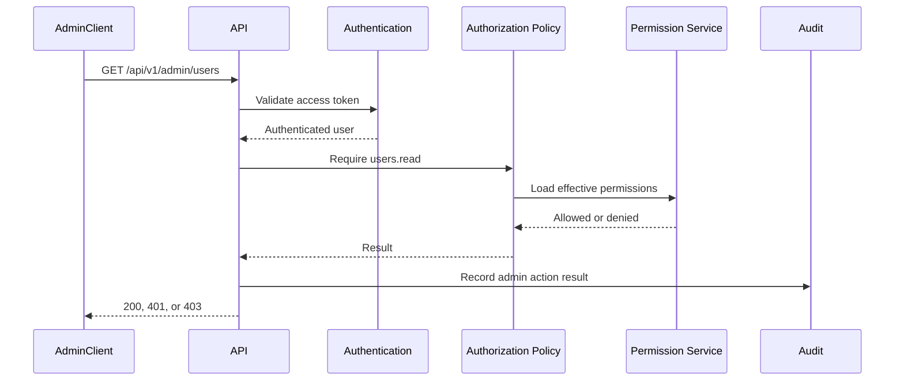
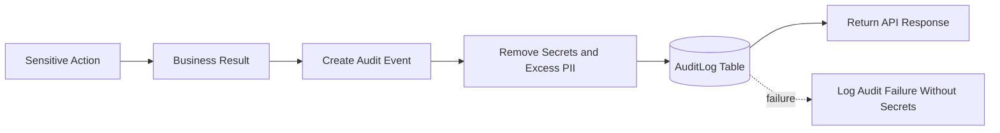

# Phase 1: MVP Foundation Design Package

## 1. Purpose

Phase 1 builds the secure foundation for the MVP e-commerce platform. It turns the Phase 0 design into a working local-first baseline using .NET 10, ASP.NET Core on .NET 10, EF Core compatible with .NET 10, Onion Architecture, and beginner-friendly implementation modules.

This phase is not about building the whole store. It is about creating the technical base that future modules can trust: identity, access control, database setup, configuration, validation, exception handling, logging, audit logging, and test patterns.

No paid AWS services are introduced in Phase 1. AWS remains the future production target.

## 2. Phase 1 Goals And Non-Goals

### Goals

- Establish .NET 10 project conventions for the modular monolith.
- Enforce Onion Architecture dependency rules.
- Configure the local database and EF Core migration strategy.
- Design Identity, customer profile, roles, permissions, refresh tokens, and audit logging.
- Define API conventions for auth, profile, and admin access-control endpoints.
- Define centralized exception handling and validation behavior.
- Define structured logging and safe audit logging.
- Define local secrets/configuration rules.
- Define unit, integration, security, and API test expectations.
- Create an AI-assisted implementation breakdown for later coding.

### Non-Goals

- Do not implement checkout, cart, inventory reservation, payment, shipping, returns, reviews, or AI/RAG behavior.
- Do not provision AWS services.
- Do not build production CI/CD.
- Do not implement advanced analytics, campaigns, recommendations, or multi-warehouse support.
- Do not create a full admin portal beyond the foundation endpoints needed for user/role/permission management.
- Do not store secrets, tokens, passwords, cookies, authorization headers, or full personal data in logs or examples.

## 3. Technology Baseline

| Concern | Approved Phase 1 Direction |
| --- | --- |
| Runtime | .NET 10. |
| Web framework | ASP.NET Core on .NET 10. |
| Language | C# version aligned with the installed .NET 10 SDK. Use modern C# conventions, nullable reference types, async/await, records for DTOs where useful, and explicit access modifiers. |
| Data access | EF Core compatible with .NET 10. |
| Identity | ASP.NET Core Identity as the local-first MVP identity foundation. |
| API testing | Swagger/OpenAPI for local API discovery and manual testing. |
| Automated tests | xUnit or equivalent .NET test framework. |
| Local database | SQL Server Developer, SQL Server LocalDB, or SQLite for local work. Keep provider-specific assumptions isolated in Infrastructure. |
| Local secrets | .NET user-secrets for developer machines, or environment variables. Never commit secrets. |
| Logging | ASP.NET Core logging abstractions with structured fields. Console logging is enough for Phase 1. |
| Cloud | No paid cloud services in Phase 1. AWS targets are documented only. |

Implementation note: exact NuGet package versions must be checked at coding time against the installed .NET 10 SDK, official Microsoft package guidance, known vulnerabilities, and the current repo `NuGet.Config`.

## 4. Architecture Decisions

### Modular Monolith Position

Phase 1 lives inside the modular monolith. Identity, access control, audit, validation, exceptions, database, and configuration are cross-cutting foundation modules. They support future product, cart, order, payment, inventory, admin, and AI/RAG modules.

### Project Responsibilities

| Project | Phase 1 Responsibilities |
| --- | --- |
| `ECommerce.Core` | Domain entities, value objects, DTOs, validation result models, application interfaces, permission constants, auth/profile service contracts, audit service contract, domain/application exceptions. |
| `ECommerce.Infrastructure` | EF Core DbContexts, entity configuration, ASP.NET Core Identity implementation, repositories, token persistence, audit log persistence, local secrets/config binding, infrastructure service registration. |
| `ECommerce.API` | REST endpoints, auth middleware setup, Swagger/OpenAPI, exception middleware, request/response mapping, API authorization policies. |
| `ECommerce.Web` | MVC/Razor shell for local UI, login/profile/admin pages later, shared error handling behavior. Web must use the same Core contracts and auth rules as API. |
| `ECommerce.Tests` | Unit, integration, API, authorization, validation, token, and audit tests. Tests may reference the projects they test. |

### Dependency Rules

- Core must not depend on Infrastructure, API, or Web.
- Infrastructure can reference Core and implement Core interfaces.
- API can reference Core and Infrastructure for composition root/DI wiring.
- Web can reference Core and Infrastructure for composition root/DI wiring.
- API and Web should call Core application services rather than directly calling EF Core or provider SDKs.
- Tests may reference API, Web, Core, and Infrastructure as needed.
- Database/provider code must not be added to Core.

## 5. Phase 1 Module Boundaries

| Module | Owns | Does Not Own |
| --- | --- | --- |
| Identity | Registration, login, password hashing via Identity, account status, token issuing contract. | Customer profile business details beyond identity link. |
| Access Control | Roles, permissions, role-permission mapping, admin policies, permission checks. | Product/cart/order business rules. |
| Audit Logging | Sensitive action records, actor, action, target, timestamp, correlation ID, result. | General debug logs or raw request body storage. |
| Exception Handling | Consistent error mapping, safe Problem Details response, correlation ID. | Business decision logic. |
| Validation | Request validation, business rule validation, validation error format. | Database schema as the only validation layer. |
| Database Foundation | DbContext, migrations, entity configuration, indexes, seed strategy. | Cloud database provisioning. |
| Configuration And Secrets | Typed options, required config validation, local user-secrets/env vars. | Hardcoded secrets or production secret stores. |

## 6. Phase 1 Module Interaction



## 7. API Design

### General API Rules

- Base path: `/api/v1`.
- JSON uses camelCase.
- Use Problem Details-style errors.
- Every endpoint must declare auth requirement: anonymous, customer, admin, or super admin.
- Never return password hashes, refresh token hashes, security stamps, or internal audit details in public responses.
- Use `X-Correlation-Id` if provided; generate one if missing.
- Use `Idempotency-Key` later for risky payment/checkout commands, not required for Phase 1 auth/profile endpoints.

### Endpoint Plan

| Use Case | Method And Route | Auth | Notes |
| --- | --- | --- | --- |
| Register | `POST /api/v1/auth/register` | Anonymous | Creates `ApplicationUser` and `CustomerProfile`; returns user summary and tokens if email confirmation is not enforced immediately. |
| Login | `POST /api/v1/auth/login` | Anonymous | Returns access token, refresh token metadata, user summary, roles/permissions summary. |
| Refresh token | `POST /api/v1/auth/refresh` | Anonymous with refresh token | Rotates refresh token; rejects expired, revoked, or reused token. |
| Logout | `POST /api/v1/auth/logout` | Authenticated | Revokes current refresh token/session. |
| Current profile | `GET /api/v1/users/me` | Customer/Admin/SuperAdmin | Returns current user's safe profile fields. |
| Update profile | `PUT /api/v1/users/me` | Customer/Admin/SuperAdmin | Updates allowed profile fields only. |
| Admin user listing | `GET /api/v1/admin/users` | Admin permission `users.read` | Supports pagination and safe filters. |
| Role assignment | `POST /api/v1/admin/users/{userId}/roles` | SuperAdmin or permission `users.roles.assign` | Audited; cannot self-escalate. |
| Permission checks | `GET /api/v1/admin/permissions/me` | Admin/SuperAdmin | Returns effective permissions for current admin. |

### Example Request Shapes

```json
{
  "email": "customer@example.com",
  "password": "provided-by-user",
  "firstName": "Amina",
  "lastName": "Rahman"
}
```

```json
{
  "email": "admin@example.com",
  "password": "provided-by-user"
}
```

```json
{
  "refreshToken": "provided-by-client"
}
```

### Example Success Response Shape

```json
{
  "user": {
    "id": "usr_123",
    "email": "customer@example.com",
    "displayName": "Amina Rahman",
    "roles": ["Customer"],
    "permissions": []
  },
  "accessToken": "returned-only-from-auth-endpoints",
  "refreshToken": "returned-only-from-auth-endpoints",
  "expiresAtUtc": "2026-06-18T12:00:00Z"
}
```

Documentation warning: examples must never contain real tokens, passwords, cookies, or secrets.

### Validation Error Format

```json
{
  "type": "https://example.com/problems/validation-error",
  "title": "Validation failed",
  "status": 400,
  "detail": "One or more fields are invalid.",
  "traceId": "generated-correlation-id",
  "errors": {
    "email": ["Email is required."],
    "password": ["Password does not meet the password policy."]
  }
}
```

### Authentication Error Format

```json
{
  "type": "https://example.com/problems/authentication-required",
  "title": "Authentication required",
  "status": 401,
  "detail": "A valid access token is required.",
  "traceId": "generated-correlation-id"
}
```

### Authorization Error Format

```json
{
  "type": "https://example.com/problems/forbidden",
  "title": "Forbidden",
  "status": 403,
  "detail": "The current user is not allowed to perform this action.",
  "traceId": "generated-correlation-id"
}
```

### Pagination For Admin Listing

```text
GET /api/v1/admin/users?pageNumber=1&pageSize=20&email=example&role=Customer&sort=created_desc
```

Rules:

- Default `pageNumber`: `1`.
- Default `pageSize`: `20`.
- Maximum `pageSize`: `100`.
- Filters and sort fields must be allowlisted.
- Admin listing must return minimal profile data only.

## 8. Authentication And Authorization Design

### Password Handling

- Use ASP.NET Core Identity password hashing.
- Never store or log plaintext passwords.
- Enforce a minimum password policy in Phase 1: length, uppercase/lowercase/number/symbol expectations, and lockout after repeated failures.
- Password reset design can be documented in Phase 1 and implemented later if email delivery is not ready.
- Admin and super admin accounts should require stronger policy and future MFA.

### Access Token Strategy

- Use JWT access tokens for API clients.
- Use short-lived access tokens. Recommended MVP default: 15 minutes.
- Include only minimal claims: subject/user ID, email or normalized email if needed, roles, permission version/security stamp, issued-at, expiry, issuer, audience.
- Do not include full profile, address, secrets, refresh token, or sensitive admin data in JWT claims.
- Validate issuer, audience, signing key, expiry, and token signature.
- Web may use secure cookies later, but Phase 1 API token design must be explicit.

### Refresh Token Strategy

- Refresh tokens must be opaque random values, not JWTs.
- Store only a hash of the refresh token in the database.
- Store device/session metadata: created time, expiry, revoked time, replaced-by token ID, created IP/user agent hash where appropriate.
- Recommended MVP default: refresh token lifetime of 7 days for normal users; shorter for admin sessions unless "remember me" is explicitly designed later.
- Rotate refresh token on every refresh.
- Reuse detection: if an already-rotated or revoked refresh token is used, revoke the token family/session and require login.
- Logout revokes the current refresh token/session.
- Password change or security stamp change revokes active refresh tokens.

### Role-Based Access Control

| Role | Purpose |
| --- | --- |
| `Customer` | Default role for registered customers. |
| `Admin` | Store operations role with permissions assigned explicitly. |
| `SuperAdmin` | Highest local role for bootstrapping and permission management. Use sparingly. |

Phase 1 role note: only `Customer`, `Admin`, and `SuperAdmin` must be created in the foundation. Later phases may add `SupportAgent`, `InventoryManager`, `CatalogManager`, `MarketingManager`, `ReportingViewer`, and `Auditor` as roles or permission bundles on `ApplicationUser`; do not create separate staff user entities.

### Permission Model

Use roles for broad grouping and permissions for sensitive admin actions.

| Permission | Allows |
| --- | --- |
| `users.read` | View safe admin user list. |
| `users.update` | Update allowed user/admin metadata. |
| `users.roles.assign` | Assign or remove roles. |
| `permissions.read` | View permission catalog/effective permissions. |
| `audit.read` | View audit logs later. |
| `catalog.manage` | Reserved for catalog admin work. |
| `inventory.manage` | Reserved for inventory admin work. |

Admin rules:

- `SuperAdmin` can assign roles and permissions.
- `Admin` can perform only actions granted by permissions.
- No user may assign themselves a higher role.
- Role assignment must be audited.
- Permission checks must happen server-side; UI hiding is not authorization.

### Protection Against Broken Access Control

- Every endpoint declares authorization metadata.
- Customer-owned resources use ownership checks.
- Admin endpoints use role and permission policies.
- Tests must include negative cases: anonymous, wrong user, customer hitting admin route, admin without permission, self-escalation attempt.

## 9. Phase 1 MVP Database Design

### Entity Relationship Diagram



### Required Entities

| Entity | Owner | Important Fields |
| --- | --- | --- |
| `ApplicationUser` | Identity | `Id`, `Email`, `NormalizedEmail`, `EmailConfirmed`, `PasswordHash`, `SecurityStamp`, `LockoutEnd`, `AccessFailedCount`, `CreatedAtUtc`, `UpdatedAtUtc`, `IsActive`. |
| `CustomerProfile` | User | `Id`, `ApplicationUserId`, `FirstName`, `LastName`, `DisplayName`, `PhoneNumber`, `CreatedAtUtc`, `UpdatedAtUtc`. |
| `Role` | Access Control | `Id`, `Name`, `NormalizedName`, `Description`, `IsSystemRole`, `CreatedAtUtc`. |
| `Permission` | Access Control | `Id`, `Code`, `Description`, `Category`, `CreatedAtUtc`. |
| `UserRole` | Access Control | `UserId`, `RoleId`, `AssignedByUserId`, `AssignedAtUtc`. |
| `RolePermission` | Access Control | `RoleId`, `PermissionId`, `GrantedByUserId`, `GrantedAtUtc`. |
| `RefreshToken` | Identity | `Id`, `UserId`, `TokenHash`, `TokenFamilyId`, `ExpiresAtUtc`, `CreatedAtUtc`, `RevokedAtUtc`, `ReplacedByTokenId`, `CreatedByIpHash`, `UserAgentHash`, `ReuseDetectedAtUtc`. |
| `AuditLog` | Audit Logging | `Id`, `ActorUserId`, `Action`, `TargetType`, `TargetId`, `Result`, `Reason`, `CorrelationId`, `IpAddressHash`, `UserAgentHash`, `CreatedAtUtc`, `MetadataJson`. |

### Constraints And Indexes

| Entity | Constraint/Index |
| --- | --- |
| `ApplicationUser` | Unique normalized email; index `CreatedAtUtc`; index `IsActive`. |
| `CustomerProfile` | Unique `ApplicationUserId`. |
| `Role` | Unique normalized role name. |
| `Permission` | Unique permission code. |
| `UserRole` | Composite unique index on `UserId`, `RoleId`. |
| `RolePermission` | Composite unique index on `RoleId`, `PermissionId`. |
| `RefreshToken` | Unique `TokenHash`; index `UserId`; index `TokenFamilyId`; index `ExpiresAtUtc`; index active tokens by `UserId`, `RevokedAtUtc`. |
| `AuditLog` | Index `CreatedAtUtc`; index `ActorUserId`; index `Action`; index `TargetType`, `TargetId`; index `CorrelationId`. |

### Migration Strategy

- Use EF Core migrations generated from Infrastructure.
- Review every migration before applying.
- Do not hand-edit generated migration code unless there is a documented reason.
- Use seed data for system roles and permissions.
- Seed exactly one initial super admin only through a safe local setup path; do not hardcode real credentials.
- For local development, use developer secrets or environment variables for seed bootstrap values.

## 10. Registration Flow



## 11. Login And Refresh Token Flow



## 12. Admin Authorization Flow



## 13. Audit Logging Flow



Audit logging should be best effort for low-risk actions, but must be treated as required for sensitive admin/security actions. If audit persistence fails during a sensitive action, return a safe server error rather than silently completing the action.

## 14. Validation Strategy

Validation has three layers:

| Layer | Purpose |
| --- | --- |
| Request validation | Required fields, string lengths, email format, password policy, page size limits. |
| Business validation | Duplicate email, inactive account, role assignment rules, self-escalation prevention. |
| Database constraints | Unique indexes, foreign keys, non-null columns, concurrency where needed. |

Rules:

- Do not rely only on client-side validation.
- Do not rely only on database exceptions for expected business cases.
- Return safe validation errors without revealing whether an email exists during login.
- Use consistent Problem Details responses.

## 15. Centralized Exception Handling

All API exceptions should pass through central exception handling.

| Exception Type | HTTP Status | Response Behavior |
| --- | --- | --- |
| Validation failure | 400 | Return field-level validation errors. |
| Authentication failure | 401 | Return generic authentication-required response. |
| Authorization failure | 403 | Return forbidden response. |
| Not found | 404 | Return not found without leaking private resource existence. |
| Conflict | 409 | Duplicate email, concurrency conflict, repeated token event. |
| Business rule failure | 422 | Valid request shape but invalid business operation. |
| Unexpected error | 500 | Safe generic message with trace/correlation ID. |

Do not expose stack traces, connection strings, SQL, tokens, or internal exception details in production-like responses.

## 16. Security Review

| Risk | Example | Mitigation |
| --- | --- | --- |
| Broken access control | Customer calls admin user listing. | Explicit role/permission policies, server-side checks, negative tests. |
| Weak password handling | Plaintext or weak password storage. | ASP.NET Core Identity hashing, password policy, no password logs. |
| Token theft | Access token copied from logs or browser storage. | Never log tokens; short access-token lifetime; secure client storage guidance later. |
| Refresh token replay | Old refresh token reused after rotation. | Store token hash, rotate every refresh, detect reuse, revoke token family. |
| User enumeration | Login reveals email exists. | Generic login error for invalid email/password; safe duplicate registration response policy. |
| Missing rate limits | Brute force login or refresh attempts. | Identity lockout now; document rate limiting for Phase 5 production hardening. |
| Sensitive data exposure | Profile or audit response leaks PII. | Minimal response DTOs, field allowlists, data classification. |
| Over-logging personal data | Logs contain passwords, tokens, full address, cookies. | Redaction rules and banned fields list. |
| Misconfigured CORS | Any origin can call authenticated API. | Local allowlist only; deny wildcard credentials. |
| Missing secure headers | Browser security weaker than needed. | HTTPS redirection, HSTS outside development, secure cookies when cookies are used, header review later. |
| Dependency vulnerabilities | Outdated NuGet package. | Check package versions during implementation and run `dotnet list package --vulnerable`. |

## 17. Failure Handling

| Failure | Expected Behavior |
| --- | --- |
| Login fails | Return generic 401 or 400-style auth failure; increment failed access count; do not reveal whether email exists. |
| Refresh token expired | Return 401; require login; audit refresh failure if user/session can be identified safely. |
| Refresh token reused | Revoke token family/session; return 401; audit possible token theft. |
| Database migration fails | Stop startup/deployment path; log safe error; do not run partially initialized app. |
| Duplicate email registration | Return safe conflict/validation response; do not create duplicate user/profile. |
| Unauthorized admin access | Return 403 for authenticated users; audit denied admin attempt. |
| Audit logging fails | For sensitive actions, fail safely with 500; for low-risk reads, log safe operational error and continue only if approved by module rules. |
| Missing configuration/secret values | Fail fast at startup with safe config key name, not secret value. |

## 18. Logging And Audit Design

### Log These

- Request start/end with method, route template, status, elapsed time, correlation ID.
- Authentication success/failure category, not password or token.
- Authorization denied events.
- Validation failure summary, not full sensitive payload.
- Migration start/end/failure.
- Audit persistence failures.
- Unexpected exceptions with correlation ID.

### Never Log These

- Passwords.
- Access tokens or refresh tokens.
- Token hashes.
- Cookies.
- Authorization headers.
- Full personal data.
- Sensitive request bodies.
- Secret values or connection strings.

### Audit These Actions

| Action | Actor | Notes |
| --- | --- | --- |
| User registered | Anonymous/new user | Store user ID after creation. |
| Login succeeded | User | Avoid storing token/session secret. |
| Login failed repeatedly | Unknown/user if safe | Useful for abuse detection. |
| Logout | User | Record session/token ID reference, not token. |
| Refresh token reused | User/session if known | High-risk security event. |
| Role assigned/removed | Admin/SuperAdmin | Required audit. |
| Permission granted/removed | SuperAdmin | Required audit. |
| Admin access denied | User | Useful for broken access control detection. |
| Profile updated | User | Store fields changed, not full old/new values. |

### Correlation IDs

- Accept `X-Correlation-Id` from trusted local clients if it is valid and length-limited.
- Generate one if missing.
- Include it in logs, audit records, and error responses.
- Do not use correlation ID as an auth or security boundary.

## 19. Testing Strategy

| Test Area | Required Cases |
| --- | --- |
| Registration | Valid registration; invalid email; weak password; duplicate email; profile created; default customer role assigned. |
| Login | Valid login; wrong password; unknown email generic error; locked account; inactive account. |
| Refresh token | Valid refresh rotates token; expired token rejected; revoked token rejected; reused token revokes token family. |
| Logout | Authenticated logout revokes current refresh token/session; repeated logout is safe. |
| Authorization | Anonymous blocked; customer blocked from admin; admin without permission blocked; super admin allowed. |
| Admin-only access | User listing requires `users.read`; role assignment requires `users.roles.assign` or super admin. |
| Validation errors | Problem Details shape; field-level errors; max page size enforced. |
| Duplicate email | Unique constraint and service-level validation both protect duplicates. |
| Token expiry | Expired access token rejected; expired refresh token rejected. |
| Audit logging | Sensitive actions create audit records; denied admin access audited; token values are not logged. |
| Exception handling | Known exceptions map to expected status; unexpected exception returns safe 500. |
| Configuration | Missing required config fails startup safely. |

Test types:

- Unit tests for domain rules, permission checks, token validation decisions, validation logic.
- Integration tests for EF Core mappings, unique indexes, migrations, and Identity persistence.
- API tests for status codes, response shapes, auth/authorization, and error format.
- Security tests for broken access control, user enumeration behavior, refresh token replay, and logging redaction.

## 20. Local Database And Configuration Plan

### Database

- Use a local relational database: SQL Server Developer, SQL Server LocalDB, or SQLite.
- Keep provider-specific EF Core configuration in Infrastructure.
- Store Identity and application foundation tables in the same database for MVP simplicity.
- Consider separate DbContexts only if it keeps Identity and domain configuration clearer; do not split into separate databases in Phase 1.

### Configuration

Required typed option groups:

- `JwtOptions`: issuer, audience, signing key reference, access-token minutes.
- `RefreshTokenOptions`: lifetime days, admin lifetime days, rotation enabled.
- `SeedOptions`: initial super admin bootstrap values, provided through secrets/env only.
- `CorsOptions`: allowed origins for local development.
- `AuditOptions`: sensitive action behavior.

All required options should be validated at startup.

## 21. Future AWS Migration Path

| Phase 1 Local Design | Future AWS Target |
| --- | --- |
| Local database | Amazon RDS for PostgreSQL or SQL Server. |
| .NET user-secrets/env vars | AWS Secrets Manager. |
| Console/local structured logs | Amazon CloudWatch Logs. |
| Local audit table | RDS audit table, later export/reporting pipeline if needed. |
| Local app process | ECS Fargate behind Application Load Balancer. |
| Local CORS allowlist | CloudFront/API domain allowlist and AWS WAF later. |

Migration principle: do not rewrite Core. Replace Infrastructure adapters and deployment configuration.

## 22. AI-Assisted Development Guidance

Give the AI coding tool one safe task at a time. Each task must include: scope, out-of-scope list, files to read, architecture rules, and tests.

Recommended implementation order:

1. Create foundation constants and DTO conventions in Core.
2. Create domain/application entities for `CustomerProfile`, `Permission`, `RefreshToken`, and `AuditLog`.
3. Configure EF Core entity mappings, constraints, and indexes in Infrastructure.
4. Configure ASP.NET Core Identity for .NET 10.
5. Add role and permission seed design.
6. Add token service interface and implementation.
7. Add refresh token persistence and rotation.
8. Add audit logging interface and implementation.
9. Add centralized exception handling.
10. Add validation pattern and Problem Details response mapping.
11. Add auth API endpoints.
12. Add profile API endpoints.
13. Add admin user/role/permission endpoints.
14. Add tests after each module, not at the end.

AI prompt guardrail:

```text
Implement only the named Phase 1 module. Preserve Onion Architecture. Do not put EF Core, Identity, JWT signing, or provider code in ECommerce.Core. Do not log passwords, tokens, cookies, authorization headers, or full personal data. Add tests for success, failure, and unauthorized cases. Stop if a requirement is unclear.
```

Stop and request human review if the AI tries to:

- Store plaintext refresh tokens.
- Put token signing secrets in source files.
- Log tokens, passwords, cookies, or authorization headers.
- Remove authorization checks.
- Let admins assign themselves roles.
- Add payment/cart/order behavior during Phase 1.
- Modify project structure beyond the approved Phase 1 task.

## 23. Phase 1 Production-Readiness Checklist

Phase 1 can be considered complete when:

- The solution targets .NET 10 and builds cleanly.
- Core has no Infrastructure/API/Web dependencies.
- Identity registration and login design are implemented and tested.
- Access tokens are short-lived and fully validated.
- Refresh tokens are hashed, rotated, expirable, revocable, and replay-detected.
- Customer, Admin, and SuperAdmin roles exist.
- Permission checks protect admin actions.
- Admin self-escalation is blocked and tested.
- Centralized exception handling returns safe Problem Details responses.
- Validation responses are consistent.
- Database migrations are reviewed and reproducible locally.
- Unique email, role, permission, refresh token, and mapping constraints exist.
- Structured logs include correlation IDs.
- Logs exclude passwords, tokens, cookies, authorization headers, and sensitive payloads.
- Sensitive actions create audit records.
- Missing required configuration fails startup safely.
- Unit, integration, API, and security tests cover the Phase 1 foundation.
- No paid AWS service is required.

## 24. Open Questions Before Implementation

| Question | Default For Phase 1 |
| --- | --- |
| Should API auth use only JWT or JWT plus cookies? | JWT for API; Web cookie strategy can be added when Web login UI is implemented. |
| Should email confirmation be required before login? | Recommended for production; optional for local MVP if email provider is mocked. |
| Should admin MFA be implemented in Phase 1? | Document as production requirement; implement later unless required immediately. |
| Which local database should be the default? | Use SQL Server Developer/LocalDB if the team wants SQL Server production path; SQLite is acceptable for lightweight local tests. |
| Should Identity tables and domain tables use one DbContext? | One database for MVP; DbContext split can be decided during implementation for clarity. |
| How should initial super admin be bootstrapped? | Use local secrets/env vars; no hardcoded credentials. |

## 25. References

- .NET 10 overview: https://learn.microsoft.com/en-us/dotnet/core/whats-new/dotnet-10/overview
- ASP.NET Core in .NET 10: https://learn.microsoft.com/en-us/aspnet/core/release-notes/aspnetcore-10.0
- ASP.NET Core authentication overview: https://learn.microsoft.com/en-us/aspnet/core/security/authentication/
- Configure JWT bearer authentication: https://learn.microsoft.com/en-us/aspnet/core/security/authentication/configure-jwt-bearer-authentication
- EF Core 10 release notes: https://learn.microsoft.com/en-us/ef/core/what-is-new/ef-core-10.0/whatsnew
- EF Core indexes: https://learn.microsoft.com/en-us/ef/core/modeling/indexes
- AWS Well-Architected Framework: https://docs.aws.amazon.com/wellarchitected/latest/framework/welcome.html
- OWASP Top 10: https://owasp.org/www-project-top-ten/
- OWASP API Security Top 10: https://owasp.org/API-Security/editions/2023/en/0x00-header/
