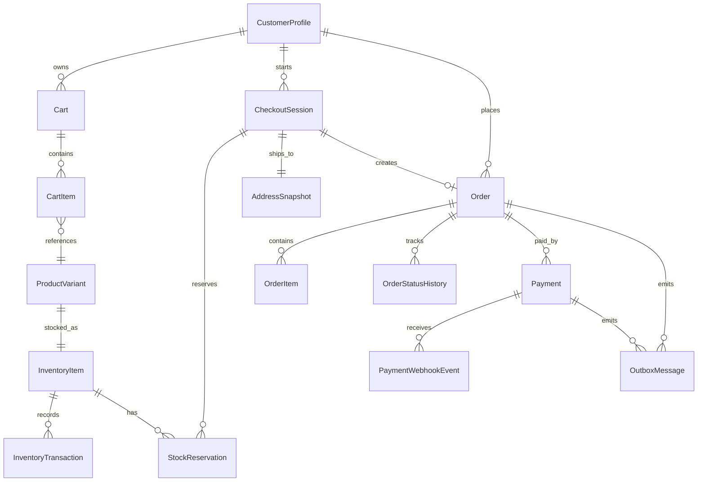
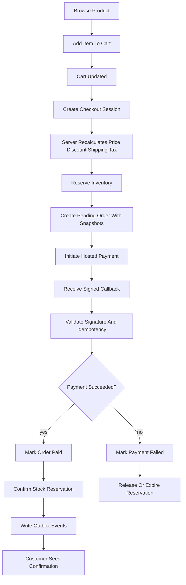
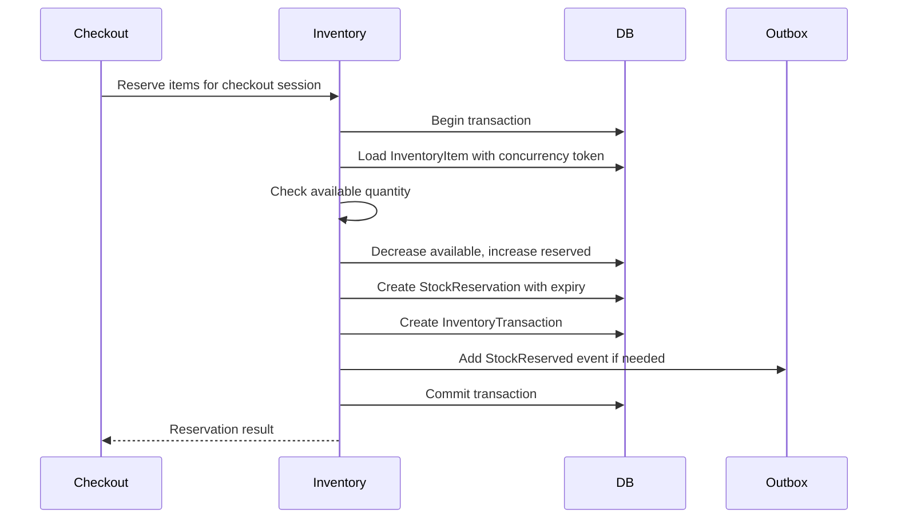
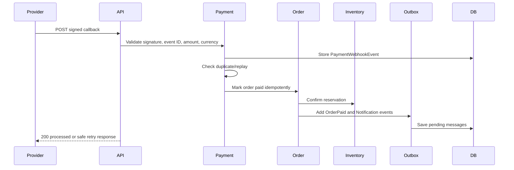
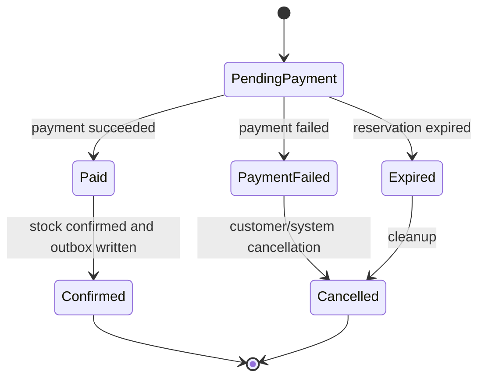
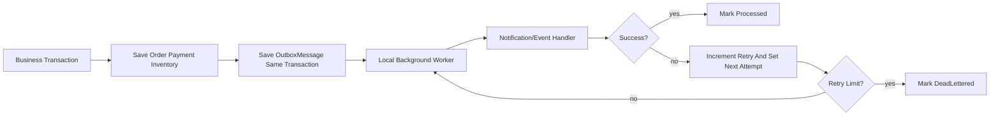

# Phase 2: MVP Commerce Flow Design Package

## 1. Purpose

Phase 2 builds the safe path from product browsing to paid order using .NET 10, ASP.NET Core on .NET 10, EF Core compatible with .NET 10, C#, Onion Architecture, and the modular monolith design approved in Phase 0 and Phase 1.

This phase is the heart of the MVP commerce system. It must protect money, inventory, customer ownership, and order state. The design deliberately avoids paid AWS services for now. Local/free-first adapters are used during MVP implementation, while AWS migration options are documented for later production readiness.

## 2. Phase 2 Goals And Non-Goals

### Goals

- Implement product browsing and product details using trusted catalog reads.
- Implement guest cart and authenticated cart behavior.
- Define cart merge behavior after login.
- Create checkout sessions from a valid cart.
- Use address snapshots so order history does not change when a profile address changes later.
- Recalculate price, discount, shipping placeholder, tax placeholder, and totals server-side.
- Reserve inventory during checkout and expire/release reservations safely.
- Create orders with immutable order item snapshots.
- Integrate with a hosted/sandbox payment gateway through an adapter.
- Validate signed payment webhook/callback messages.
- Make checkout, payment initiation, payment callback, and order creation idempotent.
- Store order/payment events in an outbox table for local background processing.
- Define failure handling and compensation behavior.
- Define unit, integration, API, security, and failure-flow test expectations.

### Non-Goals

- Do not store card data.
- Do not implement real production payment credentials.
- Do not introduce paid AWS services.
- Do not implement advanced promotions, loyalty, gift cards, split payments, refunds, returns, subscriptions, marketplace sellers, or multi-warehouse routing.
- Do not implement AI/RAG search or recommendations in Phase 2.
- Do not trust client-provided price, discount, shipping, tax, or inventory values.
- Do not build full production observability; define local logs/audit/outbox records and leave dashboards/alerts to Phase 5.

## 3. Commerce Module Boundaries

### Beginner Explanation

Think of the commerce flow like a relay race. Each module owns one part of the baton. Catalog says what can be bought, Cart records what the customer wants, Checkout verifies the purchase, Inventory protects stock, Payment verifies money, Order records the final business truth, and Outbox sends follow-up work safely.

### Module Ownership

| Module | Owns | Does Not Own | Calls Or Publishes |
| --- | --- | --- | --- |
| Catalog Read Flow | Public product list, product detail reads, active product/variant visibility, product price source. | Cart quantity, stock reservation, payment status. | Called by Cart/Checkout for trusted product and price data. |
| Cart | Guest cart, authenticated cart, cart items, cart ownership, cart merge. | Final order totals, payment, stock ownership. | Calls Catalog for product validity; publishes no external event in MVP unless needed for analytics later. |
| Checkout | CheckoutSession, server-side total calculation, address selection, validation, orchestration. | Payment gateway truth, stock source-of-truth. | Calls Cart, Catalog, Inventory, Order, Payment; writes audit and outbox events. |
| Inventory Reservation | InventoryItem, StockReservation, InventoryTransaction, reservation expiry/release/confirmation. | Product descriptions, order ownership, payment gateway status. | Called by Checkout and Payment success flow; publishes stock reservation events to outbox if needed. |
| Orders | Order, OrderItem snapshots, OrderStatusHistory, customer order history. | Payment gateway validation, live product price, live inventory count. | Called by Checkout/Payment; publishes `OrderCreated`, `OrderPaid`, `OrderFailed` events to outbox. |
| Payments | Payment, PaymentWebhookEvent, gateway adapter contract, callback validation, reconciliation status. | Card data, order item details, inventory stock. | Calls Order/Inventory after verified payment; publishes payment events to outbox. |
| Outbox/Events | OutboxMessage, local event status, retry count, next attempt time. | Business source-of-truth state. | Local worker delivers email/notification/order events; future SQS/EventBridge adapter. |
| Notifications | Email/notification command handling from outbox. | Order/payment decision making. | Consumes outbox messages; can be mocked locally. |

### Module Communication Rules

- Cart must not update inventory.
- Inventory must not decide payment status.
- Payment must not trust client order totals.
- Order must store snapshots, not live product references only.
- Checkout coordinates modules but should keep business rules in Core services.
- Outbox records are written in the same database transaction as the business state change when possible.

## 4. API Design

### General API Rules

- Base path: `/api/v1`.
- JSON uses camelCase.
- Use Problem Details-style errors from Phase 1.
- Use `X-Correlation-Id` on all requests.
- Use `Idempotency-Key` on checkout session creation, payment initiation, payment callback handling, and any order-creation command.
- Customer-owned resources require ownership checks.
- Guest cart operations require a server-issued guest cart ID or signed cart token design; do not trust arbitrary cart IDs.

### Endpoint Plan

| Use Case | Method And Route | Auth | Idempotency | Notes |
| --- | --- | --- | --- | --- |
| Product browsing | `GET /api/v1/products` | Anonymous | No | Supports pagination, filters, sorting. |
| Product details | `GET /api/v1/products/{productId}` | Anonymous | No | Returns active product and variants only. |
| Create/read cart | `GET /api/v1/cart` | Anonymous/Customer | No | Creates empty cart if needed. |
| Add cart item | `POST /api/v1/cart/items` | Anonymous/Customer | Optional | Server validates product/variant active status. |
| Update cart item | `PATCH /api/v1/cart/items/{cartItemId}` | Anonymous/Customer | Optional | Quantity must be positive and within configured limit. |
| Remove cart item | `DELETE /api/v1/cart/items/{cartItemId}` | Anonymous/Customer | No | Must verify cart ownership. |
| Merge guest cart | `POST /api/v1/cart/merge` | Customer | Yes | Merges guest cart into authenticated cart after login. |
| Create checkout session | `POST /api/v1/checkout/sessions` | Customer | Required | Recalculates totals and reserves stock. |
| Select/snapshot address | `PUT /api/v1/checkout/sessions/{checkoutSessionId}/address` | Customer | Optional | Creates/updates address snapshot. |
| Confirm inventory reservation | Internal service operation | System | Required internally | API should not expose direct customer reservation confirmation. |
| Initiate payment | `POST /api/v1/orders/{orderId}/payments` | Customer | Required | Creates hosted/sandbox payment session. |
| Payment callback/webhook | `POST /api/v1/payments/webhooks/{provider}` | Provider signature | Required by provider event ID | Validates signature and replay protection. |
| Order creation | Usually internal during checkout | Customer/System | Required | If exposed, use `POST /api/v1/orders` with idempotency. |
| Order history | `GET /api/v1/orders` | Customer | No | Customer sees own orders only. |
| Order details | `GET /api/v1/orders/{orderId}` | Customer/Admin permission | No | Customer ownership or admin permission required. |

### Product Browsing Query Conventions

```text
GET /api/v1/products?pageNumber=1&pageSize=20&categoryId=cat_1&minPrice=10&maxPrice=50&sort=price_asc
```

Rules:

- Default `pageNumber`: `1`.
- Default `pageSize`: `20`.
- Maximum `pageSize`: `100`.
- Filters must be allowlisted.
- Sorting must be allowlisted.
- Product search in Phase 2 is database/catalog search only; semantic search is Phase 4.

### Request/Response Conventions

Cart item add request:

```json
{
  "productId": "prd_123",
  "variantId": "var_456",
  "quantity": 2
}
```

Checkout session creation request:

```json
{
  "cartId": "cart_123",
  "shippingAddressId": "addr_123",
  "billingAddressId": "addr_456",
  "discountCode": "OPTIONAL"
}
```

Payment initiation response:

```json
{
  "orderId": "ord_123",
  "paymentId": "pay_123",
  "provider": "SandboxGateway",
  "paymentRedirectUrl": "https://sandbox-provider.example/checkout/session",
  "expiresAtUtc": "2026-06-18T12:15:00Z"
}
```

Order detail response should include snapshots:

```json
{
  "id": "ord_123",
  "status": "PendingPayment",
  "items": [
    {
      "sku": "TSHIRT-BLK-M",
      "productName": "Cotton T-Shirt",
      "quantity": 2,
      "unitPrice": { "amount": 19.99, "currency": "USD" }
    }
  ],
  "total": { "amount": 39.98, "currency": "USD" }
}
```

### Error Formats

Use Phase 1 Problem Details responses.

Validation error example:

```json
{
  "type": "https://example.com/problems/validation-error",
  "title": "Validation failed",
  "status": 400,
  "detail": "One or more fields are invalid.",
  "traceId": "generated-correlation-id",
  "errors": {
    "quantity": ["Quantity must be greater than zero."]
  }
}
```

Authentication error:

```json
{
  "type": "https://example.com/problems/authentication-required",
  "title": "Authentication required",
  "status": 401,
  "detail": "A valid access token is required.",
  "traceId": "generated-correlation-id"
}
```

Authorization error:

```json
{
  "type": "https://example.com/problems/forbidden",
  "title": "Forbidden",
  "status": 403,
  "detail": "The current user is not allowed to access this resource.",
  "traceId": "generated-correlation-id"
}
```

Conflict examples:

- Duplicate idempotency key with different payload.
- Payment callback already processed.
- Inventory changed during checkout.
- Reservation already expired.

## 5. Data Model Changes

### Entity Relationship Diagram



### Required Entities

| Entity | Owner Module | Important Fields |
| --- | --- | --- |
| `Cart` | Cart | `Id`, `CustomerProfileId`, `GuestCartKeyHash`, `Status`, `CreatedAtUtc`, `UpdatedAtUtc`, `MergedAtUtc`, `ExpiresAtUtc`, `Version`. |
| `CartItem` | Cart | `Id`, `CartId`, `ProductId`, `VariantId`, `Quantity`, `AddedAtUtc`, `UpdatedAtUtc`, `Version`. |
| `CheckoutSession` | Checkout | `Id`, `CustomerProfileId`, `CartId`, `Status`, `IdempotencyKeyHash`, `Currency`, `SubtotalAmount`, `DiscountAmount`, `ShippingAmount`, `TaxAmount`, `TotalAmount`, `ExpiresAtUtc`, `CreatedAtUtc`, `UpdatedAtUtc`, `Version`. |
| `AddressSnapshot` | Checkout/Order | `Id`, `CheckoutSessionId`, `OrderId`, `Type`, `RecipientName`, `Line1`, `Line2`, `City`, `Region`, `PostalCode`, `Country`, `PhoneMasked`, `CreatedAtUtc`. |
| `InventoryItem` | Inventory | `Id`, `ProductVariantId`, `AvailableQuantity`, `ReservedQuantity`, `SafetyStockQuantity`, `Version`, `CreatedAtUtc`, `UpdatedAtUtc`. |
| `InventoryTransaction` | Inventory | `Id`, `InventoryItemId`, `Type`, `Quantity`, `ReferenceType`, `ReferenceId`, `Reason`, `CreatedAtUtc`, `CreatedByUserId`. |
| `StockReservation` | Inventory | `Id`, `CheckoutSessionId`, `InventoryItemId`, `Quantity`, `Status`, `ExpiresAtUtc`, `ConfirmedAtUtc`, `ReleasedAtUtc`, `Version`, `CreatedAtUtc`. |
| `Order` | Orders | `Id`, `CustomerProfileId`, `CheckoutSessionId`, `OrderNumber`, `Status`, `Currency`, `SubtotalAmount`, `DiscountAmount`, `ShippingAmount`, `TaxAmount`, `TotalAmount`, `IdempotencyKeyHash`, `CreatedAtUtc`, `UpdatedAtUtc`, `Version`. |
| `OrderItem` | Orders | `Id`, `OrderId`, `ProductId`, `VariantId`, `Sku`, `ProductName`, `VariantName`, `Quantity`, `UnitPriceAmount`, `DiscountAmount`, `TaxAmount`, `LineTotalAmount`, `CreatedAtUtc`. |
| `OrderStatusHistory` | Orders | `Id`, `OrderId`, `FromStatus`, `ToStatus`, `Reason`, `ChangedAtUtc`, `ChangedByUserId`, `CorrelationId`. |
| `Payment` | Payments | `Id`, `OrderId`, `Provider`, `ProviderPaymentId`, `Status`, `Amount`, `Currency`, `IdempotencyKeyHash`, `InitiatedAtUtc`, `AuthorizedAtUtc`, `CapturedAtUtc`, `FailedAtUtc`, `FailureCode`, `Version`. |
| `PaymentWebhookEvent` | Payments | `Id`, `Provider`, `ProviderEventId`, `PaymentId`, `SignatureHash`, `ReceivedAtUtc`, `ProcessedAtUtc`, `Status`, `FailureReason`, `PayloadHash`, `CorrelationId`. |
| `OutboxMessage` | Outbox/Events | `Id`, `EventType`, `AggregateType`, `AggregateId`, `PayloadJson`, `Status`, `OccurredAtUtc`, `AvailableAtUtc`, `ProcessedAtUtc`, `RetryCount`, `LastError`, `CorrelationId`. |

### Constraints, Indexes, And Concurrency

| Entity | Constraint/Index |
| --- | --- |
| `Cart` | Index `CustomerProfileId`, `Status`; unique active cart per customer; index `GuestCartKeyHash`; index `ExpiresAtUtc`. |
| `CartItem` | Unique `CartId`, `VariantId` for active item; quantity greater than zero; index `CartId`. |
| `CheckoutSession` | Unique `IdempotencyKeyHash` per customer/action; index `CustomerProfileId`, `Status`; index `ExpiresAtUtc`. |
| `InventoryItem` | Unique `ProductVariantId`; concurrency token `Version`; quantity cannot be negative. |
| `InventoryTransaction` | Index `InventoryItemId`, `CreatedAtUtc`; index `ReferenceType`, `ReferenceId`. |
| `StockReservation` | Index `CheckoutSessionId`; index `InventoryItemId`, `Status`; index `ExpiresAtUtc`; concurrency token `Version`. |
| `Order` | Unique `OrderNumber`; unique `CheckoutSessionId`; unique `IdempotencyKeyHash` where present; index `CustomerProfileId`, `CreatedAtUtc`; concurrency token `Version`. |
| `OrderItem` | Index `OrderId`; immutable after order creation except correction workflows later. |
| `OrderStatusHistory` | Index `OrderId`, `ChangedAtUtc`. |
| `Payment` | Unique `Provider`, `ProviderPaymentId` when present; unique `IdempotencyKeyHash` per order/action; index `OrderId`, `Status`; concurrency token `Version`. |
| `PaymentWebhookEvent` | Unique `Provider`, `ProviderEventId`; index `PaymentId`; index `ReceivedAtUtc`; store payload hash, not sensitive raw secrets. |
| `OutboxMessage` | Index `Status`, `AvailableAtUtc`; index `AggregateType`, `AggregateId`; retry count tracked. |

### Status Values

| Entity | Status Values |
| --- | --- |
| `Cart` | `Active`, `Merged`, `CheckedOut`, `Expired`, `Abandoned`. |
| `CheckoutSession` | `Started`, `StockReserved`, `PendingPayment`, `Completed`, `Expired`, `Cancelled`, `Failed`. |
| `StockReservation` | `Active`, `Confirmed`, `Released`, `Expired`. |
| `Order` | `PendingPayment`, `Paid`, `PaymentFailed`, `Confirmed`, `Cancelled`, `Expired`. |
| `Payment` | `Initiated`, `PendingProvider`, `Succeeded`, `Failed`, `Cancelled`, `Unknown`, `RequiresReview`. |
| `PaymentWebhookEvent` | `Received`, `Processed`, `Duplicate`, `InvalidSignature`, `Failed`. |
| `OutboxMessage` | `Pending`, `Processing`, `Processed`, `Failed`, `DeadLettered`. |

### Audit Fields

All commerce entities should include `CreatedAtUtc` and `UpdatedAtUtc` where mutable. Sensitive state transitions should also include `CorrelationId` through logs/audit/outbox records.

## 6. Cart-To-Order Flow



### Workflow Rules

1. Customer adds active product variants to a cart.
2. Cart stores product/variant references and quantities only. It does not store trusted final prices.
3. Checkout loads cart and recalculates product prices server-side.
4. Discount code is validated server-side if present. Advanced promotion rules can be delayed.
5. Shipping/tax are placeholders in MVP if not implemented, but must still be server-calculated values.
6. Inventory availability is checked in a database transaction.
7. Stock reservations are created with expiry.
8. Pending order is created with immutable item snapshots.
9. Payment is initiated through hosted/sandbox provider adapter.
10. Signed callback confirms payment.
11. Payment success marks order paid, confirms stock, and writes outbox messages.
12. Payment failure marks payment/order failure and releases or lets reservation expire.

## 7. Checkout And Order Workflow Details

### Server-Side Recalculation

Never trust these from the client:

- Unit price.
- Discount amount.
- Shipping amount.
- Tax amount.
- Total amount.
- Inventory availability.

Checkout must load product/variant data, active status, current price, discount rules, and inventory availability from the database or trusted services.

### Address Snapshot

Address snapshots protect order history. If a customer edits their saved address after ordering, the old order still shows the shipping/billing address used at checkout.

Rules:

- Checkout creates shipping and billing snapshots from selected profile addresses or one-time checkout address.
- Order links to snapshots or copies snapshots at order creation.
- Do not log full addresses.
- Customer can view own order address snapshot; admin access requires permission and data minimization.

### Shipping And Tax Placeholder

If shipping/tax calculation is not fully implemented in Phase 2:

- Store explicit server-side placeholder values such as `0.00` and `CalculationStatus = NotImplemented`.
- Do not accept client-provided shipping/tax.
- Keep fields in the model so later phases can add real calculation without reshaping orders.

### Idempotency

Use idempotency for:

- Checkout session creation.
- Order creation if exposed as a command.
- Payment initiation.
- Payment callback processing.

Rules:

- Same key plus same payload returns same result.
- Same key plus different payload returns `409 Conflict`.
- Idempotency records must expire after a configured retention window.
- Store hash of payload, not full sensitive body.

## 8. Inventory Reservation Design

### How Overselling Is Prevented

InventoryItem stores:

- `AvailableQuantity`: sellable stock not already reserved.
- `ReservedQuantity`: stock temporarily held for active checkout.
- `Version`: concurrency token.

StockReservation stores:

- Product variant inventory item.
- Quantity.
- Checkout session.
- Expiry time.
- Status.

### Inventory Reservation Sequence



### Reservation Rules

- Create reservations only inside a database transaction.
- Use optimistic concurrency token or row-version field on `InventoryItem`.
- If concurrency conflict occurs, reload stock and retry only a small configured number of times.
- Reservation expiry default can be 10-15 minutes for MVP.
- Expired reservations must release reserved quantity back to available quantity.
- Payment success confirms reservation and converts it into final stock reduction.
- Payment failure releases reservation or allows expiry worker to release it.
- Product stock changes during checkout must not invalidate an active reservation unless the reservation expires or is manually cancelled.

## 9. Payment Safety Design

### Payment Assumptions

- Use hosted/sandbox payment provider for MVP.
- Do not store card data.
- Store provider references, amounts, currency, status, timestamps, and safe audit metadata only.
- Payment provider SDK/code belongs in Infrastructure behind Core interfaces.
- Provider secrets come from user-secrets/environment variables locally.

### Payment Webhook/Callback Sequence



### Webhook Safety Rules

- Validate provider signature before trusting body content.
- Validate event timestamp/replay window if provider supports it.
- Validate provider event ID uniqueness.
- Validate payment amount, currency, provider payment ID, and order reference.
- Duplicate successful callback returns success without repeating side effects.
- Invalid signature returns failure and stores only safe metadata.
- Delayed callback should still process if order/payment is in a compatible state.
- Callback for unknown payment/order should be stored as `RequiresReview` or safely rejected according to provider contract.

### Payment Status Reconciliation

MVP can include a manual/local reconciliation command design:

- Query sandbox provider by provider payment ID.
- Compare provider status with local payment/order status.
- Resolve `Unknown` or `RequiresReview` records.
- Do not auto-refund or auto-cancel without explicit workflow in later phases.

## 10. Order State Transition



Rules:

- Order status changes must go through an order service.
- Every status change writes `OrderStatusHistory`.
- Invalid transitions return `409 Conflict` or `422 Business rule failure`.
- Payment success must be idempotent.
- Order item snapshots must not change after order creation.

## 11. Outbox And Event Design

### Why Outbox Exists

Without an outbox, the system can save an order but fail to send email, or send email but fail to save the order. The outbox pattern records "work to do next" in the same local database transaction as the business change.

### Outbox Event Flow



### MVP Outbox Rules

- Outbox table is local database-backed.
- A local background worker processes pending messages.
- Event handlers must be idempotent.
- Duplicate event prevention uses `EventType`, `AggregateType`, `AggregateId`, and optional idempotency key.
- Retry uses small fixed or exponential backoff.
- After retry limit, message becomes `DeadLettered`.
- Do not require SQS/EventBridge in MVP.

### Future AWS Migration

| MVP Local Design | Future AWS Option |
| --- | --- |
| `OutboxMessage` table | Keep as source of truth for reliable publishing. |
| Local background worker | ECS service/worker or hosted background service. |
| Local event handlers | Publish to Amazon SQS for queues. |
| In-process routing | Publish domain events to Amazon EventBridge. |
| Console/local logs | CloudWatch Logs and metrics. |

## 12. Security Review

| Risk | Example | Mitigation |
| --- | --- | --- |
| Duplicate payment | Customer retries payment initiation or provider sends callback twice. | Idempotency keys, unique provider event ID, payment status checks. |
| Webhook forgery | Attacker posts fake success callback. | Signature validation, timestamp/replay checks, provider event ID uniqueness. |
| Price tampering | Client sends lower unit price. | Ignore client price; recalculate server-side from catalog/pricing. |
| Discount tampering | Client sends arbitrary discount amount. | Validate discount code server-side; store discount snapshot. |
| Stock overselling | Two customers buy last item. | Transactional reservation with concurrency token. |
| Unauthorized order access | Customer reads another customer's order. | Ownership checks; admin permission checks; `404` when existence would leak. |
| Guest cart abuse | User creates huge carts or uses another guest cart ID. | Signed/hashed guest cart key, quantity limits, expiry, rate limit later. |
| Sensitive payment data exposure | Logs include provider payload or card data. | No card storage; redacted logs; store payload hash/safe metadata. |
| Insecure callback handling | Callback endpoint trusts body before signature. | Validate signature before processing; reject invalid signature safely. |
| Over-logging customer data | Logs include full address or personal data. | Log IDs, status, correlation ID; avoid full address and full customer profile. |
| Outbox duplicate delivery | Email sent multiple times. | Idempotent event handlers and processed-message tracking. |

## 13. Failure Handling

| Failure | Expected Behavior |
| --- | --- |
| Payment succeeds but order creation fails | Preferred design avoids this by creating pending order before payment. If detected, create `RequiresReview` payment record and do not silently lose provider reference. |
| Order is created but email fails | Order remains valid; outbox message retries; eventually `DeadLettered` for manual review. |
| Inventory reservation expires | Mark checkout/order as expired or payment-incompatible; release stock; customer must restart checkout. |
| Payment callback received twice | First callback applies side effects; duplicate is recorded/recognized and returns success without repeating actions. |
| Payment callback delayed | Process if order is still `PendingPayment` and reservation active; if expired, mark `RequiresReview` for manual reconciliation. |
| Cart item price changes before checkout | Checkout uses current server price; response should show updated total before payment. |
| Product becomes unavailable during checkout | Checkout fails with business error; cart item is marked unavailable or requires removal. |
| Database transaction fails | Roll back state changes; return safe error with correlation ID; no outbox message should be published. |
| Outbox processing fails | Retry with backoff; mark `DeadLettered` after retry limit; log safe operational error. |
| Payment initiation fails | Keep order `PendingPayment` or mark payment `Failed` depending on provider response; allow retry with same idempotency key. |
| Stock confirmation fails after payment | Mark order/payment `RequiresReview`; do not double-charge; alert/log for manual action. |

## 14. Logging And Audit Design

### Log These

- Request route template, status code, elapsed time, correlation ID.
- Cart operation result without full cart contents.
- Checkout session ID, status, customer ID, correlation ID.
- Inventory reservation success/failure with inventory item ID and quantity.
- Order ID, order status transition, correlation ID.
- Payment ID, provider, status category, provider event ID.
- Outbox message ID, event type, retry count, final status.

### Never Log These

- Card data.
- Payment secrets.
- Full access tokens or refresh tokens.
- Sensitive headers.
- Authorization headers.
- Cookies.
- Full customer addresses.
- Full personal data.
- Raw provider payloads if they contain sensitive data.

### Audit These Actions

| Action | Reason |
| --- | --- |
| Cart merged after login | Ownership-sensitive action. |
| Checkout session created | Money/stock flow starts. |
| Stock reserved/released/confirmed | Inventory integrity. |
| Order created | Business transaction. |
| Order status changed | Order audit trail. |
| Payment initiated | Payment lifecycle. |
| Payment callback processed/duplicate/invalid | Payment safety. |
| Admin views customer order | Sensitive access. |

### Correlation IDs

- Use one correlation ID from product/cart/checkout/payment logs through outbox messages.
- Include correlation ID in `OrderStatusHistory`, `PaymentWebhookEvent`, `OutboxMessage`, and logs.
- Do not use correlation ID as authorization or idempotency.

## 15. Testing Strategy

| Test Area | Required Cases |
| --- | --- |
| Cart operations | Add, update, remove, read; invalid quantity; inactive product; ownership check. |
| Guest cart | Guest cart creation, expiry, signed/hashed key validation. |
| Cart merge after login | Same variant quantities merge correctly; duplicate items combine; ownership enforced; idempotent merge. |
| Product browsing | Pagination, filters, inactive products hidden, detail for active product only. |
| Checkout session | Requires authenticated customer; validates cart; recalculates prices; creates address snapshot. |
| Server-side price recalculation | Client price ignored; changed price reflected before payment. |
| Discount validation | Invalid discount rejected; client discount amount ignored. |
| Inventory reservation | Succeeds when stock available; fails when insufficient; concurrency conflict handled. |
| Reservation expiry | Expired reservation releases stock; expired checkout cannot proceed to payment. |
| Order creation | Creates immutable snapshots; unique order number; idempotent order creation. |
| Payment initiation | Requires order ownership; amount/currency match order; idempotent payment creation. |
| Payment callback validation | Valid signature succeeds; invalid signature rejected; unknown event handled safely. |
| Duplicate payment prevention | Duplicate callback does not duplicate side effects. |
| Outbox event creation | Order/payment state changes write expected outbox messages in same transaction. |
| Unauthorized order access | Customer cannot read another customer's order; admin permission required. |
| Failure flows | Payment failed releases reservation; outbox retry/dead-letter behavior; delayed callback handling. |

Test types:

- Unit tests for cart merge, total calculation, status transitions, idempotency decisions, reservation rules.
- Integration tests for EF Core mappings, unique constraints, transactions, concurrency tokens, outbox persistence.
- API tests for endpoint routes, auth, response shapes, validation errors, pagination/filtering.
- Security tests for price tampering, webhook forgery, unauthorized order access, duplicate callback.
- Failure-flow tests for expired reservation, payment failure, DB transaction rollback, outbox retry.

## 16. AI-Assisted Development Guidance

Give the AI coding tool one small task at a time. Do not ask it to implement the whole commerce flow in one prompt.

Recommended safe implementation order:

1. Define Phase 2 DTOs, value objects, status enums, and error/result models in Core.
2. Create read-only catalog query contracts for product browsing/details.
3. Add cart entities and cart service interfaces.
4. Implement cart persistence and cart API endpoints.
5. Add guest cart key handling and cart expiry.
6. Add cart merge after login.
7. Add inventory item, inventory transaction, and stock reservation entities.
8. Implement inventory reservation service with concurrency strategy.
9. Add checkout session and address snapshot entities.
10. Implement checkout session creation with server-side total calculation.
11. Add order, order item, and order status history entities.
12. Implement pending order creation from checkout session.
13. Add payment interfaces and sandbox payment adapter.
14. Implement payment initiation endpoint.
15. Implement signed payment callback validation and replay protection.
16. Implement payment success/failure order transitions.
17. Implement stock confirmation/release after payment result.
18. Add outbox message entity and local worker design.
19. Add notification event handlers as mock/local handlers.
20. Add tests after each module.

AI prompt guardrail:

```text
Implement only the named Phase 2 module. Preserve Onion Architecture. Do not put EF Core, payment provider SDK code, or infrastructure details in ECommerce.Core. Never trust client price, discount, shipping, tax, or inventory values. Do not store card data. Do not log payment secrets, tokens, full addresses, cookies, authorization headers, or full personal data. Add tests for success, failure, duplicate, and unauthorized cases. Stop if a requirement is unclear.
```

Manual review is required before accepting AI changes to:

- Inventory reservation.
- Checkout total calculation.
- Order creation.
- Payment initiation.
- Webhook/callback validation.
- Outbox transaction behavior.
- Database migrations touching order, payment, or inventory tables.

## 17. Phase 2 Approval Checklist

Phase 2 can be considered complete when:

- Product browsing and detail APIs work with pagination/filtering and hide inactive products.
- Cart add/update/remove/read works for guest and authenticated users.
- Guest cart merge after login is safe, idempotent, and ownership-protected.
- Checkout session creation requires authenticated customer and validates cart ownership.
- Checkout recalculates price, discount, shipping placeholder, tax placeholder, and total server-side.
- Client-provided price, discount amount, shipping, tax, and inventory values are ignored.
- Address snapshots are created and linked to checkout/order.
- Inventory reservation prevents overselling using transaction/concurrency strategy.
- Reservation expiry/release/confirmation behavior is implemented and tested.
- Pending order creation stores immutable item and amount snapshots.
- Payment initiation uses hosted/sandbox provider adapter and idempotency.
- No card data is stored.
- Payment callback validates signature, amount, currency, order reference, and provider event ID.
- Duplicate callbacks do not repeat side effects.
- Order status transitions are controlled and recorded in history.
- Outbox messages are written in the same transaction as business state changes where possible.
- Outbox worker retries and dead-letter behavior are defined/tested locally.
- Unauthorized order access is blocked and tested.
- Logs and audit records include correlation IDs and exclude sensitive data.
- Unit, integration, API, security, and failure-flow tests cover the listed cases.
- No paid AWS service is required.

## 18. Open Questions Before Implementation

| Question | Default For Phase 2 |
| --- | --- |
| Which sandbox payment provider will be used? | Use a mock/sandbox adapter first; choose real provider before production readiness. |
| Should order be created before or after payment initiation? | Create pending order before payment so payment can reference a stable order ID. |
| What is reservation expiry duration? | 10-15 minutes for MVP unless product/business rules require otherwise. |
| How should guest cart identity be stored? | Server-issued signed/hashed key or secure cookie; never trust arbitrary cart IDs. |
| Are discounts implemented in Phase 2? | Minimal validation placeholder only; advanced promotions move to later phase. |
| Are shipping/tax implemented in Phase 2? | Server-side placeholder fields; real calculation later. |
| What database provider is default locally? | Follow Phase 1 decision; keep EF Core provider-specific code in Infrastructure. |

## 19. References

- .NET 10 overview: https://learn.microsoft.com/en-us/dotnet/core/whats-new/dotnet-10/overview
- ASP.NET Core in .NET 10: https://learn.microsoft.com/en-us/aspnet/core/release-notes/aspnetcore-10.0
- EF Core indexes: https://learn.microsoft.com/en-us/ef/core/modeling/indexes
- AWS retry with backoff pattern: https://docs.aws.amazon.com/prescriptive-guidance/latest/cloud-design-patterns/retry-backoff.html
- AWS Builders Library on idempotent APIs: https://aws.amazon.com/builders-library/making-retries-safe-with-idempotent-APIs/
- OWASP Top 10: https://owasp.org/www-project-top-ten/
- OWASP API Security Top 10: https://owasp.org/API-Security/editions/2023/en/0x00-header/
