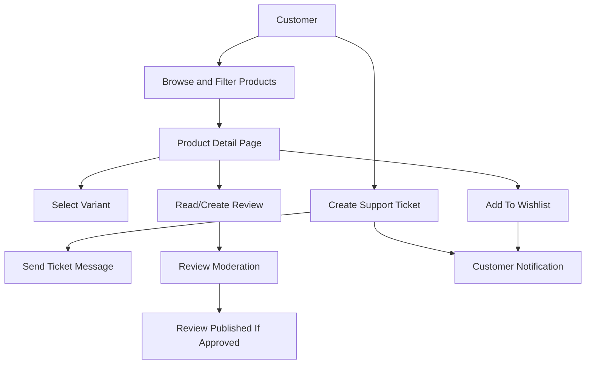
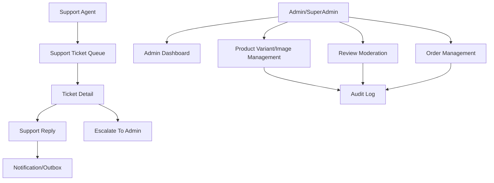
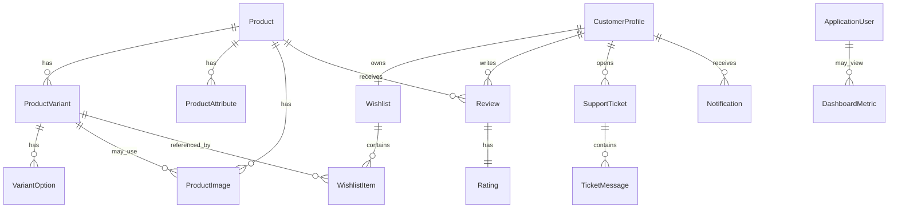
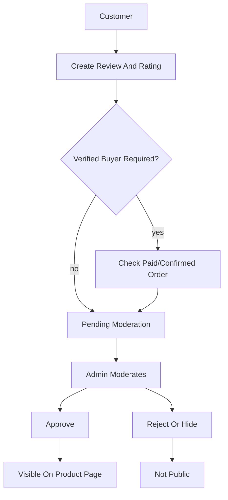
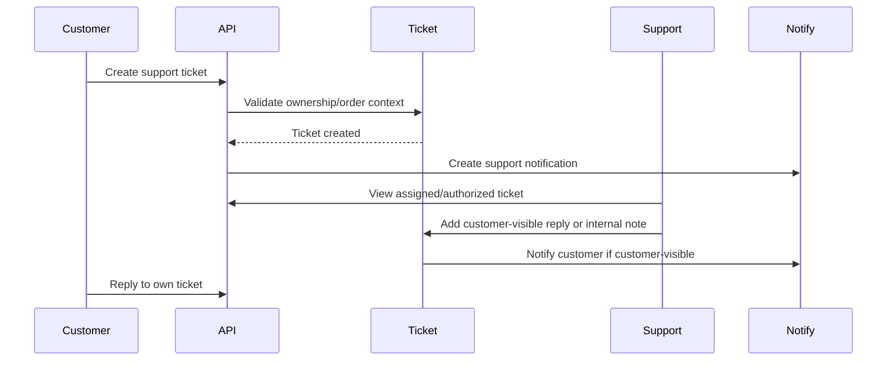
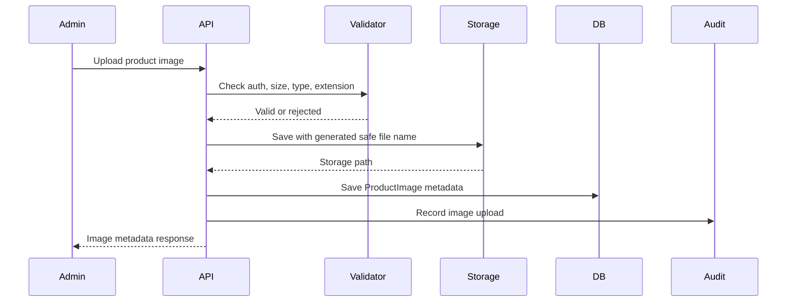
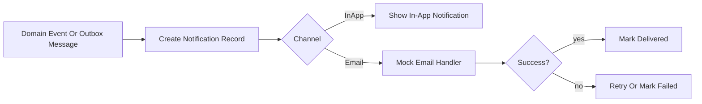

# Phase 3: MVP Experience Layer Design Package

## 1. Purpose

Phase 3 improves the customer, admin, and support experience after the core commerce flow from Phase 2 is safe. The platform continues to use .NET 10, ASP.NET Core on .NET 10, EF Core compatible with .NET 10, C#, Onion Architecture, and a modular monolith design.

This phase adds product variants, product attributes, wishlist, reviews, support tickets, admin dashboards, admin order management, product image handling, basic reporting, notifications, and search/filter UX rules. It remains local/free-first. No paid AWS services are introduced.

## 2. Phase 3 Goals And Non-Goals

### Customer Experience Goals

- Show product variants and attributes clearly on product detail pages.
- Allow authenticated customers to save products to a wishlist.
- Allow customers to create reviews and ratings according to moderation rules.
- Allow customers to create support tickets and reply to their own tickets.
- Show customer notifications for order/support/review events.
- Improve product filtering, sorting, pagination, and empty-result behavior.

### Admin Experience Goals

- Provide a basic admin dashboard summary.
- Provide admin order management screens with safe status-update rules.
- Allow authorized admins to manage product variants, product attributes, and product images.
- Allow authorized admins to moderate reviews.
- Audit sensitive admin actions.

### Support Experience Goals

- Allow support agents to view and respond to assigned or authorized support tickets.
- Allow ticket status changes and escalation to admin.
- Protect sensitive customer data in support messages.
- Keep customer-visible messages separate from internal support notes.

### Reporting And Notification Goals

- Provide basic reporting summaries using local database queries/read models.
- Create notification records for important customer/admin/support events.
- Use outbox integration when notification delivery is asynchronous.
- Keep advanced analytics for later phases.

### Non-Goals

- Do not implement real-time live chat.
- Do not implement AI/RAG support assistant; Phase 4 owns AI.
- Do not implement advanced recommendation engines.
- Do not implement advanced BI, warehouse analytics, customer segmentation, or campaign analytics.
- Do not introduce paid AWS services.
- Do not implement multi-warehouse, loyalty, fraud scoring, returns, or refunds.
- Do not allow unvalidated file uploads.
- Do not expose private wishlist, support, notification, or order-related support data across customers.

## 3. Experience Module Boundaries

| Module | Owns | Reads From | Must Not Own |
| --- | --- | --- | --- |
| Product Variants | Variant SKU, option combination, variant display state, variant price adjustment, variant image link. | Product, InventoryItem. | Final stock quantity, cart quantity, order state. |
| Product Attributes | Product specification fields used for filtering/display. | Product. | Search ranking, inventory, payment. |
| Wishlist | Wishlist, WishlistItem, customer wishlist privacy. | Product availability and public product data. | Product source-of-truth data. |
| Reviews And Ratings | Review, Rating, moderation status, verified purchase flag. | Customer, Order, Product. | Order ownership, payment status. |
| Support Tickets | SupportTicket, category, priority, status, assignment, escalation. | Customer, Order summary when authorized. | Order mutation rules. |
| Ticket Messages | Customer/support/admin messages and internal notes. | SupportTicket. | General notification delivery. |
| Admin Dashboard | Basic operational read models and summaries. | Orders, Inventory, Products, Support, Reviews. | Source-of-truth business state. |
| Admin Order Management | Authorized order lookup and controlled status updates. | Orders, Payments, Shipments later. | Payment capture/refund behavior. |
| Product Image Handling | ProductImage metadata, validation rules, storage abstraction, sort order. | Product/Variant. | Product business rules beyond image association. |
| Notifications | Notification records, delivery status, customer/admin/support visibility. | Outbox events, order/support/review events. | Business state changes. |
| Basic Reporting | DashboardMetric/read model snapshots if needed. | Operational tables. | Advanced analytics warehouse. |

Communication rules:

- Experience modules may read product/order summaries but must not bypass Product, Order, Inventory, or Payment rules.
- Admin screens must call application services with authorization checks, not raw repositories.
- Notifications are outcomes of events; they must not become the source of truth.
- Reporting read models may be stale; checkout/order/payment must never depend on reporting data.

## 4. Customer Experience Flow



## 5. Admin And Support Module Interaction



## 6. API Design

### General Rules

- Base path: `/api/v1`.
- JSON uses camelCase.
- Use Problem Details-style errors from Phase 1.
- Use pagination for list endpoints.
- Use allowlisted filters and sorts.
- Customer-owned resources require ownership checks.
- Admin/support endpoints require role and permission checks.
- File upload endpoints require authentication, authorization, file validation, and storage abstraction.

### Endpoint Plan

| Use Case | Method And Route | Auth | Notes |
| --- | --- | --- | --- |
| List product variants | `GET /api/v1/products/{productId}/variants` | Anonymous | Active variants only for public users. |
| Get product variant | `GET /api/v1/products/{productId}/variants/{variantId}` | Anonymous | Public variant detail. |
| Manage variants | `POST/PUT/DELETE /api/v1/admin/products/{productId}/variants` | Admin `catalog.manage` | Audited. Delete should usually soft-disable. |
| Manage attributes | `POST/PUT/DELETE /api/v1/admin/products/{productId}/attributes` | Admin `catalog.manage` | Audited. |
| Get wishlist | `GET /api/v1/wishlist` | Customer | Current customer only. |
| Add wishlist item | `POST /api/v1/wishlist/items` | Customer | Prevent duplicates. |
| Remove wishlist item | `DELETE /api/v1/wishlist/items/{wishlistItemId}` | Customer | Ownership required. |
| Create review | `POST /api/v1/products/{productId}/reviews` | Customer | Optional verified-buyer rule. |
| List public reviews | `GET /api/v1/products/{productId}/reviews` | Anonymous | Approved reviews only. |
| Update own review | `PUT /api/v1/reviews/{reviewId}` | Customer | Allowed only before/through moderation rules. |
| Delete own review | `DELETE /api/v1/reviews/{reviewId}` | Customer | Soft delete recommended. |
| Moderate review | `POST /api/v1/admin/reviews/{reviewId}/moderation` | Admin `reviews.moderate` | Audited. |
| Create support ticket | `POST /api/v1/support/tickets` | Customer | Customer-owned. |
| List my tickets | `GET /api/v1/support/tickets` | Customer | Own tickets only. |
| Ticket details | `GET /api/v1/support/tickets/{ticketId}` | Customer/Support/Admin | Ownership or support/admin permission. |
| Reply to ticket | `POST /api/v1/support/tickets/{ticketId}/messages` | Customer/Support/Admin | Visibility rules required. |
| Update ticket status | `PATCH /api/v1/support/tickets/{ticketId}/status` | Support/Admin | Audited. |
| Admin order list | `GET /api/v1/admin/orders` | Admin `orders.read` | Safe filters and pagination. |
| Admin order detail | `GET /api/v1/admin/orders/{orderId}` | Admin `orders.read` | Minimize PII. |
| Admin order status update | `PATCH /api/v1/admin/orders/{orderId}/status` | Admin `orders.manage` | Controlled transitions and audit. |
| Dashboard summary | `GET /api/v1/admin/dashboard/summary` | Admin `dashboard.read` | Basic metrics only. |
| Upload product image | `POST /api/v1/admin/products/{productId}/images` | Admin `catalog.manage` | Multipart upload; validate file. |
| Manage image | `PUT/DELETE /api/v1/admin/products/{productId}/images/{imageId}` | Admin `catalog.manage` | Audited; delete can soft-delete metadata. |
| Notifications | `GET /api/v1/notifications` | Customer/Admin/Support | Current actor only. |
| Mark notification read | `PATCH /api/v1/notifications/{notificationId}/read` | Owner | Ownership required. |
| Basic reporting summary | `GET /api/v1/admin/reports/summary` | Admin `reports.read` | Local read model/query. |

### Pagination, Filtering, Sorting

Use:

```text
?pageNumber=1&pageSize=20&sort=created_desc&status=open
```

Rules:

- Default `pageNumber`: `1`.
- Default `pageSize`: `20`.
- Maximum `pageSize`: `100`.
- Filter and sort fields must be allowlisted per endpoint.
- Empty results return `200` with an empty `items` array and helpful metadata.

### Error Formats

Use Phase 1 Problem Details responses:

- `400` for validation errors.
- `401` for missing/invalid authentication.
- `403` for authenticated user without permission.
- `404` when resource does not exist or existence should not be revealed.
- `409` for duplicate wishlist item, invalid state transition, or concurrency conflict.
- `422` for business rule failures such as reviewing a product without verified purchase when that rule is enabled.

## 7. Data Model Changes



### Required Entities

| Entity | Owner | Important Fields |
| --- | --- | --- |
| `ProductVariant` | Product Variants | `Id`, `ProductId`, `Sku`, `DisplayName`, `PriceAdjustmentAmount`, `Currency`, `IsActive`, `IsDefault`, `SortOrder`, `CreatedAtUtc`, `UpdatedAtUtc`, `Version`. |
| `VariantOption` | Product Variants | `Id`, `ProductVariantId`, `Name`, `Value`, `SortOrder`, `CreatedAtUtc`. |
| `ProductAttribute` | Product Attributes | `Id`, `ProductId`, `Name`, `Value`, `DataType`, `IsFilterable`, `IsPublic`, `SortOrder`, `CreatedAtUtc`, `UpdatedAtUtc`. |
| `Wishlist` | Wishlist | `Id`, `CustomerProfileId`, `Visibility`, `CreatedAtUtc`, `UpdatedAtUtc`. |
| `WishlistItem` | Wishlist | `Id`, `WishlistId`, `ProductId`, `VariantId`, `AddedAtUtc`, `Note`, `IsDeleted`. |
| `Review` | Reviews | `Id`, `ProductId`, `CustomerProfileId`, `OrderId`, `Title`, `Body`, `Status`, `ModerationReason`, `IsVerifiedBuyer`, `CreatedAtUtc`, `UpdatedAtUtc`, `DeletedAtUtc`. |
| `Rating` | Reviews | `Id`, `ReviewId`, `ProductId`, `CustomerProfileId`, `Value`, `CreatedAtUtc`. |
| `SupportTicket` | Support | `Id`, `CustomerProfileId`, `OrderId`, `Category`, `Priority`, `Status`, `Subject`, `AssignedToUserId`, `EscalatedAtUtc`, `CreatedAtUtc`, `UpdatedAtUtc`, `ClosedAtUtc`, `Version`. |
| `TicketMessage` | Support | `Id`, `SupportTicketId`, `SenderUserId`, `SenderRole`, `Body`, `Visibility`, `CreatedAtUtc`, `DeletedAtUtc`, `IsInternalNote`. |
| `Notification` | Notifications | `Id`, `RecipientUserId`, `Type`, `Channel`, `Title`, `BodyPreview`, `TargetType`, `TargetId`, `Status`, `ReadAtUtc`, `CreatedAtUtc`, `DeliveredAtUtc`, `FailureReason`. |
| `ProductImage` | Product Images | `Id`, `ProductId`, `VariantId`, `FileName`, `OriginalFileName`, `ContentType`, `StoragePath`, `AltText`, `SortOrder`, `IsPrimary`, `Status`, `UploadedByUserId`, `CreatedAtUtc`, `DeletedAtUtc`. |
| `DashboardMetric` | Reporting | `Id`, `MetricName`, `MetricValue`, `Scope`, `CalculatedAtUtc`, `SourceVersion`, `Status`. Optional for MVP if direct queries are enough. |

### Constraints And Indexes

| Entity | Constraint/Index |
| --- | --- |
| `ProductVariant` | Unique `Sku`; index `ProductId`, `IsActive`; only one default variant per product if supported. |
| `VariantOption` | Unique `ProductVariantId`, `Name`; index `Name`, `Value` for filters if needed. |
| `ProductAttribute` | Unique `ProductId`, `Name`; index `Name`, `Value` for filterable fields. |
| `Wishlist` | Unique `CustomerProfileId` for MVP private wishlist. |
| `WishlistItem` | Unique active `WishlistId`, `ProductId`, `VariantId`; index `WishlistId`; soft-delete optional. |
| `Review` | Unique active review per `CustomerProfileId`, `ProductId`, optionally per `OrderId`; index `ProductId`, `Status`, `CreatedAtUtc`. |
| `Rating` | Value range 1-5; unique per review; index `ProductId`. |
| `SupportTicket` | Index `CustomerProfileId`, `Status`; index `AssignedToUserId`, `Status`; concurrency token `Version`. |
| `TicketMessage` | Index `SupportTicketId`, `CreatedAtUtc`; do not expose internal notes to customers. |
| `Notification` | Index `RecipientUserId`, `Status`, `CreatedAtUtc`; index `TargetType`, `TargetId`. |
| `ProductImage` | Index `ProductId`, `SortOrder`; index `VariantId`; one primary image per product/variant where supported. |
| `DashboardMetric` | Unique `MetricName`, `Scope`, `CalculatedAtUtc` if persisted. |

### Status Values

| Entity | Status Values |
| --- | --- |
| `Review` | `PendingModeration`, `Approved`, `Rejected`, `Hidden`, `Deleted`. |
| `SupportTicket` | `Open`, `WaitingForCustomer`, `WaitingForSupport`, `Escalated`, `Resolved`, `Closed`. |
| `TicketMessage.Visibility` | `CustomerVisible`, `InternalOnly`. |
| `Notification` | `Pending`, `Delivered`, `Read`, `Failed`, `Cancelled`. |
| `ProductImage` | `Active`, `PendingScan`, `Rejected`, `Deleted`. |
| `DashboardMetric` | `Current`, `Stale`, `Failed`. |

## 8. Product Variant And Attribute Design

Product is the general item. ProductVariant is the sellable option. For example, a T-shirt product may have variants for `Black / Medium`, `Black / Large`, and `Blue / Medium`.

Rules:

- Variant options can include size, color, storage, material, style, or other option names.
- Each sellable variant must have a SKU.
- Cart and checkout must reference the selected variant, not only the product.
- Inventory connects to variant, not just product.
- Variant-specific price adjustment is allowed, but final checkout price is still calculated server-side.
- Variant-specific images are allowed.
- Disabled variants remain visible only if the product page needs to show "unavailable"; they cannot be added to cart.
- Product detail pages should show option selectors, current selected variant, price, availability state, image, and disabled/unavailable states.
- Product attributes are descriptive/filterable facts such as brand, material, screen size, color family, storage size, or warranty period.
- Only attributes marked `IsPublic` appear to customers.
- Only attributes marked `IsFilterable` can be used in filter UX.

## 9. Wishlist Design

Rules:

- Wishlist is authenticated-customer only for MVP.
- Guest wishlist is excluded from MVP to avoid identity/merge complexity.
- One private wishlist per customer is enough for MVP.
- Duplicate active wishlist items are prevented by unique constraint.
- Wishlist item points to product and optional variant.
- If product/variant becomes unavailable, keep the wishlist item but display unavailable state.
- Wishlist is private. Customers cannot access another customer's wishlist.
- Future price drop/restock notifications can use wishlist items as notification triggers, but delivery rules move to later phases.

## 10. Reviews And Ratings Design



Rules:

- Customers can write reviews only when authenticated.
- Recommended MVP default: allow only verified buyers to review if Phase 2 order data is available; otherwise mark reviews as unverified and require moderation.
- Reviews start as `PendingModeration`.
- Public product pages show only `Approved` reviews.
- Rating value must be 1-5.
- Product rating summary should be calculated from approved reviews only.
- Customer can edit own review while pending; editing an approved review should return it to moderation.
- Customer delete should soft-delete.
- Admin moderation actions: approve, reject, hide, restore if allowed.
- Abuse prevention: one active review per product/order, moderation queue, rate limits later, profanity/spam checks later, audit moderation decisions.

## 11. Support Ticket Design



Rules:

- Customer can create a ticket for general issue or own order.
- Ticket categories: `OrderIssue`, `PaymentIssue`, `ProductQuestion`, `ReturnQuestion`, `AccountIssue`, `Other`.
- Support ticket status values: `Open`, `WaitingForCustomer`, `WaitingForSupport`, `Escalated`, `Resolved`, `Closed`.
- Customer sees own tickets and customer-visible messages only.
- Support agent sees assigned tickets or tickets allowed by support permissions.
- Internal notes must never be returned to customer endpoints.
- Admin can escalate/reassign and view broader ticket queues with permission.
- Sensitive data handling: discourage card data/passwords in messages; redact logs; do not log full message bodies.

## 12. Admin Dashboard And Order Management Design

### Dashboard Metrics Allowed In Phase 3

- Orders today/count by status.
- Pending payment count.
- Low stock count.
- Open support tickets.
- Pending review moderation count.
- Product count by active/inactive.
- Notification failures count.

Delay these to advanced analytics:

- Cohort analysis.
- Lifetime value.
- Funnel analytics.
- Campaign attribution.
- AI recommendations performance.
- Long-running trend dashboards.

### Admin Order Management

Rules:

- Admin order list/detail requires `orders.read`.
- Order status update requires `orders.manage`.
- Status changes must use the Order service and valid transitions from Phase 2.
- Admin cannot edit payment truth directly.
- Admin cannot silently change order totals.
- Support agents can view limited order summary only when tied to an authorized ticket.
- All admin order access and status updates are audited.

### Read Model Strategy

- Direct queries are acceptable for MVP.
- Use projection/read model only if dashboard queries become complex.
- Reporting data may be delayed/stale and must not affect checkout/payment/order truth.

## 13. Product Image Safety Design



Rules:

- Allowed file types for MVP: `.jpg`, `.jpeg`, `.png`, `.webp`.
- Validate content type and file extension.
- Recommended local max size: 5 MB per image unless changed by business rules.
- Generate server-side file names. Never trust original file name as storage path.
- Store files through an abstraction such as `IFileStorageService`.
- Local MVP storage can be a configured local folder outside source-controlled code paths.
- Future AWS path: replace local storage adapter with S3 and serve public media through CloudFront.
- Public images are product media only; private support attachments are out of scope for MVP.
- Product image ownership is by product/variant and uploaded admin.
- Delete should soft-delete metadata first; physical cleanup can be async later.
- Protect against path traversal, executable upload, huge files, spoofed MIME type, overwrite attacks, and unbounded storage growth.

## 14. Notification Design



Phase 3 notification types:

- Review approved/rejected.
- Support ticket reply.
- Support ticket status changed.
- Order status changed if not already covered in Phase 2.
- Wishlist product unavailable/restocked can be designed but not required.
- Admin notification for pending moderation or open support count can be in dashboard only.

Rules:

- In-app notifications are MVP default.
- Email can be mocked locally and delivered through outbox later.
- Notification recipient must be explicit.
- Customer can access only own notifications.
- Support/admin notifications require role/permission checks.
- Notification delivery failure should not roll back the business action.
- Async delivery should use OutboxMessage where possible.

## 15. Search And Filter UX Rules

- Product filters use allowlisted fields only.
- Filterable attributes must have `IsFilterable = true`.
- Sorting options are allowlisted: `newest`, `price_asc`, `price_desc`, `rating_desc`, `name_asc`.
- Pagination defaults to page 1 and page size 20; maximum page size 100.
- Empty results return a normal empty list with metadata and no exception.
- Search input length should be limited and normalized.
- Phase 3 search remains keyword/database based.
- Semantic search, embeddings, vector DB, and RAG handoff to Phase 4.

## 16. Authorization Design

| Role | Allowed In Phase 3 |
| --- | --- |
| Customer | Manage own wishlist, write own reviews, create/view own support tickets, read own notifications, view own order support context. |
| SupportAgent | View/respond to assigned or authorized tickets, see limited order context for ticket support, update ticket status within support rules. |
| Admin | Manage variants/images/attributes with permissions, moderate reviews, view dashboard, manage orders within allowed status rules, manage support escalation. |
| SuperAdmin | Manage permissions and highest-risk admin actions; still audited. |

Ownership checks:

- Wishlist: customer owns wishlist and wishlist items.
- Reviews: customer owns own reviews; public sees only approved reviews.
- Support tickets: customer owns own ticket; support/admin access requires permission.
- Ticket messages: customer sees customer-visible messages only.
- Notifications: recipient owns notification.
- Order support actions: customer must own order; support/admin needs permission and support reason.
- Product image management: admin permission `catalog.manage`.
- Dashboard access: admin permission `dashboard.read`.

## 17. Security Review

| Risk | Example | Mitigation |
| --- | --- | --- |
| Fake reviews | User reviews product never purchased. | Verified-buyer rule if order data available; moderation required. |
| Review spam | Many abusive reviews. | One active review per product/order, moderation, rate limits later. |
| Unauthorized ticket access | Customer reads another customer's ticket. | Ownership checks, `404` for hidden existence, negative tests. |
| Unsafe file upload | Executable uploaded as image. | Extension/content-type validation, size limit, generated file names, safe storage path. |
| Admin privilege misuse | Admin changes order or hides review improperly. | Permission checks, audit logs, valid transition rules. |
| IDOR/BOLA | User changes URL ID to another wishlist/ticket/notification. | Ownership checks on every resource lookup. |
| Sensitive support data exposure | Internal note returned to customer. | Message visibility field, DTO allowlists, tests. |
| Over-logging customer info | Logs contain ticket body or address. | Log IDs/status only; do not log sensitive bodies. |
| Dashboard data leakage | Dashboard exposes PII or unrestricted business data. | Aggregate metrics only, permission checks, no raw PII. |
| Notification abuse | User marks another user's notification read. | Recipient ownership checks. |
| Unauthorized order management | Support/admin updates order without permission. | Permission policies and order service transition rules. |

## 18. Failure Handling

| Failure | Expected Behavior |
| --- | --- |
| Image upload fails | Return safe error; do not create active ProductImage metadata unless storage succeeded. |
| Image validation fails | Return validation error; do not store file. |
| Review moderation fails | Leave review in previous state; log/audit safe failure. |
| Notification sending fails | Business action remains; notification/outbox retries or marks failed. |
| Support ticket update fails | Transaction rolls back; customer/support sees safe error. |
| Admin action unauthorized | Return 403; audit denied attempt where appropriate. |
| Dashboard query fails | Return safe error or partial unavailable state; do not expose query details. |
| Variant data inconsistent | Disable affected variant from purchase and require admin correction. |
| Customer accesses another customer's resource | Return 404 or 403 according to leakage risk; audit suspicious repeated attempts. |
| Reporting data delayed/unavailable | Show stale/unavailable state; never block checkout/order flow. |

## 19. Logging And Audit Design

### Log These

- Route template, status, elapsed time, correlation ID.
- Resource IDs, status changes, and operation result.
- Image validation outcome without raw file contents.
- Notification delivery status and retry count.
- Dashboard query failure category.

### Never Log These

- Full personal data.
- Sensitive support message bodies.
- Private customer addresses.
- Full tokens.
- Cookies.
- Authorization headers.
- Sensitive request bodies.
- Raw uploaded file contents.

### Audit These Actions

- Admin order updates.
- Product image upload/update/delete.
- Product variant and attribute changes.
- Review moderation.
- Support ticket access by support/admin.
- Support ticket status changes and escalation.
- Dashboard access by privileged users.
- Notification delivery failures when tied to important customer communication.

Correlation ID rules:

- Include correlation ID in logs and audit records.
- Propagate correlation ID into outbox/notification messages.
- Do not use correlation ID for authentication, authorization, or ownership.

## 20. Testing Strategy

| Test Area | Required Cases |
| --- | --- |
| Wishlist operations | Add/remove/list; duplicate prevention; unavailable product display; ownership checks. |
| Review creation | Auth required; rating range; duplicate review prevention; verified-buyer rule if enabled. |
| Review moderation | Approve/reject/hide; approved-only public display; audit record created. |
| Support ticket creation | Customer creates own ticket; category/status defaults; invalid order ownership rejected. |
| Ticket replies | Customer/support replies; internal notes hidden from customer; ownership checks. |
| Admin order management | Permission checks; valid/invalid status transition; audit record. |
| Product image validation | Allowed types; rejected types; size limit; generated file name; delete behavior. |
| Product variants | SKU uniqueness; disabled variants cannot be added to cart; variant stock link remains intact. |
| Authorization | Customer blocked from admin/support endpoints; support limited to authorized tickets. |
| Dashboard access | Requires `dashboard.read`; metrics aggregate only; no raw PII. |
| Notifications | Recipient ownership; mark read; delivery failure stored safely. |
| Failure scenarios | Upload failure, moderation failure, dashboard query failure, stale reporting. |

Test types:

- Unit tests for status rules, moderation rules, wishlist duplicate logic, variant availability.
- Integration tests for EF Core constraints, image metadata, ticket/message visibility, notification ownership.
- API tests for routes, response shapes, pagination, filters, sorting, and errors.
- Security tests for IDOR/BOLA, unsafe upload, admin permission misuse, internal note leakage.
- UI-flow tests for product detail variant selection, wishlist, review submission, ticket creation, admin moderation.

## 21. AI-Assisted Development Guidance

Give the AI coding tool one small module at a time.

Recommended implementation order:

1. Define Phase 3 status enums, DTOs, and permission constants.
2. Add ProductVariant and VariantOption model refinements.
3. Add ProductAttribute model and filter metadata.
4. Add ProductImage metadata model and file storage interface.
5. Implement product image validation and local storage adapter.
6. Add wishlist and wishlist item entities/services.
7. Add wishlist API endpoints and ownership tests.
8. Add Review and Rating entities/services.
9. Add review moderation endpoints and tests.
10. Add SupportTicket and TicketMessage entities/services.
11. Add support ticket customer endpoints.
12. Add support/admin ticket endpoints with visibility rules.
13. Add Notification entity/service and in-app notification endpoints.
14. Add basic dashboard summary query service.
15. Add admin order management read/update endpoints using Phase 2 order rules.
16. Add basic reporting summary endpoint.
17. Add UI-flow tests and security tests after each module.

AI prompt guardrail:

```text
Implement only the named Phase 3 module. Preserve Onion Architecture. Do not bypass authorization or ownership checks. Do not log full personal data, sensitive support messages, private addresses, tokens, cookies, authorization headers, or sensitive request bodies. Do not accept file uploads without validation. Add tests for success, validation failure, unauthorized access, and ownership failure. Stop if a requirement is unclear.
```

Manual review is required before accepting AI changes to:

- Product image upload and storage.
- Admin order management.
- Support ticket visibility.
- Review moderation.
- Dashboard/reporting queries.
- Migrations touching product variant, order, support, review, or notification tables.

## 22. Future AWS Migration Options

| Local MVP Design | Future AWS Option |
| --- | --- |
| Local file storage abstraction | Amazon S3 for product images. |
| Local static file serving | CloudFront in front of S3/media. |
| Local notification/outbox worker | ECS worker plus SQS/EventBridge. |
| Local logs | CloudWatch Logs and metrics. |
| Direct dashboard queries | Read replicas, cached read models, or analytics pipeline later. |

Migration rule: keep Core interfaces stable and swap Infrastructure adapters/deployment configuration.

## 23. Phase 3 Approval Checklist

Phase 3 can be considered complete when:

- Product variants/options work and disabled variants cannot be purchased.
- Product attributes support safe public display and allowlisted filtering.
- Product image upload validates type, size, file name, ownership, and storage path.
- Wishlist works for authenticated customers and blocks duplicate active items.
- Customers cannot access another customer's wishlist.
- Reviews require authentication and follow verified-buyer/moderation rules.
- Only approved reviews appear publicly.
- Rating summaries use approved reviews only.
- Support tickets and messages enforce ownership, support/admin permissions, and internal-note visibility.
- Admin dashboard shows only approved aggregate MVP metrics.
- Admin order management uses valid Phase 2 order transitions and audits changes.
- Notifications are recipient-owned and support read/delivery status.
- Basic reporting handles stale/unavailable data safely.
- Search/filter UX uses pagination, allowlisted filters, allowlisted sorting, and empty-result behavior.
- Logs and audit records include correlation IDs and exclude sensitive data.
- Unit, integration, API, security, and UI-flow tests cover the listed scenarios.
- No paid AWS service is required.

## 24. Open Questions Before Implementation

| Question | Default For Phase 3 |
| --- | --- |
| Are only verified buyers allowed to review? | Recommended if Phase 2 order data is available; otherwise require moderation and mark unverified. |
| Should wishlist support guests? | No, authenticated customer only for MVP. |
| Should images require antivirus scanning locally? | Document as production hardening; MVP validates type/size/path and keeps storage abstraction. |
| Should dashboard metrics be persisted? | Direct queries first; add `DashboardMetric` read model only if needed. |
| Can support agents view all tickets? | Default to assigned/authorized tickets only. |
| Are support attachments included? | No, out of scope for MVP Phase 3. |
| Should email notifications be real? | In-app and mock/local email only; production email provider later. |

## 25. References

- .NET 10 overview: https://learn.microsoft.com/en-us/dotnet/core/whats-new/dotnet-10/overview
- ASP.NET Core in .NET 10: https://learn.microsoft.com/en-us/aspnet/core/release-notes/aspnetcore-10.0
- EF Core indexes: https://learn.microsoft.com/en-us/ef/core/modeling/indexes
- OWASP Top 10: https://owasp.org/www-project-top-ten/
- OWASP API Security Top 10: https://owasp.org/API-Security/editions/2023/en/0x00-header/
- AWS Well-Architected Framework: https://docs.aws.amazon.com/wellarchitected/latest/framework/welcome.html
