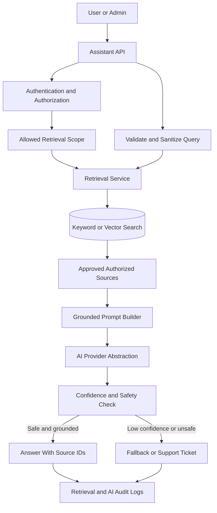
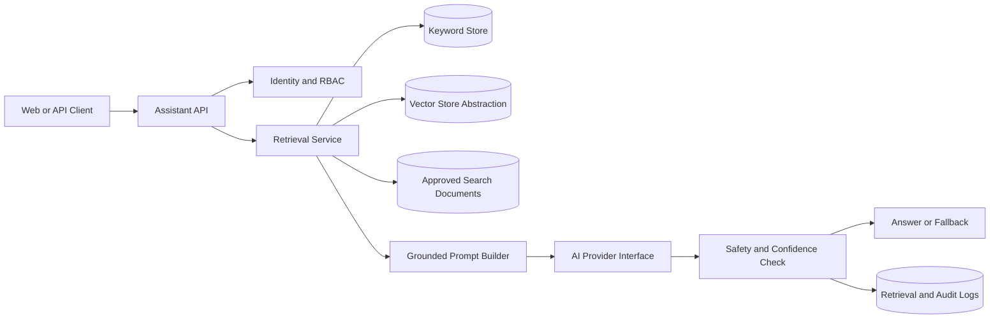
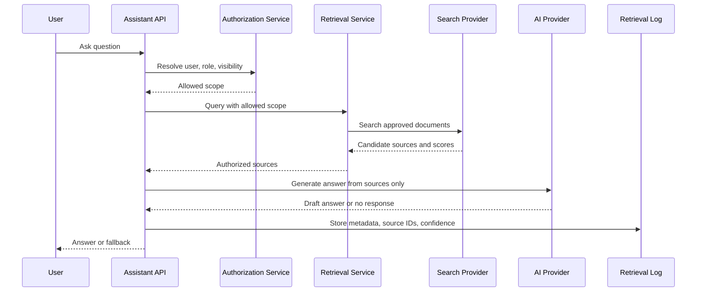
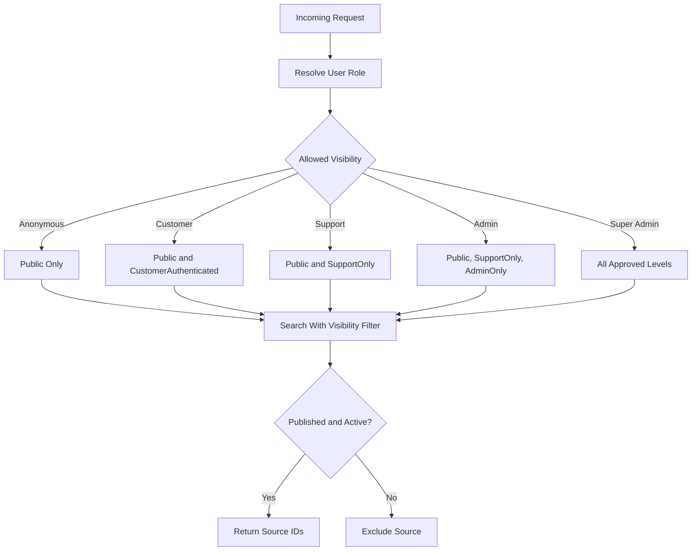
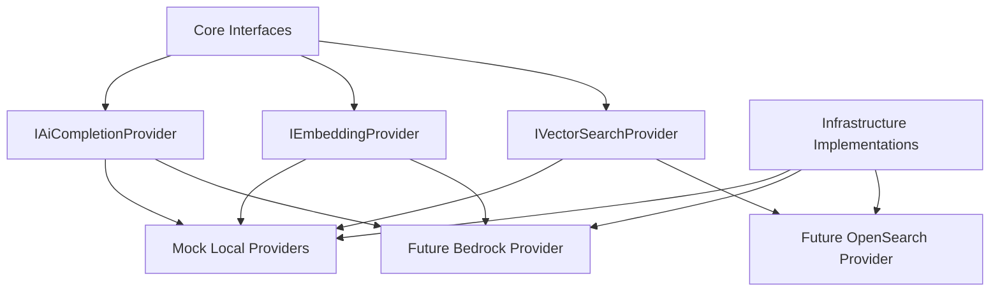
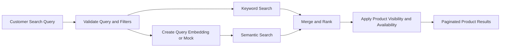
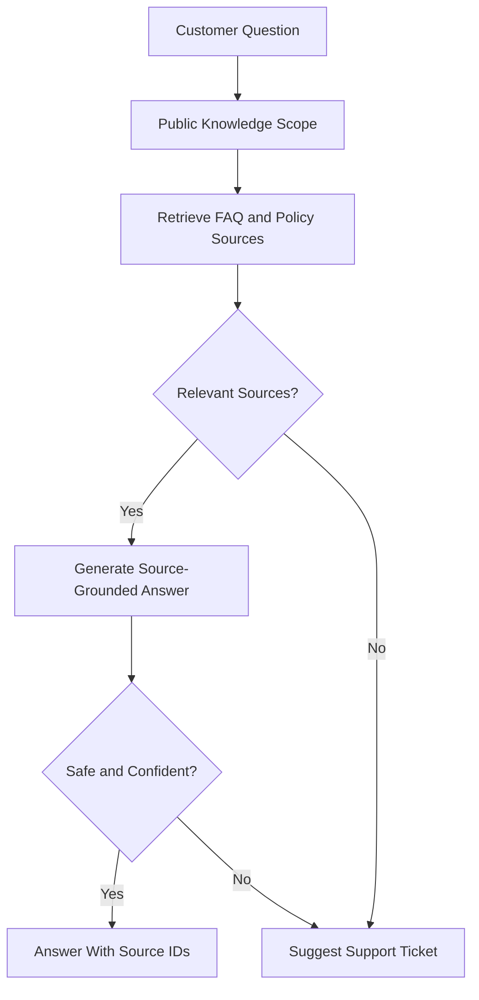
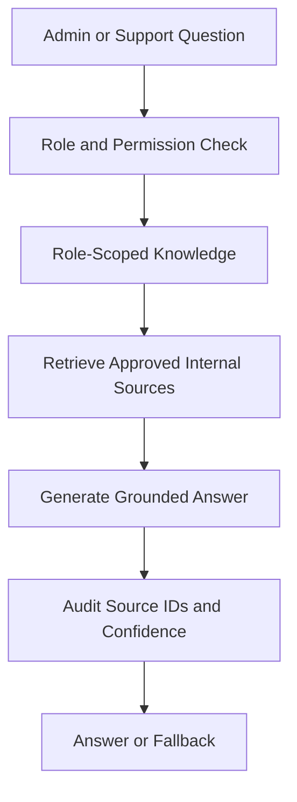
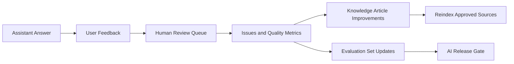

# Phase 4: AI-Enhanced MVP

## 1. Purpose

Phase 4 adds AI features only after the Phase 1 identity foundation, Phase 2 commerce flow, and Phase 3 experience modules are in place. The goal is to improve product discovery and support workflows without allowing AI to bypass business rules, authorization, policy approval, or audit requirements.

This phase is local-first and free-first. The implementation should begin with mock providers and simple local retrieval so the team can design, test, and learn safely before any paid AI or cloud service is connected.

## 2. Technology Baseline

| Area | Phase 4 Decision |
| --- | --- |
| Runtime | .NET 10 |
| API framework | ASP.NET Core on .NET 10 |
| Data access | EF Core compatible with .NET 10 |
| Architecture | Modular monolith using Onion Architecture |
| Language | Modern C# aligned with .NET 10 |
| Initial AI provider | Mock provider only |
| Initial embeddings | Mock or deterministic local embeddings only |
| Initial vector search | Local/free abstraction, simple database-backed fallback allowed |
| Future AWS target | Amazon Bedrock for LLM/embeddings and Amazon OpenSearch vector search |
| Secrets | .NET user-secrets or environment variables for local development |
| Testing | xUnit or equivalent with unit, integration, API, authorization, and safety tests |

Exact package versions must be checked during implementation. Phase 4 documentation must not require paid AWS services or paid AI providers.

## 3. Phase 4 Goals And Non-Goals

### Customer-Facing AI Features

Goals:

- Add semantic product search that helps customers search by intent, not only exact keywords.
- Add a customer support assistant that answers from approved public FAQ, shipping, return, refund-summary, and general help documents.
- Return source IDs with AI answers so answers can be traced to approved content.
- Provide fallback responses when the system has low confidence or no approved source.

Non-goals:

- No fully autonomous customer support.
- No final refund, payment, legal, policy exception, or account-security decisions by AI.
- No use of private customer or order data for anonymous users.

### Admin-Facing AI Features

Goals:

- Add an admin knowledge assistant for approved internal operational documents.
- Enforce role-based retrieval before the assistant sees source content.
- Audit admin assistant access and retrieved source IDs.

Non-goals:

- No unrestricted admin search across all database tables.
- No super-admin-only documents visible to lower-privilege admins or support agents.
- No AI action execution, such as changing order status or approving refunds.

### Search And Recommendation Features

Goals:

- Build a search document model that can represent products, public knowledge articles, and approved internal articles.
- Support semantic product search through provider abstractions.
- Add similar product recommendations based on product-to-product similarity.

Non-goals:

- No sensitive personal profiling.
- No behavioral advertising engine.
- No advanced personalization until privacy, consent, and data retention are designed.

### RAG Infrastructure Features

Goals:

- Define AI provider, embedding provider, and vector search abstractions.
- Build a knowledge article approval model before content becomes retrievable.
- Log retrieval metadata, confidence scores, and source IDs.
- Keep provider SDKs out of `ECommerce.Core`.

Non-goals:

- No direct dependency from Core to Bedrock, OpenSearch, OpenAI, or any provider SDK.
- No paid provider integration before explicit approval.
- No unapproved document ingestion.

### Safety, Logging, And Evaluation Features

Goals:

- Add guardrails for source-grounded answering, prompt injection handling, authorization-aware retrieval, and low-confidence fallback.
- Define evaluation sets before enabling customer-facing AI in production.
- Log enough metadata to debug AI behavior without storing secrets or sensitive full prompts.

Non-goals:

- No raw prompt warehouse containing private customer data.
- No customer-facing AI launch without human review and evaluation.

## 4. AI/RAG Module Boundaries

| Module | Owns | Can Consume | Must Not Do |
| --- | --- | --- | --- |
| AI Provider Abstraction | Interfaces for chat/completion generation and provider response metadata. | Sanitized prompts, retrieved source snippets, generation settings. | Depend on provider SDKs from Core or make authorization decisions. |
| Embedding Provider Abstraction | Interfaces for converting text/query into vectors or deterministic mock embeddings. | Approved indexing text and search queries. | Store raw private data in provider logs. |
| Vector Search Abstraction | Search interface for semantic and hybrid retrieval. | SearchDocument metadata, EmbeddingRecord vectors, visibility filters. | Return documents outside the caller's authorization scope. |
| Search Document Indexing | Creation of searchable chunks for products and approved knowledge articles. | Product, variant, category, policy, FAQ, and knowledge article data through approved module services. | Index unapproved, deleted, hidden, private, or stale content. |
| Knowledge Article Management | KnowledgeArticle, versions, approval, visibility, and publication lifecycle. | Admin identity and audit services. | Publish content without approval and visibility classification. |
| Retrieval Service | Query validation, scope selection, retrieval, ranking, source filtering, and confidence calculation. | Auth context, vector search, keyword search, approved documents. | Trust client-supplied role, source IDs, or confidence scores. |
| Assistant Conversation Service | AssistantConversation and AssistantMessage metadata. | Retrieval service and AI provider abstraction. | Execute business decisions or expose private data without authorization. |
| Feedback And Evaluation Service | AssistantFeedback, evaluation cases, review status, and quality metrics. | Conversation IDs, answer IDs, user ratings, reviewer decisions. | Store secrets, full sensitive prompts, or private payment/order details. |
| Authorization-Aware Retrieval | Visibility and role filters for every retrieval call. | Phase 1 identity, roles, permissions, and ownership rules. | Retrieve first and filter later in application memory when the backing store can filter. |
| AI Audit And Retrieval Logging | RetrievalLog and provider request metadata. | Correlation ID, user ID if authenticated, role, source IDs, scores, outcome. | Log full tokens, authorization headers, secrets, payment details, or full private prompts. |

Beginner note: the assistant is not allowed to decide what the user can see. Authorization happens before retrieval, and retrieval must only return documents that the user is allowed to use.

## 5. Approved And Excluded AI Use Cases

### Approved Phase 4 Use Cases

| Use Case | Users | Allowed Sources | Output Rule |
| --- | --- | --- | --- |
| Semantic product search | Anonymous, customer, admin | Public, active, searchable product data. | Return product search results with ranking metadata. |
| Similar product recommendations | Anonymous, customer, admin | Public, active, searchable product data. | Recommend similar products, not sensitive personalized results. |
| Customer support assistant | Anonymous or authenticated customer | Approved public FAQ, shipping policy, return policy, refund-policy summary, and public help docs. | Answer only from retrieved approved sources or fall back. |
| Admin knowledge assistant | Support agent, admin, super admin | Approved internal docs filtered by role. | Answer only from authorized retrieved sources and audit usage. |

### Excluded Use Cases

- Fully autonomous customer support.
- Legal, refund, payment, or policy decisions from model memory.
- Personalized recommendations using sensitive personal data.
- AI access to private customer, support, order, or payment data without authorization checks.
- Paid AI provider integration before explicit approval.
- AI-generated admin actions, such as changing stock, issuing refunds, or changing order status.

## 6. API Design

All Phase 4 APIs follow the conventions from Phase 0 and Phase 1:

- Base route: `/api/v1/...`
- JSON request and response bodies.
- Server-generated IDs.
- Problem Details error responses include `traceId`, which maps to the request correlation ID.
- Pagination uses `pageNumber`, `pageSize`, `totalCount`, and `items`.
- Filtering uses explicit query parameters. Do not accept dynamic SQL-like filter expressions from clients.
- Authentication uses Phase 1 JWT/session rules.
- Authorization is checked on every assistant, admin, indexing, and retrieval-log endpoint.
- AI endpoints should have rate limits even in local design, such as a low per-IP limit for anonymous users and a per-user limit for authenticated users.

### Common Success Response Shape

```json
{
  "data": {},
  "metadata": {
    "correlationId": "request-correlation-id",
    "confidenceScore": 0.82,
    "sourceIds": ["src_policy_returns_v3_chunk_02"],
    "fallbackUsed": false
  }
}
```

Phase 4 uses the same Problem Details-style error convention as Phases 0-3. `traceId` should map to the request correlation ID used in logs, retrieval logs, and audit records.

### Common Validation Error Shape

```json
{
  "type": "https://example.com/problems/validation-error",
  "title": "Validation failed",
  "status": 400,
  "detail": "One or more fields are invalid.",
  "traceId": "request-correlation-id",
  "errors": {
    "query": ["Query is required and must be 3 to 300 characters."]
  }
}
```

### Common Authentication Error Shape

```json
{
  "type": "https://example.com/problems/authentication-required",
  "title": "Authentication required",
  "status": 401,
  "detail": "Sign in is required for this action.",
  "traceId": "request-correlation-id"
}
```

### Common Authorization Error Shape

```json
{
  "type": "https://example.com/problems/forbidden",
  "title": "Forbidden",
  "status": 403,
  "detail": "You do not have permission to access this AI resource.",
  "traceId": "request-correlation-id"
}
```

### Fallback Response Shape

Fallback is a safe business response, not an exception. Return it when the assistant cannot answer from approved sources with enough confidence.

```json
{
  "data": {
    "answer": "I could not find enough approved information to answer that safely.",
    "nextAction": "CREATE_SUPPORT_TICKET",
    "sourceIds": []
  },
  "metadata": {
    "correlationId": "request-correlation-id",
    "confidenceScore": 0.31,
    "fallbackUsed": true,
    "reason": "LOW_CONFIDENCE"
  }
}
```

### Endpoint Plan

| Endpoint | Method | Auth | Purpose |
| --- | --- | --- | --- |
| `/api/v1/search/semantic` | POST | Optional | Semantic product search over public searchable products. |
| `/api/v1/products/{productId}/similar` | GET | Optional | Similar public products based on category, attributes, price range, and embeddings. |
| `/api/v1/assistant/customer/questions` | POST | Optional or customer | Ask a support question against approved public knowledge. |
| `/api/v1/admin/assistant/questions` | POST | Support/Admin/SuperAdmin | Ask a role-scoped internal knowledge question. |
| `/api/v1/assistant/conversations/{conversationId}/feedback` | POST | Conversation owner or authorized staff | Store thumbs up/down, reason, and optional safe comment. |
| `/api/v1/admin/knowledge/articles` | GET | Support/Admin/SuperAdmin | List knowledge articles by status, visibility, tag, and owner. |
| `/api/v1/admin/knowledge/articles` | POST | Admin/SuperAdmin | Create draft knowledge article. |
| `/api/v1/admin/knowledge/articles/{id}` | PUT | Admin/SuperAdmin | Update draft or rejected article. |
| `/api/v1/admin/knowledge/articles/{id}` | DELETE | Admin/SuperAdmin | Soft-delete article and mark search documents stale. |
| `/api/v1/admin/knowledge/articles/{id}/approve` | POST | Admin/SuperAdmin | Approve and publish article version for retrieval. |
| `/api/v1/admin/search/indexing/documents` | POST | Admin/SuperAdmin | Index or reindex selected source document. |
| `/api/v1/admin/search/reindex` | POST | Admin/SuperAdmin | Request scoped reindex by source type. |
| `/api/v1/admin/ai/retrieval-logs` | GET | Admin/SuperAdmin | Review retrieval outcomes, source IDs, scores, fallback rate, and failures. |

### Request Examples

Semantic search:

```json
{
  "query": "comfortable running shoes for rainy weather",
  "pageNumber": 1,
  "pageSize": 12,
  "filters": {
    "categoryId": "optional-category-id",
    "minPrice": 50,
    "maxPrice": 150,
    "inStockOnly": true
  }
}
```

Customer assistant:

```json
{
  "question": "How long do I have to return an unopened product?",
  "conversationId": "optional-existing-conversation-id"
}
```

Admin assistant:

```json
{
  "question": "What is the approved process for handling damaged package tickets?",
  "conversationId": "optional-existing-conversation-id",
  "requestedVisibility": "SupportOnly"
}
```

### Confidence Score Rules

| Score Range | Behavior |
| --- | --- |
| `>= 0.75` | Answer may be returned if sources are approved and authorized. |
| `0.50` to `0.74` | Prefer cautious answer with clear uncertainty, or ask a clarifying question. |
| `< 0.50` | Return fallback and offer support-ticket escalation. |

The exact threshold can be adjusted after evaluation, but the implementation must keep the threshold centralized and configurable.

### Source ID Format

Source IDs should be stable and traceable:

```text
src_{sourceType}_{sourceId}_v{version}_chunk_{chunkNumber}
```

Examples:

- `src_product_123_v7_chunk_01`
- `src_policy_returns_v3_chunk_02`
- `src_kb_support_456_v2_chunk_04`

## 7. Data Model Changes

### Entities

| Entity | Owner Module | Purpose | Important Fields |
| --- | --- | --- | --- |
| SearchDocument | Search Indexing | Searchable chunk of product or knowledge content. | Id, SourceType, SourceId, SourceVersion, ChunkNumber, Title, ContentPreview, VisibilityLevel, AccessRoleMinimum, Status, IsDeleted, IndexedAt, ExpiresAt, ReindexRequired. |
| EmbeddingRecord | Vector Search | Vector metadata for a SearchDocument. | Id, SearchDocumentId, ProviderName, ModelName, VectorDimension, VectorHash, EmbeddingStatus, CreatedAt, UpdatedAt. |
| KnowledgeArticle | Knowledge Management | User-authored knowledge source. | Id, Slug, Title, Category, VisibilityLevel, ApprovalStatus, OwnerUserId, CurrentVersionId, CreatedAt, UpdatedAt, DeletedAt. |
| KnowledgeArticleVersion | Knowledge Management | Versioned approved/draft content. | Id, KnowledgeArticleId, VersionNumber, Content, Summary, ApprovedByUserId, ApprovedAt, RejectedReason, CreatedByUserId. |
| RetrievalLog | AI Audit | Metadata for retrieval and answer decisions. | Id, CorrelationId, UserId, UserRoleSnapshot, QueryHash, QueryCategory, SourceIds, RetrievalScores, ConfidenceScore, FallbackUsed, FailureReason, CreatedAt. |
| AssistantConversation | Assistant | Conversation container. | Id, UserId, UserRoleSnapshot, AssistantType, Status, CreatedAt, UpdatedAt, ClosedAt. |
| AssistantMessage | Assistant | Message metadata. | Id, ConversationId, SenderType, SanitizedContentPreview, ContentHash, SourceIds, ConfidenceScore, FallbackUsed, CreatedAt. |
| AssistantFeedback | Feedback/Evaluation | User or reviewer feedback on an answer. | Id, ConversationId, MessageId, UserId, Rating, ReasonCode, SafeCommentPreview, ReviewStatus, CreatedAt. |
| AiProviderRequestLog | AI Audit | Provider call metadata when real providers are later enabled. | Id, CorrelationId, ProviderName, ModelName, OperationType, PromptHash, InputTokenEstimate, OutputTokenEstimate, CostEstimate, LatencyMs, Status, CreatedAt. |

### Visibility Levels

| Visibility | Who Can Retrieve |
| --- | --- |
| Public | Anonymous, customer, support, admin, super admin. |
| CustomerAuthenticated | Signed-in customers and staff, but only for non-private general guidance. |
| SupportOnly | Support agent, admin, super admin. |
| AdminOnly | Admin and super admin. |
| SuperAdminOnly | Super admin only. |

Phase 4 should not index private order, payment, address, or support message content into the AI knowledge base unless a later phase designs explicit consent, redaction, retention, and authorization controls.

### Approval Status Values

- `Draft`
- `PendingReview`
- `Approved`
- `Published`
- `Rejected`
- `Archived`
- `Deleted`

Only `Published` documents can be retrieved by customer-facing or admin-facing assistants.

### Indexes And Constraints

| Entity | Index Or Constraint |
| --- | --- |
| SearchDocument | Index on SourceType, SourceId, SourceVersion, Status. |
| SearchDocument | Index on VisibilityLevel, AccessRoleMinimum, Status, ReindexRequired. |
| SearchDocument | Unique SourceType, SourceId, SourceVersion, ChunkNumber. |
| EmbeddingRecord | Unique SearchDocumentId, ProviderName, ModelName. |
| KnowledgeArticle | Unique Slug for non-deleted articles. |
| KnowledgeArticleVersion | Unique KnowledgeArticleId, VersionNumber. |
| RetrievalLog | Index on CreatedAt, UserId, AssistantType, FallbackUsed. |
| AssistantConversation | Index on UserId, AssistantType, CreatedAt. |
| AssistantMessage | Index on ConversationId, CreatedAt. |
| AssistantFeedback | Unique MessageId, UserId where applicable. |
| AiProviderRequestLog | Index on CreatedAt, ProviderName, ModelName, Status. |

### Constraints

- `SourceType` must be one of `Product`, `ProductVariant`, `KnowledgeArticle`, `Policy`, `FAQ`, or `OperationalGuide`.
- `SearchDocument.Status` must prevent retrieval unless the document is active and approved.
- `EmbeddingRecord.VectorDimension` must match the configured provider model.
- Published knowledge article versions are immutable.
- Deleted or archived articles must mark related search documents as stale or inactive.
- Retrieval logs store source IDs, hashes, scores, and metadata, not sensitive full prompts.

## 8. RAG Architecture Design

RAG means Retrieval-Augmented Generation. In simple terms, the assistant first retrieves approved source material and then answers using only that material. The model should not invent policy or business decisions from memory.

### Full RAG Flow

1. User asks a question.
2. API authenticates the user if a token is provided.
3. API determines the user role and allowed visibility levels.
4. Request validation checks length, empty text, unsupported content, and rate limits.
5. Query is sanitized for logging and prompt construction.
6. Retrieval scope is selected based on endpoint and role.
7. Retriever searches approved documents using keyword search, vector search, or both.
8. Retriever applies visibility, status, and role filters.
9. Retrieved source IDs and retrieval scores are logged.
10. Assistant builds a constrained prompt using only the retrieved source snippets.
11. AI provider generates an answer or mock answer.
12. Confidence score is calculated from retrieval quality and provider metadata if available.
13. If confidence is low, unsupported, or unsafe, the API returns a fallback.
14. User feedback can be collected.
15. Retrieval, answer metadata, and feedback are stored for evaluation.



## 9. Semantic Product Search Design

### Indexed Product Fields

Index only public product information:

- Product name.
- Public description.
- Category and brand.
- Public tags.
- Product attributes and variant option names.
- Price range, not hidden supplier cost.
- Public image alt text or metadata if approved.
- Availability status.

### Visibility Rules

- Hidden, deleted, draft, or admin-only products must not be searchable.
- Unavailable products may appear only if the product detail page is public and the UI clearly shows the product is unavailable.
- Product visibility filters must be applied in the search query itself.

### Ranking

Initial ranking can combine:

- Keyword match score.
- Semantic similarity score.
- Product availability.
- Category match.
- Attribute match.
- Business-safe boosts, such as active product and in-stock status.

The client must not send ranking weights that override server rules.

### Hybrid Search

Phase 4 should support a hybrid design:

- Keyword search handles exact names, SKUs if public, and category terms.
- Semantic search handles intent, synonyms, and natural-language phrases.
- The API can merge results using server-side ranking.

### Future Migration

The local interface should make it possible to replace the local implementation with Amazon OpenSearch vector search later. If PostgreSQL is selected later and the team wants a simpler path, pgvector can be considered, but this is a future decision.

## 10. Similar Product Recommendation Design

Phase 4 recommendations are product-to-product similarity, not sensitive personal profiling.

Inputs:

- Current product ID.
- Category.
- Attributes and variant options.
- Price range.
- Tags.
- Text embedding similarity when available.

Exclusions:

- Hidden products.
- Deleted products.
- Draft products.
- Products unavailable for sale unless the UI explicitly supports unavailable suggestions.
- Products the user is not authorized to see.
- Private user behavior, order history, payment data, support tickets, or sensitive profile attributes.

Fallback:

- If no strong match exists, return popular or recent products from the same public category.
- If no safe fallback exists, return an empty list with no AI-generated explanation required.

## 11. Customer Support Assistant Design

### Approved Sources

The customer assistant may retrieve only:

- Public FAQ.
- Shipping policy.
- Return policy.
- Refund-policy summary approved for public display.
- Public product information.
- General support documents approved as public.

### Rules

- Answer only from retrieved approved sources.
- If the source does not contain the answer, return fallback and offer support-ticket creation.
- Do not make final payment, refund, legal, account-security, or exception decisions.
- Do not expose private customer/order data to anonymous users.
- For authenticated customers, do not use private order data in Phase 4 unless a later design explicitly authorizes and redacts it.
- Policy-sensitive answers should include source IDs in metadata and optionally show friendly citations in the UI.

### Escalation

Escalate to a support ticket when:

- Confidence is below threshold.
- The question asks for a decision the AI cannot make.
- The user asks about private account/order data.
- The user reports a safety, payment, legal, or fraud issue.

## 12. Admin Knowledge Assistant Design

### Access Rules

- Support agents can retrieve `Public` and `SupportOnly` documents.
- Admins can retrieve `Public`, `SupportOnly`, and `AdminOnly` documents.
- Super admins can retrieve all approved visibility levels, including `SuperAdminOnly`.

### Source Rules

- Internal knowledge must be approved before retrieval.
- Draft, rejected, archived, deleted, or stale internal documents cannot be retrieved.
- Operational documents should be tagged by topic, owner, and visibility.

### Audit Rules

Audit every admin assistant request with:

- User ID.
- Role snapshot.
- Correlation ID.
- Assistant type.
- Source IDs.
- Confidence score.
- Fallback status.
- Timestamp.

Do not audit full sensitive prompts unless a later protected retention policy is approved.

## 13. AI Safety And Guardrails

| Guardrail | Requirement |
| --- | --- |
| Source-grounded answering | Answers must be based on retrieved approved source snippets. |
| Confidence threshold | Low-confidence answers fall back or ask clarifying questions. |
| Prompt injection handling | Treat user input, product content, and knowledge articles as untrusted data. |
| Jailbreak rejection | Ignore instructions that ask the assistant to reveal prompts, bypass policy, or ignore authorization. |
| Authorization-aware retrieval | Apply visibility and role filters before retrieved content reaches the prompt. |
| Approved-source-only generation | Draft, rejected, stale, or deleted content is not retrievable. |
| Safe response boundaries | No final refund, payment, legal, account-security, or exception decisions. |
| Human escalation | Create or suggest support escalation for uncertain, private, or policy-sensitive requests. |
| No model-memory policy answers | If no approved source exists, fallback instead of inventing. |
| Output validation | Verify answer has source support and does not include restricted data. |

## 14. Security Review

| Risk | Why It Matters | Mitigation |
| --- | --- | --- |
| Private data leakage | AI can accidentally expose customer, order, payment, or internal data. | Classify documents, filter retrieval by role, exclude private data from Phase 4 indexing, test data-extraction prompts. |
| Prompt injection | Retrieved content or user input may instruct the model to ignore rules. | Treat retrieved text as data, use fixed system instructions, reject override attempts, evaluate prompt-injection cases. |
| Hallucinated policy answers | Incorrect policy answers can harm customers and operations. | Require approved sources for policy answers, use confidence thresholds, fallback when unsupported. |
| Unauthorized retrieval | A user may access documents for another role. | Enforce authorization in retrieval service and backing query filters, test each role. |
| Sensitive admin data exposure | Lower-privilege users may see operational details. | Visibility levels, RBAC, audit logs, super-admin-only classification. |
| Retrieval poisoning | Malicious or incorrect content may be indexed. | Approval workflow, versioning, source ownership, audit changes, no direct ingestion from untrusted uploads. |
| Stale knowledge sources | Old policy content can produce wrong answers. | ExpiresAt, ReindexRequired, versioning, scheduled review, stale-source fallback. |
| High cost from repeated queries | Future provider calls can create cost spikes. | Rate limits, caching safe embeddings, provider request logs, budget alerts in future AWS phase. |
| Over-logging prompts/private data | Logs may become a privacy risk. | Store hashes, previews, metadata, and source IDs; avoid full sensitive prompts and private data. |
| Unsafe generated answers | Model may output unsupported or harmful advice. | Output validation, restricted topic fallback, human escalation. |
| Abuse of public AI endpoints | Attackers may spam public assistant/search APIs. | Anonymous rate limits, input size limits, abuse logging, optional CAPTCHA later. |
| Cross-user conversation exposure | Users might read another user's conversation. | Conversation ownership checks, staff permission checks, no predictable IDs. |
| Vector/embedding weakness | Embeddings can leak or retrieve unintended related content. | Do not embed payment/private data in Phase 4, separate indexes by visibility, test role filters. |

This review aligns with OWASP LLM risk themes such as prompt injection, sensitive information disclosure, excessive agency, and vector/embedding weaknesses.

## 15. Failure Handling

| Failure | Expected Behavior |
| --- | --- |
| AI provider fails | Return fallback with `AI_PROVIDER_UNAVAILABLE`, log metadata, do not retry endlessly inside the request. |
| Mock provider returns no response | Return fallback with `NO_AI_RESPONSE`, log failure, keep endpoint stable. |
| Embedding generation fails | Mark EmbeddingRecord as failed, keep document searchable through keyword fallback if allowed. |
| Vector search fails | Use keyword fallback if configured, otherwise return fallback and log `VECTOR_SEARCH_FAILED`. |
| Retrieval returns no relevant result | Return fallback or clarifying question; do not answer from model memory. |
| Confidence score is too low | Return fallback, offer support ticket, log low confidence. |
| User asks unauthorized question | Return `FORBIDDEN` if the endpoint/resource is unauthorized, or safe fallback if the content is outside allowed scope. |
| Knowledge source is stale | Exclude stale source and return fallback if no current source exists. |
| Indexing fails | Mark reindex job failed, keep old active index if still valid, log error. |
| Reindexing partially fails | Activate successful chunks only when source version completeness checks pass; otherwise keep previous version active. |
| Assistant gives unsupported answer | Record feedback/review issue, disable affected source or prompt path if needed, create corrective task. |
| Feedback submission fails | Return retryable error, do not affect the original assistant answer. |
| Rate limit is exceeded | Return `429 TOO_MANY_REQUESTS` with a safe retry-after value. |

## 16. Logging And Audit Design

### Log These

- Correlation ID.
- Endpoint name and operation type.
- User ID when authenticated.
- Role snapshot.
- Assistant type.
- Source IDs retrieved.
- Retrieval scores and confidence score.
- Fallback reason.
- Provider name and model name when future providers are enabled.
- Token and cost estimates when future providers are enabled.
- Latency and failure category.

### Never Log These

- Secrets.
- Tokens.
- Authorization headers.
- Cookies.
- Full sensitive prompts.
- Full private customer data.
- Full order/payment information.
- Card data.
- Private support messages unless a later protected policy explicitly permits it.
- Provider API keys.

### Audit These Actions

- Admin assistant question.
- Knowledge article create, update, delete, approve, publish, archive.
- Reindex request.
- Retrieval-log review by privileged users.
- Visibility change on any knowledge article.
- Any safety override or threshold change.
- Provider configuration changes.

### Correlation IDs

Every Phase 4 request should carry or create a correlation ID. The same ID should connect API logs, retrieval logs, provider request logs, audit records, and feedback records.

## 17. Evaluation Strategy

Evaluation must happen before customer-facing AI is enabled beyond local development.

### What To Evaluate

| Area | Measurement |
| --- | --- |
| Retrieval quality | Did the retriever find the correct source documents? |
| Answer grounding | Does the answer use only retrieved approved sources? |
| Source correctness | Are returned source IDs relevant and current? |
| Hallucination rate | How often does the assistant add unsupported claims? |
| Unsupported answer rate | Does the assistant fallback instead of guessing? |
| Unauthorized data exposure | Can a user retrieve content outside their role? |
| Prompt injection resistance | Does malicious input change system behavior? |
| User feedback | Are users marking answers helpful or harmful? |
| Latency | Does the endpoint respond within acceptable local and future production budgets? |
| Cost estimate | For future providers, estimate token and embedding cost per operation. |
| Fallback rate | Is the assistant failing too often due to missing knowledge? |

### Minimum Evaluation Set

- 20 product discovery questions.
- 20 customer support and policy questions.
- 10 similar-product test cases.
- 10 admin knowledge questions by role.
- 10 prompt-injection attempts.
- 10 private-data extraction attempts.
- 10 low-confidence or no-answer questions.

### Human Review Checklist

For each answer, reviewers should confirm:

- The user was authorized for every retrieved source.
- The answer is supported by the source IDs.
- No private data is exposed.
- The assistant did not make a forbidden decision.
- The fallback was used when the source was missing or weak.
- The answer is clear enough for a customer or admin to understand.

## 18. Local/Free-First AI Strategy

Phase 4 implementation should start with:

1. Mock AI provider that returns deterministic safe responses.
2. Mock embedding provider that produces deterministic local vectors or simple hashes.
3. Simple database-backed keyword search fallback.
4. Provider interfaces in Core and implementations in Infrastructure.
5. No paid AI services.
6. No cloud services required.
7. No secrets beyond local placeholders.

Optional local experiments are allowed only if free and simple, such as a local vector library or a small local embedding model. These experiments must remain behind interfaces and must not become required for the MVP design.

## 19. Future AWS Migration Path

These are future production options, not Phase 4 local requirements.

| Future Need | AWS Option | Migration Note |
| --- | --- | --- |
| LLM generation | Amazon Bedrock | Add an Infrastructure provider implementation behind the existing AI provider interface. |
| Embeddings | Amazon Bedrock embeddings | Add an embedding provider implementation and reindex documents with provider/model metadata. |
| Vector search | Amazon OpenSearch vector search or OpenSearch Serverless vector collection | Replace local vector search implementation behind the vector search abstraction. |
| Knowledge document storage | Amazon S3 | Store approved source documents and keep metadata in the application database. |
| Async indexing jobs | Amazon SQS or EventBridge | Replace local background worker queue with managed eventing. |
| AI metrics and logs | Amazon CloudWatch | Forward structured logs and metrics with redaction. |
| Provider access control | IAM and AWS Secrets Manager | Move provider credentials out of app settings and local secrets. |
| Safety controls | Amazon Bedrock Guardrails | Add provider-side guardrails as defense in depth, not as the only safety layer. |

## 20. Mermaid Diagrams

### RAG Architecture



### Retrieval Flow Sequence



### Authorization-Aware Retrieval



### AI Provider Abstraction



### Semantic Product Search Flow



### Customer Support Assistant Flow



### Admin Knowledge Assistant Flow



### Feedback And Evaluation Loop



## 21. AI-Assisted Development Guidance

When using a basic AI coding tool later, give it one small task at a time. Do not ask it to build the whole Phase 4 system in one prompt.

### Safe Task Order

1. Define AI/RAG interfaces in Core:
   - `IAiCompletionProvider`
   - `IEmbeddingProvider`
   - `IVectorSearchProvider`
   - `IRetrievalService`
   - `IAssistantConversationService`
2. Define AI/RAG entities:
   - SearchDocument.
   - EmbeddingRecord.
   - KnowledgeArticle.
   - KnowledgeArticleVersion.
   - RetrievalLog.
   - AssistantConversation.
   - AssistantMessage.
   - AssistantFeedback.
3. Add EF Core configuration for the entities.
4. Add mock AI provider in Infrastructure.
5. Add mock embedding provider in Infrastructure.
6. Add local keyword search fallback.
7. Add search document indexing for public products.
8. Add knowledge article draft, approval, publish, archive, and delete workflow.
9. Add retrieval service with visibility filters.
10. Add retrieval logging and audit logging.
11. Add semantic product search API.
12. Add similar product API.
13. Add customer support assistant API.
14. Add admin knowledge assistant API.
15. Add assistant feedback API.
16. Add evaluation test data and safety tests.
17. Add integration tests for each role and visibility level.

### Rules For AI Coding Prompts

Every Phase 4 implementation prompt should include:

- Do not bypass authorization.
- Do not put provider SDK dependencies in Core.
- Do not call paid AI or cloud services.
- Do not log secrets, tokens, full sensitive prompts, private customer data, or payment/order details.
- Do not answer from model memory when retrieved sources are missing.
- Use existing API, error, audit, and logging conventions from Phases 0-3.
- Keep changes scoped to the named task.

## 22. Testing Strategy

| Test Type | Required Coverage |
| --- | --- |
| Unit tests | Scope calculation, visibility filters, confidence threshold, fallback decisions, source ID generation. |
| Integration tests | Knowledge article publishing, indexing, retrieval logging, conversation creation, feedback storage. |
| API tests | Semantic search, similar products, customer assistant, admin assistant, knowledge article management, reindex request. |
| Authorization tests | Anonymous, customer, support, admin, and super admin retrieval boundaries. |
| Security tests | Prompt injection, private-data extraction attempts, cross-user conversation access, unauthorized retrieval. |
| Failure-flow tests | Provider failure, vector search failure, stale source, indexing failure, low confidence, rate limit exceeded. |
| Evaluation tests | Golden question set for product search, support answers, admin answers, fallback behavior, and source correctness. |

## 23. Phase 4 Approval Checklist

- [ ] Phase 4 uses .NET 10, ASP.NET Core on .NET 10, and EF Core compatible with .NET 10.
- [ ] AI provider, embedding provider, and vector search abstractions are defined before implementation.
- [ ] Mock/local providers are the first implementation path.
- [ ] No paid AI or cloud provider is required for MVP design.
- [ ] Customer assistant retrieves only approved public sources.
- [ ] Admin assistant retrieval is role-scoped and audited.
- [ ] Knowledge articles require approval before publication and retrieval.
- [ ] Draft, stale, deleted, hidden, or unauthorized documents cannot be retrieved.
- [ ] Semantic product search excludes hidden/deleted/unauthorized products.
- [ ] Similar products do not use sensitive personal profiling.
- [ ] AI does not make final refund, payment, legal, policy exception, or account-security decisions.
- [ ] Retrieval logs store metadata, source IDs, scores, hashes, and outcomes, not sensitive full prompts.
- [ ] Prompt injection and private-data extraction tests exist.
- [ ] Confidence thresholds and fallback behavior are implemented centrally.
- [ ] Rate limits are defined for AI endpoints.
- [ ] Evaluation set is created and reviewed before customer-facing AI launch.
- [ ] Future AWS migration remains behind interfaces and is not required locally.

## 24. Remaining Open Questions

- Which local database option will be approved for the first implementation: SQLite, SQL Server Developer, or another free local database?
- Should customer-facing answers show source citations in the UI, or only keep source IDs internally for MVP?
- What initial confidence threshold should be used after the first evaluation set is created?
- Who approves knowledge articles: admin only, super admin only, or a two-person review for policy content?
- Should semantic search be enabled for anonymous users on day one, or only after authenticated testing?
- What is the maximum retention period for retrieval logs and assistant conversation metadata?

## 25. Public References For Future Design

- [Amazon Bedrock Knowledge Bases](https://docs.aws.amazon.com/bedrock/latest/userguide/kb-how-it-works.html) explain the managed RAG pattern of retrieving context from a knowledge base before generating an answer.
- [Amazon Bedrock Guardrails](https://docs.aws.amazon.com/bedrock/latest/userguide/guardrails.html) can be a future defense-in-depth layer for filtering model inputs and responses.
- [Amazon OpenSearch vector search](https://docs.aws.amazon.com/opensearch-service/latest/developerguide/vector-search.html) supports semantic retrieval using embeddings.
- [OWASP Top 10 for LLM Applications](https://owasp.org/www-project-top-10-for-large-language-model-applications/) highlights risks relevant to this phase, including prompt injection, sensitive information disclosure, and vector/embedding weaknesses.
