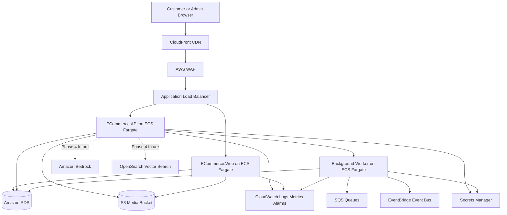
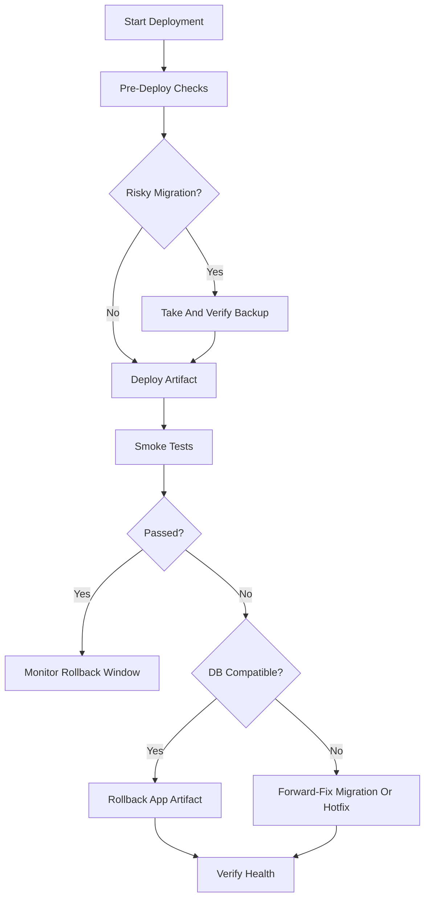
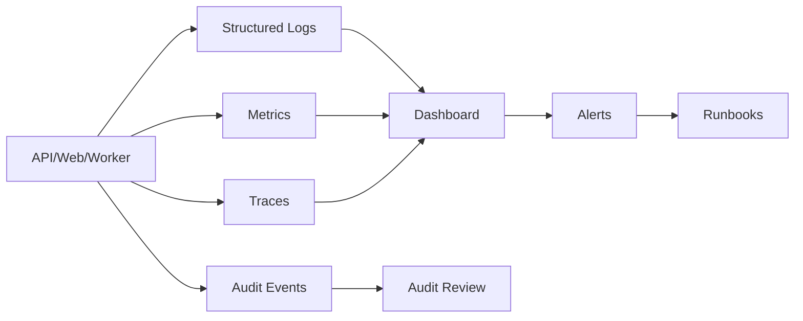
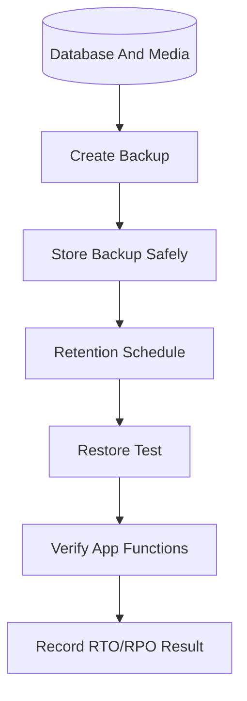
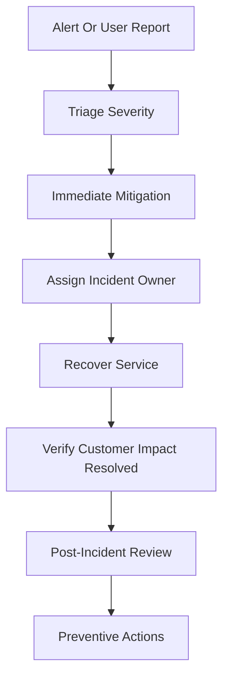

# Phase 5: Production Readiness Design Package

## 1. Purpose

Phase 5 prepares the .NET 10 modular monolith for real production deployment. The goal is not to add major customer features. The goal is to prove that the platform can be deployed, monitored, secured, backed up, restored, rolled back, and operated safely.

This phase remains local/free-first during planning. Do not provision paid AWS services yet. AWS services are documented as the future production target so the implementation can be designed without surprise rewrites.

## 2. Technology Baseline

| Area | Phase 5 Decision |
| --- | --- |
| Runtime | .NET 10 |
| API framework | ASP.NET Core on .NET 10 |
| Data access | EF Core compatible with .NET 10 |
| Architecture | Modular monolith using Onion Architecture |
| Language | Modern C# aligned with .NET 10 |
| Local operations | Local scripts, Markdown runbooks, local database backups, local logs, local load tests |
| Future production host | ECS Fargate behind an Application Load Balancer |
| Future production database | Amazon RDS for the approved relational database engine |
| Future observability | CloudWatch, OpenTelemetry-compatible traces, dashboards, and alarms |
| Future secrets | AWS Secrets Manager with IAM least privilege |
| Future cost controls | AWS Pricing Calculator, AWS Budgets, AWS Cost Anomaly Detection |

Exact package, tool, and AWS service versions must be checked during implementation. This document does not authorize provisioning paid infrastructure.

## 3. Phase 5 Goals And Non-Goals

### Deployment Readiness

Goals:

- Define environment promotion from local to development to staging to production.
- Define CI/CD stages, quality gates, artifact creation, approvals, smoke tests, and rollback.
- Define safe EF Core migration review and production migration strategy.
- Define how API, Web, background workers, outbox processors, and static/media storage fit into deployment.

Non-goals:

- Do not write deployment code yet.
- Do not provision AWS resources yet.
- Do not split the modular monolith into microservices.

### Security Readiness

Goals:

- Harden HTTPS, headers, CORS, CSRF, rate limiting, auth, admin access, file upload, dependency scanning, audit logging, validation, and safe error responses.
- Define future IAM least-privilege planning.
- Define production access review and incident response gates.

Non-goals:

- Do not implement enterprise compliance certifications.
- Do not store secrets in documentation examples.
- Do not create production admin credentials in code.

### Observability Readiness

Goals:

- Define structured logs, correlation IDs, metrics, traces, dashboards, alerts, audit review, and retention.
- Define monitoring for checkout, payment callbacks, outbox, login failures, admin actions, AI/RAG safety, latency, and errors.

Non-goals:

- Do not require paid observability tooling during local planning.
- Do not log passwords, tokens, cookies, authorization headers, payment secrets, or full personal data.

### Backup And Disaster Recovery Readiness

Goals:

- Define backup frequency, restore testing, RTO, RPO, retention, local restore simulation, and future AWS backup approach.
- Define recovery steps for application, database, media, deployment, payment, outbox, accidental deletion, security, and AI/RAG incidents.

Non-goals:

- Do not promise multi-region active-active architecture in Phase 5.
- Do not add enterprise disaster recovery automation before production needs are clear.

### Performance Readiness

Goals:

- Define baseline latency, throughput, and load test scenarios.
- Define catalog browsing, cart, checkout, payment callback, admin dashboard, and database bottleneck checks.
- Define caching boundaries.

Non-goals:

- Do not cache checkout totals, payment status, final inventory values, authorization decisions, or private user data.
- Do not introduce complex distributed caching before measuring bottlenecks.

### Cost Readiness

Goals:

- Require AWS Pricing Calculator review before provisioning.
- Require budgets, anomaly detection, service limit review, log retention planning, and non-production shutdown rules.
- Define AI/RAG cost controls before using paid providers.

Non-goals:

- Do not optimize for scale that does not exist yet.
- Do not keep unused non-production AWS environments running by default.

### Operational Readiness

Goals:

- Create runbook outlines for common incidents.
- Define escalation paths, owners, immediate mitigations, recovery steps, and post-incident review notes.
- Define production approval checklist.

Non-goals:

- Do not rely on tribal knowledge for production operations.
- Do not launch production without tested runbooks.

## 4. Environment Strategy

| Environment | Purpose | Data | Access | Deployment Rule |
| --- | --- | --- | --- | --- |
| Local | Individual development and learning. | Local test data only. | Developer machine. | Manual `dotnet run`, local tests, local secrets. |
| Development | Shared integration environment for completed feature branches. | Synthetic test data only. | Developers. | Automatic deploy from approved development branch after checks. |
| Staging | Production-like validation before release. | Synthetic or masked data only. | Limited team access. | Manual approval required. Must pass smoke, migration, and rollback checks. |
| Production | Real customer workload. | Real customer/business data. | Strictly limited, audited access. | Manual approval, change record, smoke tests, rollback plan, monitoring active. |

### Environment Rules

- Configuration must be separate per environment.
- Databases must be separate per environment.
- Secrets must be separate per environment.
- Production secrets must never be copied into local, development, or staging.
- Local and development logs can be more verbose, but must still avoid secrets and sensitive full payloads.
- Staging should use production-like log levels and error responses.
- Production should use safe error responses, structured logs, and alerting.
- Test data must be clearly synthetic.
- Real production data must not be used in lower environments unless masked and approved.
- Production deployments require explicit approval.
- Production access must be least privilege, time-bound where possible, and audited.
- Every deployment must have a rollback or forward-fix decision before release begins.

### Rollback Expectations By Environment

| Environment | Rollback Expectation |
| --- | --- |
| Local | Developer can discard local test database or restore a local backup. |
| Development | Re-deploy last good artifact and reset synthetic data if needed. |
| Staging | Re-deploy last release candidate and restore staging backup if migration testing fails. |
| Production | Prefer application rollback for code-only failures. Use database forward-fix for irreversible migrations. Restore from backup only for severe data loss or corruption. |

## 5. CI/CD Pipeline Design

No CI/CD code is written in this phase. The design below is the required future pipeline.

```mermaid
flowchart LR
    Dev[Developer Branch] --> PR[Pull Request]
    PR --> Build[Build .NET 10 Solution]
    Build --> Unit[Unit Tests]
    Unit --> Integration[Integration Tests]
    Integration --> API[API Tests]
    API --> Security[Security And Dependency Scans]
    Security --> Static[Static Analysis]
    Static --> Migration[EF Core Migration Review]
    Migration --> Artifact[Versioned Artifact]
    Artifact --> StagingApproval[Staging Approval]
    StagingApproval --> Staging[Deploy To Staging]
    Staging --> Smoke[Smoke Tests]
    Smoke --> ProdApproval[Production Approval]
    ProdApproval --> Prod[Deploy To Production]
    Prod --> ProdSmoke[Production Smoke Tests]
    ProdSmoke --> Monitor[Monitor And Rollback Window]
```



### Branch Strategy

| Branch | Purpose | Rules |
| --- | --- | --- |
| `main` | Production-ready history. | Protected, PR only, all checks pass. |
| `develop` or integration branch | Shared development integration. | Optional for team workflow; must not bypass tests. |
| feature branches | Small implementation modules. | One module per branch where possible. |
| release tags | Immutable release markers. | Tag only after staging approval. |

### Pipeline Stages

| Stage | Required Checks |
| --- | --- |
| Build | Restore packages, compile all projects, fail on build errors. |
| Unit tests | Core business rules, validation, authorization policies, status transitions. |
| Integration tests | EF Core mappings, migrations, database constraints, outbox, provider adapters with mocks. |
| API tests | Routes, auth, error format, pagination, idempotency, ownership. |
| Security tests | Broken access control, unsafe file upload, webhook validation, prompt-injection/AI retrieval boundaries where applicable. |
| Dependency vulnerability scan | Check NuGet packages and transitive dependencies before merge/release. |
| Static analysis | Code quality, nullable warnings, risky patterns, secret scanning. |
| EF Core migration review | Migration script generated, reviewed, backed up, and marked safe or requiring manual plan. |
| Artifact creation | Produce immutable versioned artifact/container image. |
| Staging deployment approval | Human approval before staging deploy. |
| Staging smoke tests | App health, database connectivity, login, catalog, cart, checkout sandbox, outbox, admin health. |
| Production deployment approval | Human approval with change notes, rollback plan, and monitoring owner. |
| Production smoke tests | Minimal safe checks after release. No destructive customer actions. |
| Rollback | Trigger rollback/forward-fix if smoke tests or alerts fail. |

## 6. AWS Production Target Architecture



### AWS Mapping And Local Equivalents

| Production Concern | Future AWS Target | Local/Free-First Equivalent |
| --- | --- | --- |
| Application hosting | ECS Fargate | `dotnet run`, local process, local containers optional. |
| Load balancing | Application Load Balancer | Local ports and manual routing. |
| CDN/static acceleration | CloudFront | Static file serving from local app. |
| Edge protection | AWS WAF | Local validation tests, threat model, rate-limit design. |
| Relational database | Amazon RDS | SQLite, SQL Server Developer, or LocalDB. |
| Media/file storage | S3 | Local filesystem through storage abstraction. |
| Async jobs | SQS | Database outbox table and local background worker. |
| Event routing | EventBridge | In-process events plus outbox. |
| Logs/metrics/alarms | CloudWatch | Console/file structured logs and local test reports. |
| Secrets | Secrets Manager | .NET user-secrets or environment variables. |
| Access control | IAM least privilege | Local configuration boundaries and no secrets in code. |
| Backups | RDS automated backups, AWS Backup, S3 versioning/lifecycle | Manual local database/media backup and restore simulation. |
| AI/RAG providers | Bedrock and OpenSearch | Mock/local providers from Phase 4. |

## 7. Deployment Architecture

### API And Web Deployment

- Deploy `ECommerce.API` and `ECommerce.Web` as separate services or containers in the future so they can scale independently.
- Keep both services using the same Core and Infrastructure contracts.
- Use one versioned artifact per release.
- Keep configuration outside the artifact.
- Health checks must exist before traffic is routed.

### Database Migrations

- Generate migration script before deployment.
- Review migration for destructive operations, long locks, data backfill, and rollback/forward-fix plan.
- Back up production database before risky migrations.
- Prefer expand/contract migrations:
  - Add nullable columns first.
  - Deploy code that writes both old and new fields if needed.
  - Backfill safely.
  - Remove old fields in a later release.
- Do not run unreviewed automatic production migrations at app startup.

### Static And Media Files

- Product images and uploaded media must use storage abstraction.
- Local MVP uses local filesystem.
- Future production stores media in S3 and serves public product media through CloudFront.
- Private files, if introduced later, require signed access and authorization checks.

### Background Workers And Outbox

- Outbox processor can run as a hosted background service locally.
- In future production, run workers as separate ECS Fargate services or scheduled tasks.
- Workers must be idempotent.
- Dead-lettered messages require visibility and runbook steps.

### Rolling Or Blue/Green Deployment

- Start with rolling deployment or one-service replacement in staging.
- Blue/green is preferred later for safer production traffic shifting.
- Database changes must be compatible with old and new app versions during rollout.

### Failed Deployment Behavior

- Stop deployment if build/tests/security/migration review fails.
- Stop deployment if staging smoke tests fail.
- Stop production deployment if health checks fail before traffic shift.
- Roll back application artifact if post-deploy smoke tests fail and database state is compatible.
- Use forward-fix when migration cannot be safely rolled back.

## 8. Configuration And Secrets Management

### Configuration Values

Configuration values are non-secret settings:

- Environment name.
- Public base URLs.
- Feature flags.
- Page size limits.
- Rate-limit thresholds.
- Logging levels.
- Allowed CORS origins.
- File size limits.
- Reservation expiry minutes.
- AI confidence thresholds.

### Secret Values

Secrets are sensitive values:

- Database passwords or connection strings with credentials.
- JWT signing keys.
- Payment provider secrets.
- Webhook signing secrets.
- Email provider credentials.
- AI provider API keys or AWS access values if introduced later.
- Cookie/data-protection keys.

### Local Rules

- Use .NET user-secrets or environment variables.
- Do not commit secrets to Git.
- Do not paste real secrets into Markdown, screenshots, tickets, or logs.
- Use placeholder names, not secret values, in documentation.

### Future Production Rules

- Store secrets in AWS Secrets Manager.
- Use IAM roles for ECS tasks where possible.
- Grant least privilege access to only the secrets each service needs.
- Rotate secrets on a defined schedule and immediately after suspected exposure.
- Missing required configuration must fail startup safely with the config key name, not the secret value.

### Never Commit

- Real credentials.
- API keys.
- JWT signing keys.
- Payment secrets.
- Production connection strings.
- Private URLs that expose internal systems.
- Exported production data.
- `.env` files containing secrets.

## 9. Security Hardening

| Area | Production Rule |
| --- | --- |
| HTTPS | Enforce HTTPS in staging/production. Use HSTS outside local development. |
| Secure headers | Add headers for content type protection, frame protection, referrer policy, and content security policy where compatible. |
| CORS | Use explicit origin allowlist. Never use wildcard origins with credentials. |
| CSRF | Protect cookie-based Web forms and state-changing browser actions. |
| Rate limiting | Apply limits to login, registration, refresh, checkout, payment callbacks, file upload, search, and AI endpoints. |
| Authentication | Short-lived access tokens, refresh-token rotation, secure cookies if used, lockout, admin MFA target. |
| Authorization | Review every endpoint for role, permission, and ownership checks before production. |
| Admin access | Restrict admin routes, require stronger controls, audit sensitive admin actions. |
| File upload | Validate type, size, extension, storage path, ownership, and scan strategy before production. |
| Dependency scanning | Run package vulnerability scan in CI and before release. |
| Audit logging | Audit auth, admin, payment, inventory, support, file, AI/RAG, and permission events. |
| Input validation | Server-side validation for all inputs; allowlist filters/sorts. |
| Error response safety | No stack traces, SQL, secrets, internal URLs, or provider payloads in production responses. |
| Future IAM | One IAM role per service/task; least privilege for RDS, S3, SQS, EventBridge, CloudWatch, Secrets Manager, Bedrock, and OpenSearch. |

## 10. Observability Design

### Observability Pieces

| Piece | Purpose | Local/Free-First Approach | Future AWS Target |
| --- | --- | --- | --- |
| Structured logs | Explain what happened. | Console/file JSON-like logs. | CloudWatch Logs. |
| Correlation IDs | Connect one request across API, DB, outbox, provider calls. | `X-Correlation-Id` and generated IDs. | Same ID in CloudWatch logs/traces. |
| Metrics | Track counts, rates, durations, and business signals. | Test reports/local counters. | CloudWatch metrics and alarms. |
| Traces | Follow request path across services/providers. | OpenTelemetry design and local traces later. | CloudWatch/X-Ray or compatible tracing. |
| Health checks | Tell load balancer/orchestrator if service is ready. | Local health endpoint. | ALB/ECS health checks. |
| Dashboards | Show system state quickly. | Markdown dashboard plan/local reports. | CloudWatch dashboards. |
| Alerts | Notify humans before customers do. | Checklist/manual local simulation. | CloudWatch alarms/SNS or approved alerting channel. |
| Audit review | Detect sensitive or suspicious behavior. | Database queries/admin view later. | Protected audit review workflow. |
| Retention | Keep logs long enough without uncontrolled cost/privacy risk. | Local cleanup policy. | CloudWatch log retention policy. |

### What To Monitor

| Area | Signals |
| --- | --- |
| API health | Availability, 5xx rate, 4xx spikes, latency, request volume. |
| Web health | Page errors, latency, static/media errors, login page health. |
| Database health | Connection errors, slow queries, migration failures, deadlocks, storage capacity. |
| Checkout | Checkout creation failures, validation failures, reservation conflicts, total calculation failures. |
| Payment callbacks | Invalid signatures, duplicate callbacks, delayed callbacks, provider failures, reconciliation required. |
| Outbox | Pending backlog, retry count, dead-lettered messages, worker failures. |
| Login/security | Failed logins, refresh token reuse, lockouts, suspicious IP/user-agent patterns. |
| Admin actions | Role changes, permission changes, order status changes, dashboard access. |
| AI/RAG | Provider failures, high fallback rate, unsafe answer reports, unauthorized retrieval attempts. |
| Performance | p50/p95/p99 latency, slow endpoints, slow queries. |
| Errors | Unhandled exceptions, new error categories, repeated failures after release. |

### Alert Examples

| Alert | Example Trigger | Initial Owner |
| --- | --- | --- |
| High 5xx rate | 5xx rate above threshold for 5 minutes. | On-call developer/operator. |
| High checkout failure rate | Checkout failures exceed normal baseline. | Commerce owner. |
| Payment callback failures | Invalid/failed callbacks spike or provider callbacks stop arriving. | Payment owner. |
| Outbox retry exhaustion | Dead-lettered messages greater than zero for critical event types. | Operations owner. |
| Database connection errors | Repeated connection failures or pool exhaustion. | Database owner. |
| High login failure rate | Login failures spike by IP/user/user-agent category. | Security owner. |
| Admin privilege changes | Any role/permission assignment in production. | Security/Admin owner. |
| Suspicious file uploads | Rejected upload spike or disallowed file attempts. | Security/Product owner. |
| AI/RAG unsafe reports | Any unsafe answer report or high fallback rate. | AI/RAG owner. |
| Low disk/storage | Local disk or future storage capacity below threshold. | Operations owner. |

## 11. Backup And Restore Strategy

### Backup Requirements

| Asset | Backup Strategy |
| --- | --- |
| Database | Local dump/export during MVP. Future RDS automated backups with point-in-time restore and manual snapshots before risky migrations. |
| Media/files | Local folder copy with checksum during MVP. Future S3 versioning/lifecycle and backup policy. |
| Configuration | Store non-secret config in source-controlled templates. Store secrets in user-secrets/env locally and Secrets Manager later. |
| Runbooks/docs | Source-controlled Markdown. |

### Suggested Targets

| Target | Phase 5 Default |
| --- | --- |
| RTO | MVP production target: restore service within 4 hours for normal outage. Tighten after business review. |
| RPO | MVP production target: lose no more than 1 hour of database changes. Tighten after business review. |
| Backup frequency | Daily full backup plus more frequent transaction/PITR capability in future RDS. |
| Backup retention | 7-35 days for early production planning, final value decided by business/legal needs. |
| Restore testing | Test restore before production launch and after major schema changes. |

### Local Restore Simulation

1. Create local database backup/export.
2. Create local media folder backup.
3. Delete or move local working database/media copy.
4. Restore database into a new local database.
5. Restore media into a new local folder.
6. Run app against restored configuration.
7. Verify login, catalog, product images, cart, order history, outbox, and admin basics.
8. Record restore time and any manual fixes.

### Restore Verification Checklist

- Database schema matches expected migration version.
- User login works with test users.
- Product catalog and images load.
- Order history and payment records are consistent.
- Inventory quantities and reservations are consistent.
- Outbox has no duplicated critical work.
- Audit logs are present.
- AI/RAG search documents can be rebuilt if needed.
- No secrets were restored into an unsafe environment.

## 12. Disaster Recovery Design

| Incident | Immediate Mitigation | Recovery Path | Owner |
| --- | --- | --- | --- |
| Application outage | Stop traffic to unhealthy instance/service; roll back if tied to release. | Redeploy last good artifact, verify health, run smoke tests. | Operations owner. |
| Database failure | Put app into maintenance/read-only mode if possible. | Restore latest verified backup or fail over future managed database if configured. | Database owner. |
| File/media storage failure | Disable uploads and show safe placeholder for missing public media. | Restore media backup or switch to healthy storage path. | Product/Operations owner. |
| Failed deployment | Stop rollout and keep last healthy version serving. | Roll back application or forward-fix migration issue. | Release owner. |
| Payment callback outage | Pause payment-dependent order completion and log callbacks safely. | Reprocess stored callback events or reconcile with provider. | Payment owner. |
| Outbox worker failure | Stop dependent background delivery expectations; preserve outbox rows. | Restart worker, process backlog, dead-letter after safe retry limit. | Operations owner. |
| Accidental data deletion | Stop writes to affected area if needed. | Restore backup to separate location, compare, repair or restore. | Database owner plus module owner. |
| Security incident | Revoke tokens/secrets, disable affected accounts, preserve evidence. | Rotate secrets, patch issue, review audit logs, communicate as required. | Security owner. |
| AI/RAG unsafe answer | Disable affected AI endpoint or source, preserve retrieval logs. | Review source, prompt, evaluation tests, patch guardrail, re-evaluate before re-enable. | AI/RAG owner. |

## 13. Runbooks And Incident Response

Each runbook should be copied into a dedicated operational page later. These outlines are enough to guide the first implementation.

| Runbook | Symptoms | First Checks | Immediate Mitigation | Escalation | Recovery | Post-Incident Notes |
| --- | --- | --- | --- | --- | --- | --- |
| Application is down | Health check failing, users cannot load app. | Recent deploy, app logs, DB connectivity, host health. | Roll back recent app deploy or restart unhealthy service. | Operations owner, release owner. | Redeploy last good artifact, run smoke tests. | Record root cause, detection time, recovery time. |
| Database connection failure | 500 errors, login/catalog fail, DB health check red. | Connection string config, DB availability, network, pool errors. | Stop deployment, reduce traffic if possible. | Database owner. | Restore config, restart app, restore DB if needed. | Add alert or capacity fix if missing. |
| High API error rate | 5xx spike, specific endpoint failures. | Logs by correlation ID, recent release, dependency errors. | Disable feature flag or roll back release. | Module owner. | Patch or forward-fix, verify error rate. | Add missing tests/alerts. |
| Slow checkout | High checkout latency, abandoned payments. | DB slow queries, inventory locks, payment adapter latency. | Pause new release, reduce expensive operations. | Commerce owner. | Tune query, scale later, fix lock/contention issue. | Add load test case. |
| Payment callback failure | Provider retries, invalid signature spike, orders stuck pending. | Signature config, callback logs, provider status, event IDs. | Stop marking orders paid if validation uncertain. | Payment owner/security owner. | Fix validation/config, replay stored valid events, reconcile provider. | Review payment incident timeline. |
| Failed deployment | Staging/prod smoke tests fail. | Failed stage, logs, migration status, health checks. | Stop rollout. | Release owner. | Roll back app or forward-fix DB, rerun smoke tests. | Update release checklist. |
| Outbox messages stuck | Outbox backlog grows, emails/events missing. | Worker health, retry count, dead-letter rows, handler errors. | Restart worker if safe; pause failing handler if harmful. | Operations owner/module owner. | Process backlog idempotently, fix handler, review dead-letter. | Add alert threshold. |
| Suspicious login activity | Login failures spike, lockouts, unusual user-agent/IP. | Auth logs, affected users, admin accounts, refresh token reuse. | Rate limit/block source, force reset for affected users if needed. | Security owner. | Revoke sessions, rotate secrets if exposed, notify users if required. | Add detection rule. |
| Admin account compromise | Unauthorized admin changes, strange role assignment. | Audit logs, role changes, login history, active sessions. | Disable account, revoke sessions, freeze high-risk admin actions. | Security owner/super admin. | Restore permissions, rotate credentials, review data access. | Complete security incident report. |
| File upload abuse | Rejected uploads spike, suspicious file names/types. | Upload logs, file validation failures, storage usage. | Temporarily disable upload endpoint or tighten limits. | Security/product owner. | Remove unsafe files, patch validation, add rate limits. | Review upload allowlist. |
| AI/RAG unsafe answer | User reports wrong/unsafe answer, high fallback/unsafe reports. | Retrieval logs, source IDs, confidence, prompt path, knowledge article version. | Disable AI endpoint/source if needed. | AI/RAG owner/security owner. | Correct source/guardrail, reindex, rerun evaluation set. | Add unsafe prompt to evaluation suite. |

## 14. Performance And Load Testing

### Baseline Targets

These are starter targets for design. Final production targets must be confirmed with business expectations and real measurements.

| Area | Starter Target |
| --- | --- |
| API simple read p95 | Under 300 ms under expected baseline load. |
| Product list p95 | Under 500 ms with indexed filters. |
| Product detail p95 | Under 400 ms. |
| Cart update p95 | Under 400 ms. |
| Checkout session p95 | Under 1,500 ms excluding external payment redirect. |
| Payment callback handling p95 | Under 500 ms after request reaches app, excluding provider retries. |
| Admin dashboard p95 | Under 1,000 ms for MVP aggregate queries. |
| Error rate | Under agreed threshold, with zero known critical payment/inventory errors. |

### Load Test Scenarios

| Scenario | What To Test |
| --- | --- |
| Catalog browsing | Product list, filters, sorting, pagination, product detail. |
| Cart flow | Add/update/remove items, guest cart, authenticated cart, cart merge. |
| Checkout stress | Concurrent checkout for same limited-stock variant, reservation conflicts, idempotency. |
| Payment callback | Duplicate callbacks, delayed callbacks, invalid signatures, provider retry behavior. |
| Admin dashboard | Query latency, aggregate correctness, no raw PII exposure. |
| Outbox worker | Backlog processing rate, retry behavior, dead-letter threshold. |
| AI/RAG endpoints | Query limits, fallback rate, retrieval latency, no private data exposure. |

### Database Bottleneck Checks

- Missing indexes on filter/sort fields.
- Slow product listing queries.
- Inventory row contention during checkout.
- Outbox queries scanning too many rows.
- Admin dashboard aggregations reading too much data.
- Support/review queries missing ownership/status indexes.

### Caching Boundaries

Can cache:

- Public catalog reads.
- Product image metadata.
- Category lists.
- Public policy/FAQ pages.
- Safe read-only dashboard summaries if marked stale/refresh time.

Must not cache as source of truth:

- Checkout totals.
- Payment status.
- Final inventory values.
- Authorization decisions.
- Refresh tokens/sessions.
- Private customer data.
- Admin permission changes without a safe invalidation strategy.

## 15. Cost-Control Design

| Area | Rule |
| --- | --- |
| Free-first planning | Use local/free tools until deployment approval. |
| Pricing Calculator | Estimate ECS, RDS, S3, CloudFront, WAF, SQS, EventBridge, CloudWatch, Secrets Manager, Bedrock/OpenSearch if used. |
| Budgets | Configure budget alerts before first paid environment. |
| Cost anomaly detection | Plan anomaly monitors before production launch. |
| Service limits | Review quotas for ECS tasks, RDS connections/storage, S3 requests, CloudWatch logs, WAF, SQS, Bedrock/OpenSearch later. |
| Log retention | Set retention by environment. Do not keep verbose logs forever. |
| RDS cost | Choose instance/storage/backups carefully. Use dev/staging smaller sizes. |
| S3 cost | Plan storage lifecycle, object size, transfer, CloudFront cache behavior. |
| CloudWatch cost | Avoid excessive high-cardinality metrics and verbose logs. |
| AI/RAG cost | Rate limit, cache safe embeddings, log token/cost estimates, require approval before paid providers. |
| Non-production shutdown | Stop or scale down development/staging outside working hours where practical. |

## 16. Security Approval Gates

Before production deployment, each gate must be reviewed and marked pass/fail:

- [ ] Authentication and authorization review completed.
- [ ] Admin MFA or approved compensating control defined.
- [ ] Secrets review completed; no secrets in Git/docs/logs.
- [ ] Dependency vulnerability review completed.
- [ ] OWASP Top 10 and API Security review completed.
- [ ] File upload review completed.
- [ ] Payment flow review completed.
- [ ] Webhook signature and replay review completed.
- [ ] Logging privacy review completed.
- [ ] Backup and restore test completed.
- [ ] Incident response runbooks reviewed.
- [ ] Production access control reviewed.
- [ ] AI/RAG safety review completed if Phase 4 endpoints are enabled.

## 17. Rollback Strategy

### Application Rollback

- Keep the last known good artifact available.
- Roll back app version when code-only failure occurs.
- Run post-rollback smoke tests.
- Continue monitoring for delayed errors.

### Database Migration Strategy

- Prefer forward-fix over destructive rollback for production data.
- Avoid migrations that cannot coexist with the previous app version unless a maintenance window and backup are approved.
- Back up before risky migrations.
- Generate and review SQL migration script before deployment.
- Do not auto-apply unreviewed migrations at production startup.

### Feature Flags

Feature flags are useful for:

- AI/RAG endpoint enablement.
- New admin dashboard queries.
- New file upload behavior.
- New payment provider adapter.
- New notification delivery channel.

Feature flags must not be used to hide insecure or incomplete authorization checks.

### Stop Deployment When

- Build/test/security scan fails.
- Migration review is incomplete.
- Backup before risky migration is missing.
- Staging smoke tests fail.
- Production health check fails.
- Error rate rises during rollout.
- Payment, checkout, inventory, or auth alerts trigger.

### Rollback Flow



## 18. Production Data Protection

| Area | Requirement |
| --- | --- |
| PII minimization | Store only customer data needed for business workflows. |
| Sensitive data masking | Mask phone, address, email where full value is not needed. |
| Audit log protection | Restrict audit access; audit records may contain sensitive operational metadata. |
| Access review | Review production admin/staff access regularly. |
| Data retention | Define retention for logs, audit, orders, support tickets, AI/RAG metadata, and deleted accounts. |
| Secure deletion | Soft-delete where business/audit requires recovery; hard-delete only with approved policy. |
| Admin data access | Staff access requires role, permission, business purpose, and audit trail. |
| Privacy-safe logging | Logs include IDs/status/correlation, not full personal data or sensitive payloads. |

## 19. Observability, Backup, And Incident Diagrams

### Observability Architecture



### Backup And Restore Flow



### Incident Response Flow



## 20. AI-Assisted Development Guidance

Give a basic AI coding tool one small production-readiness task at a time. Do not ask it to "make the app production ready."

### Safe Task Groups

1. Add health check design and endpoint contract.
2. Add structured logging field conventions.
3. Add correlation ID middleware design.
4. Add safe error response review checklist.
5. Add security header design.
6. Add CORS policy design.
7. Add rate-limiting design per endpoint group.
8. Add dependency scanning checklist.
9. Add EF Core migration review checklist.
10. Add backup verification plan.
11. Add local restore simulation instructions.
12. Add runbook templates.
13. Add CI/CD checklist.
14. Add monitoring alert definitions.
15. Add production release checklist.
16. Add cost review worksheet.

### AI Prompt Guardrail

```text
Implement only the named Phase 5 production-readiness task. Do not provision cloud services. Do not add real credentials or secrets. Preserve Onion Architecture. Do not change unrelated files. Do not log passwords, tokens, cookies, authorization headers, payment secrets, or full personal data. Add or update tests/checklists for the specific task. Stop if a production security decision is unclear.
```

Manual review is required for:

- CI/CD workflow changes.
- Database migration execution.
- Production configuration.
- IAM permissions.
- Secret management.
- Payment callback behavior.
- Rate limits on auth/payment/checkout.
- Backup/restore process.
- Incident response procedures.

## 21. Phase 5 Production-Readiness Checklist

- [ ] .NET 10 solution builds and tests pass in pipeline design.
- [ ] Environment strategy is approved for local, development, staging, and production.
- [ ] Configuration, database, and secrets are separated by environment.
- [ ] CI/CD stages and approval gates are documented.
- [ ] EF Core migration review and production migration rules are documented.
- [ ] API/Web/worker deployment architecture is documented.
- [ ] Health checks are designed for app and database readiness.
- [ ] HTTPS, secure headers, CORS, CSRF, rate limits, auth, and authorization hardening rules are approved.
- [ ] Dependency vulnerability scanning is part of the release gate.
- [ ] Structured logging, correlation IDs, metrics, traces, dashboards, and alerts are designed.
- [ ] Logs exclude passwords, tokens, cookies, authorization headers, payment secrets, and full personal data.
- [ ] Monitoring covers API, Web, database, checkout, payment callbacks, outbox, login failures, admin actions, AI/RAG, latency, and error rate.
- [ ] Backup frequency, retention, RTO, RPO, and restore test process are approved.
- [ ] Disaster recovery scenarios and owners are documented.
- [ ] Runbook outlines exist for the required incidents.
- [ ] Performance and load test scenarios are documented.
- [ ] Caching boundaries are approved, especially no cache-as-truth for checkout/payment/inventory.
- [ ] AWS Pricing Calculator review is required before provisioning.
- [ ] Budget alerts and cost anomaly detection are planned before paid environments.
- [ ] Production data protection rules are approved.
- [ ] Rollback and forward-fix strategy is documented.
- [ ] Security approval gates are listed and must pass before production.
- [ ] No paid AWS service is required during planning.

## 22. Remaining Open Questions

| Question | Default For Phase 5 |
| --- | --- |
| Which CI/CD platform will be used? | Keep platform-neutral for now; design works with GitHub Actions, Azure DevOps, or another approved tool. |
| Which production database engine is approved? | Decide before migration/deployment implementation: PostgreSQL or SQL Server. |
| What are final RTO/RPO targets? | Use 4-hour RTO and 1-hour RPO as starter targets until business owner approves. |
| Who is the first production incident owner? | Assign before launch. |
| What alerting channel will be used? | Decide before production launch; email alone may be too slow. |
| Is admin MFA mandatory before launch? | Recommended as a production gate or documented compensating control. |
| What is the production log retention period? | Choose per data sensitivity, cost, and support needs. |
| Will Phase 4 AI/RAG be enabled in production immediately? | Default no unless evaluation and safety gates pass. |

## 23. Public References

- [AWS Well-Architected Framework](https://docs.aws.amazon.com/wellarchitected/latest/framework/welcome.html) for operational excellence, security, reliability, performance efficiency, cost optimization, and sustainability.
- [AWS Fargate for Amazon ECS](https://docs.aws.amazon.com/AmazonECS/latest/developerguide/AWS_Fargate.html) for future container hosting without managing EC2 instances.
- [Amazon RDS automated backups](https://docs.aws.amazon.com/AmazonRDS/latest/UserGuide/USER_WorkingWithAutomatedBackups.html) for future managed database backup and point-in-time recovery planning.
- [AWS Secrets Manager guidance](https://docs.aws.amazon.com/wellarchitected/latest/framework/sec_identities_secrets.html) for future secret storage and rotation.
- [AWS Budgets](https://docs.aws.amazon.com/cost-management/latest/userguide/budgets-managing-costs.html) and [AWS Cost Anomaly Detection](https://docs.aws.amazon.com/cost-management/latest/userguide/getting-started-ad.html) for future cost controls.
- [OWASP Top 10](https://owasp.org/www-project-top-ten/) and [OWASP ASVS](https://owasp.org/www-project-application-security-verification-standard/) for production security review.
