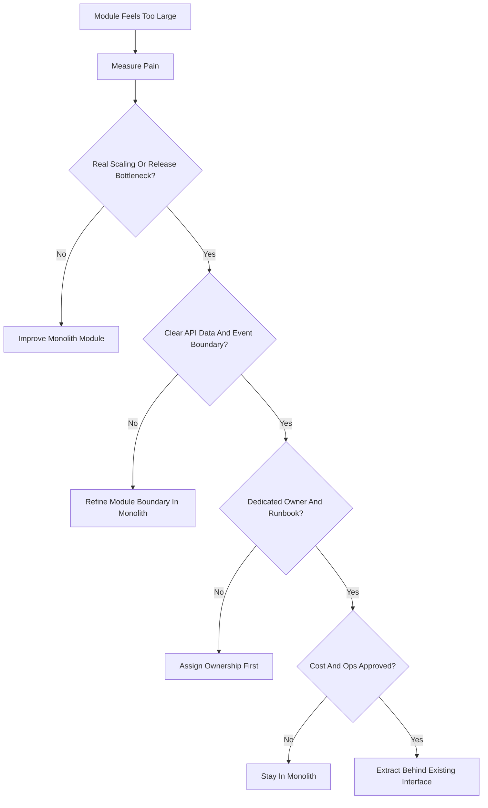
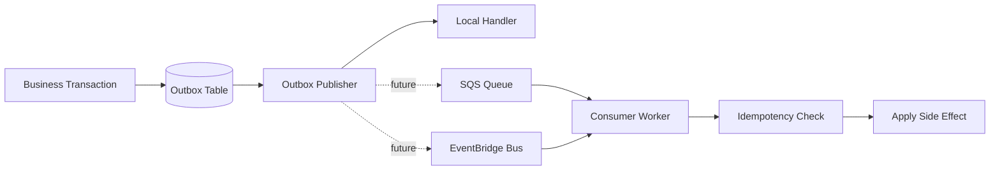
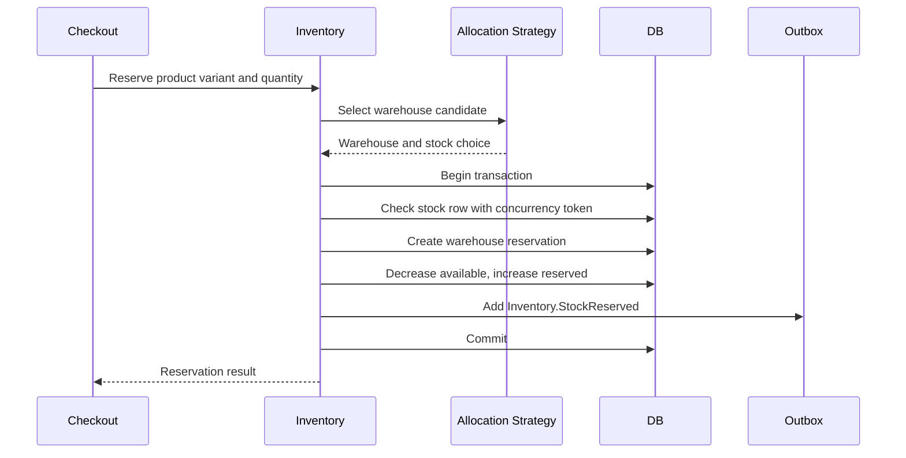
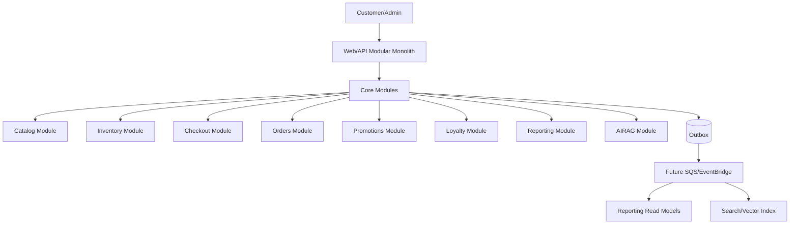
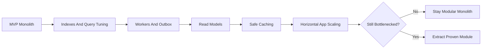
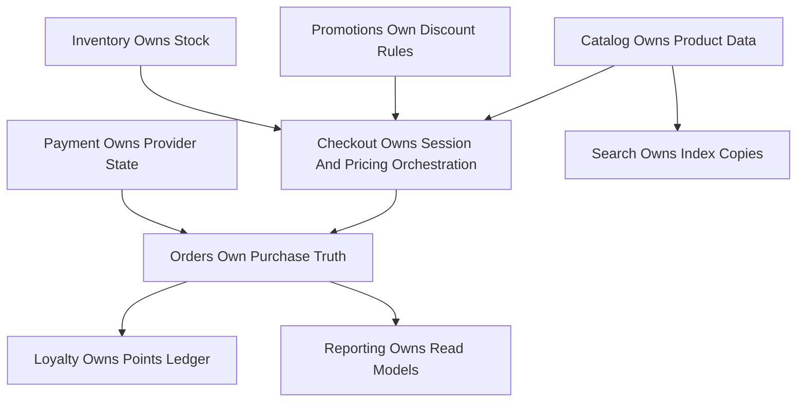
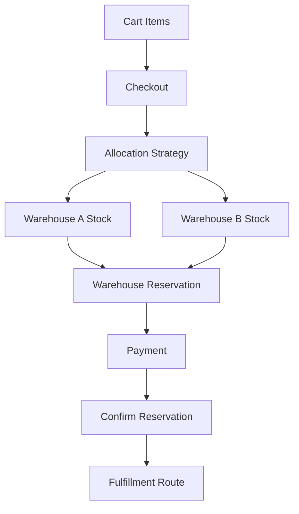
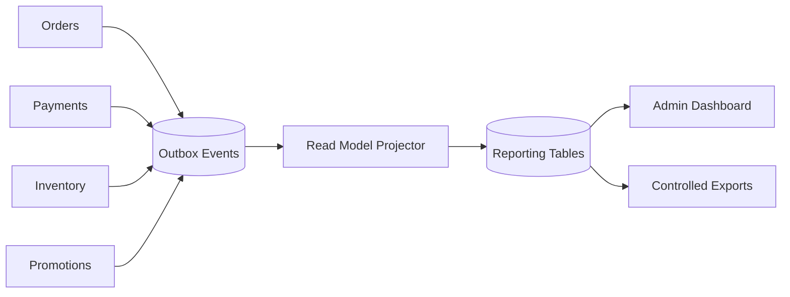
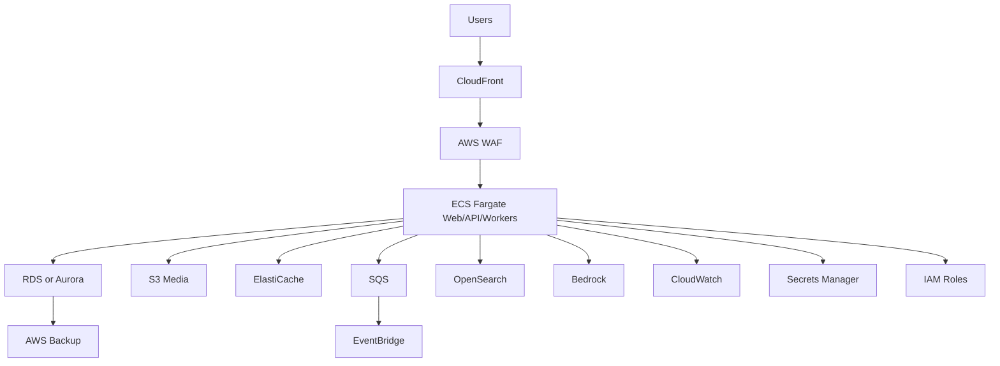

# Phase 6: Scale And Enterprise Design Package

## 1. Purpose

Phase 6 defines the future enterprise evolution of the e-commerce platform after the MVP is stable, production-ready, monitored, backed up, and operated safely. It is not a rewrite phase. It is a controlled growth phase.

The platform still uses .NET 10, ASP.NET Core on .NET 10, EF Core compatible with .NET 10, C#, Onion Architecture, and a modular monolith by default. Microservices are not the goal. They are an option only when a module has clear evidence that independent deployment, scaling, ownership, data isolation, or operational isolation is worth the extra complexity.

## 2. Phase 6 Goals And Non-Goals

### Realistic Enterprise Evolution

Goals:

- Add enterprise features without destabilizing catalog, checkout, inventory, payment, or order workflows.
- Scale the modular monolith first through indexing, read models, background jobs, caching, horizontal app scaling, and module ownership.
- Use event-driven patterns carefully, starting from the outbox pattern already designed in earlier phases.
- Plan future service extraction only when module boundaries are proven and operational need is real.
- Define enterprise access control, data retention, compliance preparation, cost controls, and risk gates.

### Features That Should Remain Inside The Modular Monolith First

- Advanced promotions.
- Coupon rules.
- Loyalty points and rewards.
- Multi-warehouse inventory.
- Enterprise admin permissions.
- Reporting read models.
- AI/RAG improvements.
- Notification improvements.
- Event publishing through outbox.

These should start as modules because they still need tight consistency with checkout, order, payment, inventory, and customer ownership rules.

### Features That May Later Become Separate Services

- Search and AI/RAG if query volume, indexing jobs, or provider integration grows independently.
- Reporting/analytics if transactional database load becomes unsafe.
- Notifications if delivery channels and retry behavior grow independently.
- Inventory if multi-warehouse allocation requires independent scaling or operational ownership.
- Payment if provider integrations, compliance, or operational isolation justify it.

### Features Intentionally Delayed

- Active-active multi-region commerce.
- Marketplace seller architecture.
- Full data warehouse/lakehouse.
- Autonomous fraud rejection.
- Real-time personalization based on sensitive profiles.
- Multi-currency/tax automation without legal/accounting review.
- Microservices-by-default.

### Overengineering Risks To Avoid

- Splitting modules before the team has production traffic and operational maturity.
- Adding distributed transactions where a local database transaction is still safer.
- Adding cache as a source of truth.
- Using analytics pipelines for checkout decisions.
- Introducing active-active multi-region before single-region operations are excellent.
- Paying for enterprise AWS services before cost and service-limit reviews.

## 3. Enterprise Feature Expansion

| Feature Area | Future Boundary | Should Start In Monolith? | Why |
| --- | --- | --- | --- |
| Advanced promotions | Promotion rules, eligibility, stacking, campaign lifecycle. | Yes | Checkout must calculate discounts server-side and atomically with order totals. |
| Discount campaigns | Campaign schedule, audience rules, coupon batches, usage limits. | Yes | Campaigns affect pricing and customer-visible totals. |
| Coupon rules | Coupon validation, ownership, redemption count, expiry. | Yes | Abuse prevention and checkout consistency require tight control. |
| Loyalty points | Points ledger, earning, redemption, reversal, expiry. | Yes | Refunds, order status, and payment status affect points. |
| Customer rewards | Reward catalog, reward issuance, reward redemption. | Yes | Rewards must use the same identity, audit, and checkout rules. |
| Multi-warehouse inventory | Warehouses, stock by warehouse, allocation, transfers. | Yes | Overselling prevention remains a core inventory rule. |
| Advanced reporting | Reporting read models and exports. | Yes initially | Start with read models; extract later if reporting harms transactional performance. |
| Analytics read models | Sales, inventory, support, campaign, customer behavior summaries. | Yes initially | The outbox can feed read models before adding a warehouse. |
| Enterprise admin permissions | Granular roles, approval workflows, audit review. | Yes | Identity and authorization stay central until a dedicated IAM boundary is justified. |
| Advanced AI/RAG search | Indexing, retrieval, recommendations, feedback, evaluation. | Yes initially | Phase 4 already defines provider abstractions; extract later if scale justifies it. |
| Event-driven integrations | Outbox events, integration event schema, SQS/EventBridge target. | Yes initially | The local outbox remains the durable source of published events. |

## 4. Scaling The Modular Monolith First

Scaling does not start with microservices. It starts with removing bottlenecks inside the current architecture.

| Scaling Technique | Use It For | Rule |
| --- | --- | --- |
| Database indexing | Product filters, order history, support tickets, outbox polling, reporting lookups. | Add indexes based on measured query patterns, not guesses. |
| Query optimization | Slow catalog, dashboard, order, inventory, and report queries. | Review execution plans and avoid loading whole aggregates for list screens. |
| Read models | Dashboard, reports, campaign performance, search display summaries. | Read models can be stale and must never drive checkout/payment truth. |
| Background jobs | Outbox, indexing, notifications, reporting refresh, loyalty accrual. | Jobs must be idempotent and observable. |
| Outbox processing | Reliable event publication. | Keep business write and outbox insert in the same transaction where possible. |
| Caching | Public catalog, categories, public policies, safe read-only summaries. | Never cache checkout totals, final stock, payment status, authorization truth, or private data as source of truth. |
| Horizontal app scaling | API/Web/worker replicas. | App instances must be stateless or use shared external state. |
| Module ownership | Clear code, data, and service boundaries. | Each module has an owner, API surface, data ownership, tests, and runbooks. |
| Feature flags | Gradual rollout, rollback, enterprise features, AI/RAG, new reports. | Feature flags cannot hide missing authorization or broken validation. |
| API versioning | Backward-compatible public API evolution. | Prefer additive changes; breaking changes require new version and migration plan. |

### Avoid Distributed Complexity Too Early

Do not extract a module because it "feels big." Extract only when the module has a stable boundary and the current deployment model is clearly limiting business or operations.

Signs that monolith scaling is still enough:

- One team can still coordinate releases.
- A single database transaction prevents important consistency bugs.
- The module does not need a separate release cadence.
- Load can be handled by indexes, read models, workers, and horizontal scaling.
- The cost of service-to-service communication is not justified.

## 5. Module Extraction Decision Model

### Decision Criteria

Consider extraction only when most of these are true:

- The module has independent scaling needs.
- The module needs independent deployment.
- The module changes at a different release frequency.
- The module has clear data ownership.
- The module benefits from operational isolation.
- A dedicated team owns the module.
- The module has a clear API boundary.
- The module has a clear event boundary.
- High-risk dependencies should be isolated.
- Cost, monitoring, CI/CD, on-call, and incident ownership are justified.

### Reasons Not To Extract Too Early

- Distributed transactions replace simple database transactions.
- Network calls create latency and failure modes.
- Debugging requires tracing across services.
- CI/CD, versioning, security, and monitoring multiply.
- Data duplication and eventual consistency become normal.
- Small teams can become slower, not faster.
- Cloud costs increase through more compute, logs, metrics, queues, and data transfer.

### Extraction Decision Tree



## 6. Future Microservice Boundaries

Microservices are possible future targets, not Phase 6 requirements.

| Candidate Service | Why It Might Be Extracted | When To Extract | Owns | APIs/Events | Risks | Migration Path | Fallback |
| --- | --- | --- | --- | --- | --- | --- | --- |
| Catalog Service | High product read traffic, independent catalog admin release cycle. | Product/catalog load dominates and boundary is stable. | Product, category, variants, attributes, images metadata. | Product APIs, `Catalog.ProductPublished`. | Product/inventory split can create stale availability. | Start with read API behind interface, then move catalog writes. | Keep monolith catalog module active until parity. |
| Inventory Service | Multi-warehouse allocation needs independent scaling and operations. | Reservation contention or warehouse operations become specialized. | Warehouse, stock, reservations, transfers. | Reserve/release APIs, `Inventory.Reserved`, `Inventory.Released`. | Distributed checkout consistency and overselling risk. | Extract reservation API last, after events and idempotency are proven. | Route checkout to monolith inventory module. |
| Cart Service | Extremely high cart write traffic or separate web/mobile needs. | Cart traffic scales independently and consistency needs are simple. | Cart and cart items. | Cart APIs, `Cart.Merged`, `Cart.CheckedOut`. | Cart/checkout handoff consistency. | Extract after cart is independent from pricing/inventory truth. | Keep checkout able to load monolith cart. |
| Order Service | Order lifecycle needs independent operations and integrations. | Fulfillment, returns, and order workflows outgrow monolith release cadence. | Order, order items, status history. | Order APIs, `Order.Placed`, `Order.Confirmed`. | Payment/inventory consistency becomes eventual. | Extract read APIs first, then command APIs. | Keep monolith as source of truth during migration. |
| Payment Service | Provider complexity, compliance isolation, or high-risk operational boundary. | Multiple providers, reconciliation, or compliance needs justify isolation. | Payment, provider event log, reconciliation state. | Payment initiation/callback APIs, `Payment.Confirmed`, `Payment.Failed`. | Callback/order consistency, PCI scope misunderstandings. | Keep no-card-storage rule; extract adapter and webhook handling carefully. | Monolith payment adapter remains available. |
| Search Service | Search/indexing load grows independently. | OpenSearch/vector indexing needs separate scaling. | Search documents, indexes, search ranking config. | Search APIs, `Search.ProductIndexed`. | Stale index, unauthorized results. | Keep source-of-truth in monolith; build external index from events. | Fallback to database search. |
| AI/RAG Service | AI provider costs, retrieval latency, or safety review needs isolation. | AI/RAG has dedicated owner and evaluation pipeline. | Knowledge index, retrieval logs, provider request metadata. | Assistant APIs, `AI.KnowledgeUpdated`. | Data leakage, prompt injection, cost spikes. | Extract behind Phase 4 provider interfaces. | Disable AI feature flag and use support tickets. |
| Reporting Service | Reporting load harms transactional database. | Reports need separate storage, refresh, and access patterns. | Read models, exports, metric snapshots. | Report APIs, `Reporting.ReadModelUpdated`. | Stale metrics, privacy leakage. | Feed read models from outbox events. | Return stale/unavailable report state. |
| Notification Service | Multiple delivery channels and retries grow independently. | Email/SMS/push/in-app delivery needs dedicated operations. | Notification records, delivery attempts. | Notification APIs, `Notification.Delivered`, `Notification.Failed`. | Duplicate messages, user privacy, cost. | Extract handlers after outbox delivery is stable. | Monolith in-app notification remains. |

## 7. Event-Driven Architecture Evolution

### Event Naming Conventions

Use past-tense business events:

```text
<Domain>.<EntityOrConcept>.<PastTenseAction>.v<Version>
```

Examples:

- `Catalog.ProductUpdated.v1`
- `Inventory.StockReserved.v1`
- `Order.OrderPlaced.v1`
- `Payment.PaymentConfirmed.v1`
- `AI.KnowledgeUpdated.v1`

### Future Event Flows

| Event | Owner | Consumers | Notes |
| --- | --- | --- | --- |
| `Catalog.ProductCreated.v1` | Catalog | Search, reporting, admin audit. | Published after product is created. |
| `Catalog.ProductUpdated.v1` | Catalog | Search, recommendations, reporting. | Must include product ID and changed fields summary. |
| `Search.ProductIndexed.v1` | Search | Admin dashboard, monitoring. | Signals index update result, not product truth. |
| `Inventory.StockReserved.v1` | Inventory | Checkout, order, monitoring. | Must be idempotent by reservation ID. |
| `Inventory.StockReleased.v1` | Inventory | Checkout, reporting. | Used for expiry or cancellation. |
| `Order.OrderPlaced.v1` | Order | Notification, reporting, loyalty, fulfillment. | Order snapshot is source of truth. |
| `Payment.PaymentInitiated.v1` | Payment | Order, monitoring. | Do not include secrets or card data. |
| `Payment.PaymentConfirmed.v1` | Payment | Order, inventory, loyalty, notification. | Must be idempotent by provider event/payment ID. |
| `Payment.PaymentFailed.v1` | Payment | Order, inventory, notification. | Used to release reservation or mark failure. |
| `Shipment.ShipmentCreated.v1` | Fulfillment | Order, notification, reporting. | Future module. |
| `Refund.RefundRequested.v1` | Returns/Payments | Order, payment, loyalty, audit. | Future workflow, never auto-approve without rules. |
| `Review.ReviewSubmitted.v1` | Reviews | Moderation, reporting. | Public display requires moderation. |
| `Loyalty.PointsAwarded.v1` | Loyalty | Notification, reporting. | Ledger entry ID is idempotency key. |
| `AI.KnowledgeUpdated.v1` | AI/RAG | Search index, assistant cache, evaluation. | Approved knowledge only. |

### Event Rules

- The producing module owns the event meaning and schema.
- Events must have event ID, event type, version, aggregate ID, occurred timestamp, correlation ID, and idempotency key where applicable.
- Consumers must be idempotent.
- Producers must use the outbox pattern.
- Retries must use backoff and a dead-letter path.
- Duplicate events must not repeat side effects.
- Do not assume global ordering across event types.
- For one aggregate, use version/concurrency fields to detect stale events.
- Event payloads must not contain secrets, card data, raw private prompts, or unnecessary PII.

### Outbox-To-SQS/EventBridge Migration

1. Keep `OutboxMessage` as the source of publish intent.
2. Add an outbox publisher that can publish to a local handler first.
3. Add an Infrastructure adapter for SQS or EventBridge later.
4. Record provider message ID after publish.
5. Keep idempotency in consumers.
6. Monitor publish failures and dead-lettered messages.
7. Do not remove the outbox table just because queues exist.



## 8. Advanced Promotions And Loyalty Design

### Promotion Ownership

Promotions belong to a Pricing and Promotions module. Checkout asks this module for valid discounts, but checkout still calculates final totals server-side.

Entities to consider:

- Promotion.
- Campaign.
- Coupon.
- CouponRedemption.
- PromotionRule.
- PromotionAudience.
- PromotionStackingPolicy.

### Promotion Rules

- Coupon validation is server-side only.
- Rules can check product, category, customer eligibility, minimum order amount, date range, usage count, and channel.
- Stacking rules define which promotions can combine.
- Expiry is enforced by the server clock in UTC.
- Usage limits can be per coupon, per customer, per order, and per campaign.
- Discount calculation stores a snapshot on order items/order totals.
- Admin promotion changes are audited.

### Abuse Prevention

- Rate limit coupon validation attempts.
- Do not reveal whether a private coupon exists to unauthorized users.
- Track redemption attempts and failed validation categories.
- Prevent reuse beyond allowed limits with unique constraints and transactions.
- Block client-provided discount amounts.

### Loyalty Design

Entities to consider:

- LoyaltyAccount.
- LoyaltyLedgerEntry.
- Reward.
- RewardRedemption.
- PointsExpiryBatch.

Rules:

- Points are a ledger, not a mutable number only.
- Earning happens after payment/order confirmation, not before.
- Redemption is server-side and idempotent.
- Refunds reverse or adjust earned points.
- Cancelled/failed orders do not earn points.
- Points expiry must be transparent and auditable.
- Loyalty changes require audit records.

## 9. Multi-Warehouse Inventory Design

### Ownership

The Inventory module owns warehouses, stock by warehouse, reservations by warehouse, transfers, and allocation rules.

Entities to consider:

- Warehouse.
- WarehouseStockItem.
- WarehouseReservation.
- InventoryTransfer.
- FulfillmentRoute.
- AllocationRule.

### Reservation Flow



### Rules

- Stock is tracked per warehouse.
- Reservation is tied to a warehouse.
- Fulfillment selection can use priority, nearest warehouse, stock availability, shipping cost, or business rule.
- Transfers move stock between warehouses and create audit records.
- Overselling prevention still requires transaction/concurrency checks per warehouse stock row.
- If warehouse selection changes after checkout starts, the existing reservation remains valid until it expires or is released.
- Eventual consistency is acceptable for reporting, not for final stock reservation.

## 10. Advanced Reporting And Analytics Design

### Why Reporting Should Not Overload Transactional Tables

Transactional tables must protect customer actions: browse, cart, checkout, payment, order, support. Heavy reporting queries can lock tables, consume CPU, and slow revenue-critical flows.

### Read Model Strategy

| Read Model | Source Events | Refresh Style | Notes |
| --- | --- | --- | --- |
| SalesSummary | Order/payment events. | Near-real-time or scheduled. | Use for dashboard, not accounting truth. |
| InventorySummary | Inventory events. | Near-real-time. | Shows stock health and reservation trends. |
| CampaignPerformance | Promotion/order events. | Scheduled or event-driven. | Useful for marketing decisions. |
| CustomerBehaviorSummary | Page/search/cart/order events. | Privacy-reviewed batch. | Avoid sensitive profiling without consent. |
| SupportSummary | Ticket/review events. | Scheduled. | Helps staffing and SLA review. |

### Reporting Rules

- Reports may be stale and must display last refreshed time.
- Reports must not drive checkout pricing, payment status, or final stock decisions.
- Aggregates should minimize PII.
- Exports require permission and audit.
- Large exports should run as background jobs.
- Future data warehouse or analytics pipeline can be introduced only after reporting load exceeds safe transactional limits.

## 11. Enterprise Permissions And Access Control

| Role | Future Permissions |
| --- | --- |
| SuperAdmin | Manage roles, permissions, sensitive settings, emergency access. |
| Admin | Manage store operations within assigned permissions. |
| SupportAgent | Manage assigned/authorized tickets and limited order context. |
| InventoryManager | Manage stock, warehouses, transfers, and inventory adjustments. |
| CatalogManager | Manage products, variants, attributes, and images. |
| MarketingManager | Manage campaigns, promotions, coupons, rewards. |
| ReportingViewer | View approved aggregate reports and exports. |
| Auditor | Read audit logs and compliance reports without modifying business data. |

Rules:

- Use least privilege.
- Review privileged access regularly.
- Sensitive actions can require approval or two-person review.
- Admin audit logs are mandatory for role changes, permission changes, promotions, inventory adjustments, exports, and policy changes.
- Separate duties where possible: a person who creates a promotion should not necessarily approve high-value campaign rules.
- Permission sprawl must be managed with categories, descriptions, owners, and review dates.

## 12. AI/RAG Scaling Strategy

Phase 4 AI/RAG should scale through interfaces before becoming a service.

| Area | Scaling Strategy |
| --- | --- |
| Vector index | Partition by source type and visibility if needed; keep authorization filters. |
| Knowledge approval | Require versioning, approval, expiry, owner, and audit before retrieval. |
| Retrieval performance | Cache safe embeddings and optimize top-k retrieval; never bypass authorization. |
| AI cost control | Rate limits, token estimates, provider budgets, fallback, feature flags. |
| Feedback loop | Store feedback, unsafe reports, and no-answer cases for knowledge improvement. |
| Evaluation dataset | Expand golden questions, prompt-injection tests, role-boundary tests, and regression tests. |
| Prompt injection monitoring | Track unsafe attempts and source poisoning signals. |
| Future AWS path | Bedrock for LLM/embeddings and OpenSearch for vector search after cost/security approval. |

AI/RAG can become its own service when:

- It has a dedicated owner.
- Retrieval/indexing load grows independently.
- Provider cost/rate-limit management needs isolation.
- Safety/evaluation workflow needs independent deployment.
- Interfaces and event boundaries are already stable.

## 13. Multi-Region And High Availability Considerations

| Stage | Option | When |
| --- | --- | --- |
| First production | Single AWS Region with Multi-AZ database where available. | Default. |
| Better read scale | Read replicas for reporting/read-heavy workloads. | After measured read bottlenecks. |
| Static/media performance | CloudFront CDN. | Production media/static scale. |
| Backup region | Cross-region backups or replicated media. | When DR target requires regional recovery. |
| Active-passive DR | Standby infrastructure in secondary Region. | When RTO/RPO and business value justify cost. |
| Active-active multi-region | Multi-region writes and conflict handling. | Delay unless global uptime and engineering maturity require it. |

Why active-active should be delayed:

- Orders, payments, inventory, and loyalty require difficult conflict resolution.
- Distributed consistency bugs are expensive and hard to test.
- Operational cost and on-call complexity rise sharply.
- A strong single-region, Multi-AZ design plus backups is usually the safer first enterprise step.

## 14. Data Retention And Compliance Planning

| Data Type | Retention Planning Rule |
| --- | --- |
| Customer data | Keep only what is needed for account, order, support, and legal/business needs. |
| Order data | Retain based on accounting, tax, refund, and support requirements. |
| Audit logs | Retain long enough for security and operational review; protect access. |
| Payment events | Keep gateway references/status and safe metadata; no card data. |
| AI retrieval logs | Store source IDs, hashes, scores, outcome, and safe previews only; define expiry. |
| Backups | Retention must match business/legal requirements and cost plan. |
| Support tickets | Retain based on support/legal needs; mask sensitive data where possible. |
| Reports/exports | Expire or protect exports; audit access and downloads. |

Compliance preparation:

- Minimize PII.
- Mask sensitive data in admin views.
- Do not log full personal data.
- Define secure deletion expectations.
- Support customer data export/delete workflows later if required by jurisdiction.
- Review admin access regularly.
- Keep documentation of data ownership and retention decisions.

## 15. AWS Future Service Mapping

These services are future options. Each requires cost, security, and operational approval before use.

| Need | AWS Service | Why Useful | When To Introduce | Local/Free Equivalent | Cost/Complexity Concern |
| --- | --- | --- | --- | --- | --- |
| App hosting | ECS Fargate | Managed container runtime without managing EC2 hosts. | Production deployment after Phase 5 approval. | `dotnet run`, local container. | Always-on compute cost, service operations. |
| Relational database | RDS or Aurora | Managed relational database, backups, Multi-AZ options. | Production data persistence. | SQLite, LocalDB, SQL Server Developer. | Instance/storage/backup cost, migration planning. |
| Cache | ElastiCache | Managed in-memory cache for safe read-heavy data. | After measured read bottlenecks. | In-memory/local cache. | Cache invalidation, cost, stale data risk. |
| Media storage | S3 | Durable object storage for images/files. | Production media storage. | Local filesystem abstraction. | Storage/transfer/lifecycle cost. |
| CDN | CloudFront | Global static/media caching. | Public media/static scale. | Local static files. | Cache invalidation and transfer cost. |
| Edge protection | AWS WAF | Managed web ACL rules and rate protections. | Production internet edge. | Validation/rate-limit tests. | Rule tuning and request cost. |
| Queues | SQS | Decoupled async processing. | Outbox publisher needs managed delivery. | Database outbox/local worker. | Duplicate delivery/idempotency, queue cost. |
| Event routing | EventBridge | Event bus routing to many targets. | Multiple consumers/integrations. | In-process events/outbox. | Event schema governance and cost. |
| Search/vector | OpenSearch | Text/vector search at scale. | Search load or AI retrieval exceeds local DB. | Database search/mock vector provider. | Cluster/serverless cost, relevance tuning. |
| AI | Bedrock | Managed LLM/embedding provider. | After Phase 4 evaluation/cost approval. | Mock/local provider. | Token/embedding cost, safety controls. |
| Observability | CloudWatch | Logs, metrics, alarms, dashboards. | Production launch. | Console/file logs. | Log/metric volume cost. |
| Access control | IAM | Least-privilege AWS permissions. | Any AWS resource use. | Local config boundaries. | Policy complexity. |
| Secrets | Secrets Manager | Secret storage/rotation. | Production secrets. | user-secrets/env vars. | Secret count/API call cost. |
| Backups | AWS Backup | Centralized backup policy. | When multiple AWS resources need policy. | Manual backup scripts. | Backup storage and restore testing. |
| Cost controls | Cost Explorer and Budgets | Cost visibility and alerts. | Before paid AWS environments. | Cost worksheet. | Requires ownership and review cadence. |

## 16. Enterprise Architecture Diagrams

### Future Enterprise Architecture



### Modular Monolith Scaling Path



### Data Ownership Boundaries



### Multi-Warehouse Inventory Flow



### Reporting Read-Model Flow



### Future AWS Service Mapping



## 17. Risk Review

| Risk | Why It Matters | Mitigation |
| --- | --- | --- |
| Premature microservices | Adds network, CI/CD, monitoring, and data complexity before value. | Scale monolith first; require extraction decision checklist. |
| Distributed transaction complexity | Checkout/payment/inventory can become inconsistent across services. | Keep tight workflows in monolith until APIs/events are proven; use idempotency and compensation. |
| Event duplication | Queues and retries can deliver messages more than once. | Idempotent consumers and unique event/message IDs. |
| Event ordering issues | Consumers may see events out of order. | Use aggregate version checks and avoid global ordering assumptions. |
| Data consistency problems | Read models/search/reporting can be stale. | Label stale data and never use it for checkout/payment truth. |
| Reporting load on transactional DB | Heavy queries can slow customer workflows. | Use read models, projections, exports, and eventually separate analytics storage. |
| Inventory overselling across warehouses | Allocation can reserve same stock twice. | Warehouse-level concurrency tokens, transactions, and reservation expiry. |
| Promotion abuse | Users may reuse coupons or stack discounts unfairly. | Server-side validation, usage limits, audit logs, rate limits. |
| Permission sprawl | Staff get excessive privileges over time. | Least privilege, permission ownership, access review, audit. |
| AI/RAG scaling cost | Paid inference and vector search can grow quickly. | Rate limits, cost logging, budgets, evaluation gates, feature flags. |
| Multi-region complexity | Active-active writes create conflict risk. | Single-region first, Multi-AZ, backups, active-passive only when justified. |
| Cloud cost growth | Enterprise services add ongoing spend. | Pricing Calculator, Budgets, Cost Explorer, service limit review. |
| Operational overload | More modules/services require more on-call and runbooks. | Assign owners, runbooks, alerts, and support model before expansion. |

## 18. AI-Assisted Development Guidance

Phase 6 tasks are future planning tasks. Do not ask an AI coding tool to implement enterprise architecture in one change.

Safe task groups:

1. Add promotion module design.
2. Add coupon rule design.
3. Add loyalty ledger design.
4. Add reward redemption design.
5. Add multi-warehouse inventory design.
6. Add inventory transfer design.
7. Add reporting read-model design.
8. Add analytics event design.
9. Add enterprise permissions matrix.
10. Add event-driven migration design.
11. Add module extraction decision checklist.
12. Add future service boundary design for one candidate module.
13. Add AWS enterprise service mapping.
14. Add compliance and retention checklist.
15. Add cost and complexity review worksheet.

AI prompt guardrail:

```text
Implement only the named Phase 6 planning task. Do not write application code. Do not provision cloud services. Do not rewrite the MVP architecture. Keep the modular monolith as the default. Do not introduce a microservice unless the document explains why, when, data ownership, APIs/events, migration path, risks, and rollback. Do not add paid service requirements before cost review.
```

Manual review is required before accepting future AI changes to:

- Checkout pricing.
- Promotion stacking.
- Loyalty ledger.
- Multi-warehouse reservation.
- Payment/refund workflows.
- Reporting exports with customer data.
- Admin permissions.
- Service extraction plans.
- AWS cost assumptions.

## 19. Phase 6 Enterprise-Readiness Checklist

- [ ] MVP and Phase 5 production controls are stable before enterprise expansion starts.
- [ ] The modular monolith remains the default architecture.
- [ ] Every enterprise feature has a module owner and data owner.
- [ ] Advanced promotions calculate discounts server-side only.
- [ ] Coupon usage, stacking, expiry, and abuse rules are defined.
- [ ] Loyalty uses an auditable points ledger.
- [ ] Refund impact on points is defined.
- [ ] Multi-warehouse stock and reservations are warehouse-specific.
- [ ] Overselling prevention is preserved with transactions/concurrency.
- [ ] Reporting uses read models or projections before heavy production queries.
- [ ] Reporting/export permissions and privacy rules are defined.
- [ ] Enterprise permission matrix follows least privilege.
- [ ] Permission review and audit process is defined.
- [ ] AI/RAG scaling keeps authorization, evaluation, and cost controls.
- [ ] Event naming, idempotency, retry, duplicate handling, and ordering rules are documented.
- [ ] Outbox-to-SQS/EventBridge migration path is documented.
- [ ] Module extraction decision checklist is required before any service extraction.
- [ ] Future service boundaries include data ownership, APIs/events, risks, migration, and fallback.
- [ ] Single-region/Multi-AZ remains the default production path.
- [ ] Active-active multi-region is delayed unless strongly justified.
- [ ] Data retention and compliance planning exists for customer, order, audit, payment, AI, backup, and export data.
- [ ] AWS service mapping includes when to introduce each service and cost/complexity concerns.
- [ ] No paid service is required before cost review and architecture approval.

## 20. Remaining Open Questions

| Question | Default For Phase 6 |
| --- | --- |
| Which enterprise feature comes first? | Advanced promotions only after checkout/payment/inventory are production stable. |
| Which database engine is final? | Decide before analytics, read replicas, or Aurora-specific planning. |
| What data retention laws apply to target markets? | Document jurisdiction before implementing deletion/export workflows. |
| Who owns promotion approval? | Marketing can draft; admin/super admin approval for high-risk campaigns. |
| How many warehouses are expected? | Start with one warehouse model extension, then add allocation strategy. |
| Should reporting become a separate service? | Only after measured reporting load harms transactional performance. |
| When should AI/RAG become a separate service? | Only after load, cost, safety workflow, or team ownership justifies it. |
| Is active-passive multi-region needed? | Decide from RTO/RPO and revenue impact, not architecture preference. |

## 21. Public References

- [AWS Prescriptive Guidance: decomposing monoliths into microservices](https://docs.aws.amazon.com/prescriptive-guidance/latest/modernization-decomposing-monoliths/welcome.html) for future extraction patterns.
- [Amazon EventBridge documentation](https://docs.aws.amazon.com/eventbridge/) for future event routing.
- [Amazon SQS documentation](https://docs.aws.amazon.com/AWSSimpleQueueService/latest/SQSDeveloperGuide/welcome.html) for future managed queues.
- [Amazon ElastiCache documentation](https://docs.aws.amazon.com/elasticache/) for future managed caching.
- [Amazon Aurora high availability](https://docs.aws.amazon.com/AmazonRDS/latest/AuroraUserGuide/Concepts.AuroraHighAvailability.html) for future HA and global database planning.
- [AWS Well-Architected Framework](https://docs.aws.amazon.com/wellarchitected/latest/framework/welcome.html) for enterprise reliability, security, performance, cost, and operations review.
- [AWS Cost Management](https://docs.aws.amazon.com/cost-management/latest/userguide/what-is-costmanagement.html) for budgets, cost visibility, and anomaly planning.
